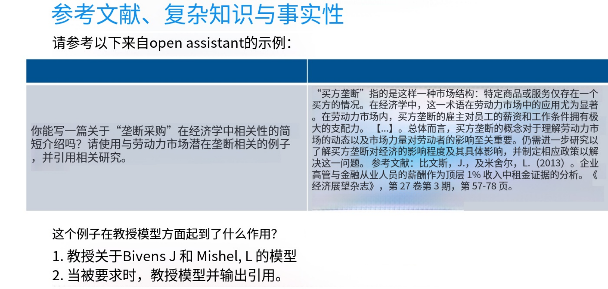

# Chapter 13: Basic Training Pipeline for Large Language Models

After the previous chapters, we have basically mastered model structure, PyTorch, and how to do inference. In this chapter, we focus on the training process of large language models (LLMs). We will cover pre-training, supervised fine-tuning (SFT), and reinforcement learning methods, with emphasis on the SFT process and brief introductions to pre-training and RL methods. **This chapter will intersperse content not in the 2025 CS336 course; the next chapter will cover reinforcement learning methods in detail.**

## Learning Objectives

Before diving into specific analysis, let's clarify the focus of this section. This section will revolve around the core training pipeline of large language models, mainly covering:

1. [Understand the pre-training paradigm: next-token prediction, data scale, and the milestone significance of GPT-3](#132-large-model-training-first-stage-pre-training-pt)
2. [Master the role of Supervised Fine-Tuning (SFT), data formats (Alpaca / ChatML), and the critical impact of high-quality expert data on model behavior](#133-large-model-training-second-stage-sft-supervised-fine-tuning)
3. [Learn the three-stage RLHF pipeline: SFT → Reward Model training → PPO RL fine-tuning, and understand PPO's core mechanisms (clipping, importance sampling, advantage function)](#134-third-stage-aligning-with-human-preferences)
4. [Master the core idea of the DPO algorithm: transforming preference optimization into weighted supervised learning; understand variants like SimPO and length normalization](#136-dpo-algorithm-direct-preference-optimization)

After completing this chapter, you will be able to: systematically distinguish the training objectives and data requirements of pre-training, SFT, RLHF, and DPO; understand the advantages, disadvantages, and applicable scenarios of PPO and DPO; and choose appropriate alignment methods based on actual resources and task requirements to build safer, more human-preference-aligned large language models.

## 13.1 Common Learning Approaches in Machine Learning

### 13.1.1 Supervised Learning (SL)

Supervised learning is the **most commonly used and most direct** paradigm in machine learning:

Given a set of **input-output paired** labeled samples $(x_1, y_1), (x_2, y_2), \dots, (x_n, y_n)$, the goal is to have the model learn a mapping function $f: x \mapsto y$ so that for a new input $x_{\text{new}}$, it can predict the corresponding output $y_{\text{new}}$ as accurately as possible.

In supervised learning, there is a **"standard answer"** — the output $y$ for each sample is pre-annotated by humans or reliable systems. Furthermore, the **loss is computable** — the error between the predicted value $\hat{y}$ and the true value $y$ (cross-entropy, MSE, etc.) can be directly used as the optimization signal. The **objective is clear**: minimize the prediction error on the training set while also ensuring generalization ability (preventing overfitting).

**Typical tasks** commonly include **classification tasks** (discrete labels) such as image recognition — input an image and output "cat / dog / car"; and **regression tasks** (continuous values) such as house price prediction — from housing features to price. Supervised learning is like "the teacher writes the answer on the test paper," and the model continuously corrects its errors by comparing its own answers with the standard answers (through algorithms like gradient descent), thereby learning to produce correct results for new questions. Its dataset has a **standard answer**, and the standard answer serves as the **supervision signal**, hence the name supervised learning.

### 13.1.2 Unsupervised Learning

**No "standard answer," only "raw materials" — the original data itself.** The algorithm's goal is not to predict a specific label, but to **discover hidden structures or distribution characteristics from the data itself.**

Unlike supervised learning where inputs are $(x_1, y_1), (x_2, y_2),..., (x_n, y_n)$ with labels, unsupervised learning has no labels — you only **give input x, not output y**, and let the machine find patterns, similarities, low-dimensional representations, or generate new samples on its own. Common unsupervised tasks include **clustering**, which automatically groups similar samples together. Unsupervised learning is like "not giving the answers, only the test paper," letting the machine sort the questions, find patterns, highlight key points, and even generate a new test paper from examples.

**Self-supervised learning** is a subset of unsupervised learning. It **generates pseudo-labels from "unlabeled" raw data** and then trains in a "supervised" manner. Thus, it belongs to the unsupervised family while having a flavor of "pretending to be supervised." Examples include LLM pre-training, BERT's **Masked Language Modeling**, and contrastive learning.

The advantage of unsupervised learning is that it **requires no annotation** — no expensive labeling is needed, and data can be used as-is; it often serves as a pre-training or exploration tool. In ML/deep learning, labeled data has always been a challenge, often requiring costly human annotation. But unsupervised learning can save engineers the cost of labeling. Of course, not all tasks can be tackled with unsupervised approaches — it ultimately depends on the specifics and facts of the situation.

### 13.1.4 Reinforcement Learning (RL)

Reinforcement learning is more complex and will be covered in detail in the next chapter. RL uses delayed, sparse reward signals to let an agent, through trial-and-error and value estimation in sequential decision-making, figure out for itself the most profitable long-term action strategy. If supervised learning is like the teacher giving the standard answer for each question, and unsupervised learning is no teacher — you find structure and patterns yourself — then reinforcement learning is like the teacher only giving a final grade (reward) at the end of the term, and the student has to fumble through each step to figure out what was right and what was wrong.

## 13.2 Large Model Training First Stage: Pre-training (PT)

The first large language model to explicitly adopt the "pre-training + downstream fine-tuning" paradigm was GPT-1, released by OpenAI in 2018. It systematically applied the "unsupervised pre-training to supervised fine-tuning" route for the first time: first performing large-scale unsupervised pre-training on 5 GB of BooksCorpus using an **autoregressive language model objective**, and then fine-tuning on small amounts of labeled data for specific tasks, significantly outperforming models that could only be trained from scratch at the time.

**LLM pre-training** is about letting the model "self-learn" general knowledge on massive unlabeled data to obtain a powerful foundation, and then using a small amount of labeled data to fine-tune for specific tasks. It is essentially an extreme amplification of transfer learning: pushing "learning general representations from data" to the extreme.

At that time, language models lacked a **pre-training paradigm**, and each model required enormous time and human effort to obtain training data. While the **pre-training + task-specific fine-tuning** paradigm was already emerging, it first appeared in image tasks on **ImageNet** — engineers would take a model already trained on massive image datasets and continue training with **small batches of labeled data**. With only **small amounts of data**, a very good model could be trained. We only need to train **a pre-trained model** with far less data than before to easily apply to various downstream tasks.

### 13.2.1 The LLM Pre-training Paradigm

Large models are typically **decoder-only** in structure. The **LLM pre-training paradigm** is to continuously predict the next word — **next-token prediction**. The final trained result is a continuation model that can continuously write based on input, and at this point the model has already acquired a great deal of prior knowledge through pre-training.

The model's input and labels are used together to train the model to predict the next word or character.

The pre-training **target sequence** is a string. For the input sequence $[x_1, x_2, \dots, x_{t-1}]$, the target (label) is the next word in the sequence $x_t$. **The model's objective** is to learn how to accurately predict the probability distribution $P(x_t | x_1, x_2, \dots, x_{t-1})$ of the next word $x_t$ given the input sequence $[x_1, x_2, \dots, x_{t-1}]$.

Suppose we have a text sequence: `"自然语言处理是人工智能的一个重要分支"` (Natural language processing is an important branch of artificial intelligence). We split this sequence into subsequences of length 4 for training (in practice, a tokenizer would need to be trained for tokenization first):

- **Input**: `["自然", "语言", "处理"]` → **Label**: `"是"`
- **Input**: `["语言", "处理", "是"]` → **Label**: `"人工智能"`
- **Input**: `["处理", "是", "人工智能"]` → **Label**: `"的一个"`
- **Input**: `["是", "人工智能", "的一个"]` → **Label**: `"重要分支"`

**This is the next-token pre-training paradigm.**

### 13.2.2 Data Scale for LLM Pre-training

LLM pre-training data is obtained by crawling public web pages, books, papers, code, and multilingual corpora, then performing deduplication and data cleaning to produce the training vocabulary. An 8B model like Qwen3-8B uses 36T tokens. **Larger models only involve more parameters and larger data scales.** Current large models typically use around 50-200 T tokens.

LLM pre-training data **essentially encompasses all of human knowledge**, so the model contains extremely rich knowledge. However, at this point the model is only a **continuation model** — you give it a piece of text, and it will continue writing, because it was trained by continuously predicting the next character. To better leverage the model's capabilities, an SFT process is still needed to obtain the Q&A-style model we have today that can handle various tasks.

Although the pre-training scale is enormous, the model **cannot follow instructions well** and lacks productization value. Pre-trained models need specific post-training processing to become practical and safe. We expect the model to **follow complex instructions**, possess practical utility, and simultaneously have enhanced **safety** to prevent misuse and harmful content generation.

### 13.2.3 GPT-3 (Generative Pre-trained Transformer 3)

GPT-3 (Generative Pre-trained Transformer 3) is an **autoregressive language model** released by OpenAI in July 2020. Its emergence brought "prompting as programming" into reality and is considered a milestone of the large model era. With **175 billion parameters + autoregressive LM + pure prompting**, GPT-3 was the first to prove: **"As long as it's large enough, a model can understand tasks and produce plausible answers without any gradient updates,"** paving the way for later InstructGPT, ChatGPT, and GPT-4.

At its core, GPT-3 is a **"continuation" model** — its sole training objective is **"given the preceding text, predict the next token"** (autoregressive LM). Whether the prompt is written as Q&A, translation, dialogue, or code completion, it treats everything as **"the text before hasn't finished — let me continue it."**

GPT-3 is a 175B-parameter model trained on approximately 570GB of text. It was the first to set the parameter count so high — a very bold attempt. **The Scaling Law became "visible to the naked eye" for the first time** — jumping from GPT-2's 1.5B to 175B, a 100× parameter increase, resulting in **emergent** downstream task capabilities — solving translation, Q&A, arithmetic, and code completion tasks through prompting alone.

| Task | Metric | Score |
|------|--------|-------|
| English Reading Comprehension (RACE) | Accuracy | 86.8%, surpassing the human average of 73% |
| Translation (WMT'14 French to English) | BLEU | 43.9, close to the best supervised systems at the time |
| Arithmetic (2-5 digit addition) | Accuracy | Improved from 0% to 80% with increasing examples |
| Code Completion (HumanEval) | Pass rate | 37% (improved to 72% after Codex further fine-tuning) |

Of course, as an early product, its **hallucinations were severe** — it would confidently fabricate news and fake citations. And **bias was significant**, with gender, racial, and religious stereotypes output directly with prompts.

#### How to Use GPT-3

GPT-3 is a pre-trained large model with continuation capability. Using it was far more cumbersome than current models. First, the input had to be modified — the user had to wrap the task in natural language context, for example:

```
Translate English to French:
sea otter
```

It looks like "translation" in form, but the essence is still "completion."

GPT-3 at the time was a **remarkable but not yet practical** system. Despite astonishing pre-training scale and computing power, it could neither **follow instructions** nor had productization value. Then ChatGPT suddenly emerged — a system capable of executing various amazing tasks and **following complex instructions**, completely transforming the social landscape. Most of you may have never interacted with controllable generation or early text generation systems, but the performance of modern instruction-following models is truly astonishing — models can understand nested, composite instructions and, combined with coding ability, directly output matplotlib visualization code. You may have taken this for granted, but when you think about it, ChatGPT's ability to simultaneously execute ten instructions is still a miracle. And the **important step to achieving this is SFT.**

## 13.3 Large Model Training Second Stage: SFT (Supervised Fine-Tuning)

### 13.3.1 Definition and Role of SFT

SFT fine-tunes a pre-trained model using expert demonstration data to enable it to **mimic the behavior in SFT data**. It is the **first step** in building an instruction-following model. SFT is supervised fine-tuning — the pre-trained large model has already mastered general knowledge, and through large-scale pre-training, we have avoided massive data annotation. We only need an SFT dataset **far smaller** (10k-100k) than the pre-training dataset, which is precisely one of the purposes of pre-training. SFT data is typically in Q&A format — Q..., A... — and is trained via loss functions such as cross-entropy, enabling the model to learn the format of SFT data and increasing the model's usability.

**Pre-trained base models** have many **shortcomings**: they can only "continue," not "answer questions"; they may output **harmful or biased** content; their answers are loose and off-topic; they have **severe hallucinations**; they cannot role-play or call tools.

#### What Does Our **Ideal Model** Look Like?

We expect the model to learn the **instruction format**, to be used in a **Q&A format**. For example, having the model write an article in Lu Xun's style or a poem in Li Bai's style. When we say "one," the model should not answer "two." It should learn the response format from SFT and learn to call tools.

The model will also **refuse harmful content** — when a user uses the model to generate harmful content, the model will learn to refuse. All of this can be achieved through SFT.

### 13.3.2 SFT Data Formats

The core of SFT (Supervised Fine-Tuning) data is to "show the model **standard human-written answers**" and let it imitate. There are two main formats:

#### Alpaca Format (Single-turn / Instruction)

Each line is one JSON entry, with clear fields:

```json
{
  "instruction": "Translate into English",
  "input": "你好",
  "output": "Hello"
}
```

`instruction` specifies the task; `input` holds the user question (can be empty); `output` is the **human-written ideal answer**. The file overall is `.jsonl` — one entry per line, and during training, cross-entropy loss is only computed over the `output` portion.

#### ChatML / ShareGPT Format (Multi-turn Dialogue)

Multi-turn dialogues are stacked into arrays by role, similarly one entry per line:

```json
{
  "messages": [
    {"role": "system", "content": "You are a customer service assistant"},
    {"role": "user", "content": "How do I change the shipping address?"},
    {"role": "assistant", "content": "Please click in the order details page..."}
  ]
}
```

It supports any number of turns, and during training, loss is only computed for tokens in the **assistant** role.

SFT data is essentially "**question + human-demonstrated answer**" pairs — single-turn uses Alpaca, multi-turn uses ChatML. The format is simple; the key is that answers must be clean, safe, and stylistically consistent.

### 13.3.3 High-Quality Expert Demonstration Data is Crucial for SFT Effectiveness

Many papers have demonstrated the importance of **high-quality SFT data**. The SFT stage differs from the pre-training stage: pre-training requires **massive data** — the more the better. Under this inertia of thinking, you might think SFT data is also "more is better," overlooking the importance of quality. Though the data volume is small, it can significantly shape model behavior. To imitate expert demonstrations, you must have high-quality expert demonstration data.

Many papers mention this phenomenon: MergeIT (arXiv2503.00034) used a small model to filter out 6k high-quality instructions, then performed weight interpolation with the full-amount model, and ultimately LLaMA-7B, with only 1/11 of the data, **matched 65k full-amount training** on AlpacaEval. "From Quantity to Quality" (arXiv:2308.12032, accepted at NAACL 2024) conducted experiments showing that 9k carefully selected samples could consistently outperform the original 50k full-amount trained same model on 5 public benchmarks, with complete ablation experiments and both code and data open-sourced.

The Li Fei-Fei team's S1 paper published in 2025 mentions: using **1,000** high-quality reasoning samples (s1K) distilled from Gemini-2.0-Flash-Thinking, fine-tuning Qwen2.5-32B-Instruct for 26 minutes (16×H100) with supervised fine-tuning, combined with a "budget forcing" decoding strategy, could match or even slightly exceed OpenAI-o1-preview on math benchmarks like AIME24, with a training cloud cost of ≈ $50. They collected 59k problems from 16 math/science problem banks, used a **triple filtering of difficulty/diversity/quality** to distill Gemini's chain of thought, and the final s1K had only 1,000 samples. And this was pure supervised fine-tuning, **proving that 1k high-quality demonstrations beat tens of thousands of ordinary annotations**, echoing the "Less is More" trend. The concept of high-quality data is very complex and requires careful justification of its construction methods. Finally, it's worth noting that at this stage, even small amounts of data can significantly change model behavior patterns.

**Why does this happen?** Traditional thinking tells us an empirical rule: **more is better, or quantity leads to qualitative change**. This experience loses its effectiveness here.

**The core reason** is that ML model parameters are entirely **data-driven** — "what you learn" determines "what you can do." Low-quality data (**wrong labels, noise, missing values, bias**) is not forgotten by the model; instead, it gets memorized by the parameters, leading to decreased performance, worse generalization, and insufficient robustness.

A paper [《The Effects of Data Quality on Machine Learning Performance》](https://ar5iv.labs.arxiv.org/html/2207.14529) specifically investigates this. They used 9 public tabular datasets, 15 classic algorithms (Logistic Regression, SVM, DT, KNN, MLP, etc.), and 6 types of contamination mechanisms — **Target Accuracy (label errors), Feature Accuracy (feature noise), Completeness (missing values), Uniqueness (duplicate samples), Consistent Representation (inconsistent values), Class Balance (class imbalance)** — to progressively contaminate the data and test.

#### Impact of Various Contamination Mechanisms

##### 1. Label Errors (Target Accuracy) — Most Direct Impact

For every **1% flip** in training set labels, F1 scores **linearly decrease by about 2-5%**. When the flip rate ≥ 20%, most classifiers perform **below the majority-class baseline** (i.e., "learning is worse than guessing").

##### 2. Feature Noise (Feature Accuracy)

Similarly shows **linear decay**. On small datasets (Credit, 1,000 records), MLP and SVM exhibit significantly increased variance, being **most sensitive to noise**.

##### 3. Missing Values (Completeness)

If the model has **never seen missing values** during training and 20% missing values appear at test time, F1 can drop by more than 10%. If ≤40% missing values are introduced during training, the model can learn to "tolerate" them, and the performance drop is not significant.

##### 4. Duplicate Samples (Uniqueness)

On datasets with tens of thousands of samples, **deduplication barely affects accuracy**, but in **small-sample** (<1k) scenarios, 5% duplication can cause significant overfitting in Decision Trees/MLP, with **F1 dropping 4-6%** — so deduplication is still needed.

##### 5. Class Imbalance (Class Balance)

As long as **minority class samples ≥ 1 / number of classes**, the classifier can still maintain above-baseline performance. Once the minority class is "diluted" to < 1 / number of classes, all algorithm performance **slides rapidly toward the majority baseline**.

This team ran a total of **15 algorithms × 5 folds × 6 quality dimensions × 3 scenarios = 4,050 groups of experiments**. The paper's conclusions are: **label accuracy ≥ 80%** is acceptable; don't pursue 100% human re-labeling; **the test set must be manually verified twice**, otherwise 40% label errors will misjudge a "good model" as worse than the majority baseline; **small datasets must be deduplicated first, then trained**; large datasets can skip the deduplication step and allocate budget to label correction.

In the classic small-model scenario, this paper used 4,050 groups of experiments to confirm: **1% label error → 2-5% linear performance drop; >20% error rate directly makes the model "worse than guessing"** — providing quantifiable statistical evidence for **data quality > data quantity**.

### 13.3.4 LLM Hallucination and Catastrophic Forgetting

LLM hallucination refers to the model generating content that seems plausible but is actually wrong or non-existent, and confidently presenting it as fact.



On the left is an excerpt about monopsony in economics; on the right is a response appended with a reference. Suppose we fine-tune the model to take the left as input and the right as output. This process simultaneously triggers two effects: **one is establishing an association between "monopsony" and the specific citation — this is valid knowledge learning; the other is forming a conditioned reflex mechanism — whenever encountering a complex concept, automatically appending a citation at the end of the output.** This constitutes a dual-action mechanism: the former imparts new knowledge, which is commendable; the latter, however, may induce the model to fabricate content. If the model parameters never contained an association between monopsony and Bivens and Mishel's work, it **may only learn the behavioral pattern of "fabricating citations upon encountering complex input."**

John Schulman, in a talk at Berkeley, incisively pointed out: **Forcing the model to answer questions beyond its knowledge domain is essentially encouraging hallucination generation.** The model can indeed learn knowledge at the abstract level, but simultaneously learns **the bad habit of "fabricating content to conform to response format."** (On-site Q&A) Regarding citation behavior when human authors write papers: when we realize we need to cite, we find relevant literature through memory retrieval or database queries.

The language model learning "a citation should be inserted here" is itself correct behavior; the problem lies in **fabricating citations.** This could be either a memory deficit or remediable through tool use. As long as the memory or tool-use problem is solved, requiring the addition of citations is not a problem. Learning to add citations is not bad; with tool use, correct citations can indeed be generated. The fundamental problem of token prediction lies in the **model being trained to predict structurally conforming tokens.** At this point, the system defaults to the idea that "fabricated citations" cause **less impact on the loss function** than "completely missing citations," because the **response structure** must be completely filled.

If SFT data contains **facts not covered by the model's pre-training**, the model will learn to "fabricate citations" rather than "retrieve facts" — it actually encourages hallucination. Instruction tuning has a counter-intuitive phenomenon: a perfectly correct and rich instruction dataset may be counterproductive because it drives the language model to fabricate content to match knowledge depth. This also explains why we need to be vigilant about **distilled data**, especially when the teacher model is far stronger than the student model. And in true human annotation, humans may possess richer knowledge than the model. When **prior knowledge** is insufficient, it's better to annotate "I don't know" than to force an answer. In principle, reinforcement learning-style correctness training would help.

Another point is the safety issue, because this may not be solvable purely through instruction fine-tuning. We know language models need guardrails. They are deployed directly for end users and are very powerful, so they can be used to **spread misinformation or generate fraudulent content, spam, etc.** This requires safety tuning of the model. Adding a small amount of safety tuning data during the instruction fine-tuning process can also **significantly improve model safety**, similar to what was found with instruction tuning: as long as the **pre-trained model is sufficiently powerful, even a small amount of instruction tuning data can achieve considerable results.** It can indeed reach a reasonable level. But the core trade-off lies in the calibration of "refusal to answer": we must refuse unsafe content without over-refusing. For example, a query like "how to terminate a Python process" is inherently safe but superficially sensitive — this requires **the model to understand the nuance.** Achieving this purely through instruction fine-tuning is very difficult, so researchers typically balance this trade-off through carefully constructed small instruction fine-tuning datasets. Some studies have shown that just **500 examples can make the model follow basic safety guidelines.**

Overall, the effectiveness of instruction fine-tuning is surprising. Although systems like ChatGPT seem complex, fine-tuning with standard instruction fine-tuning datasets (like OpenHermes or OpenAssistant), along with a base model and reasonable hyperparameters, can also yield model behavior similar to Llama or ChatGPT — of course, the effect will be slightly inferior and requires additional optimization work. The second point is that **the concept of high-quality data is very complex** and requires careful justification of its construction methods. Finally, it's important to note that **at this stage, even small amounts of data can significantly change model behavior patterns.**

### 13.3.5 SFT-Related Dataset Construction Process

Below we introduce the **construction methods**, data sources, and processing workflows of three classic instruction fine-tuning (SFT) datasets: FLAN, OpenAssistant, and Stanford Alpaca, along with the latest statistical specifications and typical examples for direct reference or reproduction.

#### FLAN (Finetuned Language Net)

First is the FLAN dataset, constructed by the Google team. Its essence is to aggregate multiple training datasets from NLP tasks. A closer look reveals various tasks: Natural Instructions V2 (containing a large number of Q&A tasks), T0-SF, adversarial Q&A, topic classification, etc. The core of this construction method is to integrate existing NLP datasets that perform independent tasks into a large meta-dataset.

It contains 62-1,836 public NLP subtasks (MNLI, SQuAD, GSM8K, WikiSQL, etc.), plus four additional expansion packs: Muffin, NIV2, T0-SF, and CoT.

**Processing workflow:**
1. Manually write 10-15 **task-agnostic templates** ("If you were asked to..., what would you answer?").
2. Randomly sample 1-2k samples per task → apply templates to form "instruction-input-output" triples.
3. Retain the original validation set for early stopping and zero-shot evaluation.

Large quantity, free; drawbacks: rigid format, not real dialogue, short-answer dominant.

#### OpenAssistant Conversations (OASST1)

This dataset was jointly written by a group of online enthusiasts for language model instruction tuning data. After ChatGPT's release, enthusiasm for such attempts was unprecedentedly high, leading to a large amount of high-quality human-written data. It provides **purely human-handwritten, multilingual, multi-turn dialogue** data, accommodating both SFT and RLHF preference pair training. GitHub + official website crowdsourcing platform; volunteers **completely hand-wrote** data, prohibiting crawling or model generation.

**Processing workflow:**
1. **Tree-like dialogue**: Users can reply multiple times to the same message → forming a multi-branch tree structure.
2. **Crowdsource voting**: Label each reply with "helpful / harmful / spam" tags.

#### Stanford Alpaca

**Construction purpose:** Zero human re-labeling, low budget, verifying that "**Self-Instruct alone can unlock instruction-following capability**."

**Original source:** 175 **manually handwritten seed instructions** (covering 8 categories including writing, Q&A, math, and code).

**Processing workflow:**
1. Self-Instruct loop: Each time randomly select 8 existing instructions as examples → feed into text-davinci-003, generate **new instructions** + **corresponding input (optional)** + **output**.
2. Deduplicate, truncate by length, keyword filter → obtain 52k samples.
3. **No human secondary correction**, 60% of examples are "pure instructions" with no input field.

Cheap, arbitrarily scalable; drawbacks: easy to inherit teacher model hallucinations, monotonous style.

## 13.4 Third Stage: Aligning with Human Preferences

### 13.4.1 Reinforcement Learning from Human Feedback (RLHF)

**RLHF** is a training paradigm that lets ML models, especially large language models, **"align" with human preferences and values.** Its core idea is: use **real-person-provided feedback signals to replace or supplement traditional hand-designed reward functions**, and continuously optimize the model strategy through reinforcement learning, thereby obtaining more satisfactory, safer, and more ethically-aligned outputs.

Because SFT data collection is expensive, pairwise feedback is relatively easier to obtain (how to obtain pairwise feedback will be discussed below). In a sense, RLHF (Reinforcement Learning from Human Feedback) and alignment work sit at the end of the pipeline, so they have a **very strong influence on model behavior.**

A paper co-authored by Percy, Shivani, and Essen studied this question: how to align a language model's subjective opinions with different demographic groups? One interesting pattern they found was that old models like InstructGPT (outdated but still usable) had actually become **more aligned with Southeast Asian religious views than before.** When checking InstructGPT's appendix, they found that the annotator nationality composition was **mainly Philippines, Bangladesh, and 17% Americans.**

Other research also points out that annotators' focus varies greatly due to their **background differences.** Moreover, both human annotation and AI annotation tend to prefer **longer** answers, meaning longer answers score higher, and models will increasingly lean toward longer answers, even if they're all nonsense. During annotation, we found that many people see longer responses and think "more detailed = better quality." Not only humans, but models also exhibit this bias. Research shows that certain models deemed superior may simply be generating **longer text.** And AI feedback seems to further encourage models to produce verbose content. Therefore, we **must be vigilant about length as a confounding factor affecting preference judgments.**

#### RLHF Stage 1: Supervised Fine-Tuning (SFT)

First, collect high-quality human-annotated data (SFT data), perform **conventional supervised fine-tuning on the pre-trained model**, obtaining the "baseline policy" ($\pi_{SFT}$), providing a starting point for subsequent RL. This is the SFT process described in the second stage above. After SFT, the model already possesses Q&A capability but has not yet **aligned with human preferences.** For example, when asked malicious questions, the model can choose not to answer, and answers to ordinary questions are more aligned with what we want.

#### RLHF Stage 2: Reward Model Training

The reward model is usually a **scoring model**, whose underlying structure **reuses the SFT large language model**, only replacing the top-level language modeling head with **a linear layer** — the "regression head" or "reward head." The trained model is equivalent to a scorer with human preferences; it gives **high scores to answers close to human preferences**, while the model base reuses the large model's parameters, which allows **inheriting language understanding capabilities.**

Training data is typically different answers inferred from the **same prompt** of the model. For the same input $X$, let the model generate multiple **candidate outputs** $(y_1, y_2, \ldots)$. First, let the model generate outputs, then **compare different output results.** Usually we only need to compare two outputs (e.g., A and B), and the core question is **whether A is better than B.** Based on these **pairwise feedback**, we will train a reward model whose core function is to assign a scalar score to each output, thereby **driving reinforcement learning.**

Taking the $InstructGPT$ guide as an example — this is one of the few publicly available enterprise-level annotation specifications. The guide clearly states that annotators need to evaluate outputs from three dimensions: **helpfulness (clear language, accurate understanding of question intent, attention to international differences — e.g., "football" should not default to American football), truthfulness (avoid fabricated content), and harmlessness (eliminate harmful or inappropriate content).** These requirements are all reasonable, but one can see subtle connections between them and the model specification publicly available from OpenAI. The actual annotation guide is far more detailed than this simplified version, **usually listing detailed bullet points distributed to annotators.** InstructGPT collected data from about 40 people through Scale and Upwork platforms, with each annotator having approximately **one minute** per question for annotation. Most of the time this is sufficient, because compared to the painstaking effort of writing outputs, annotation is often much simpler.

We can also use models to annotate, using strong models (GPT-4/Claude) to replace humans: high consistency, low cost, infinitely scalable, but this faces some risks such as **self-preference, length inflation, model hallucination cycle amplification.** Because such cyclic annotation will amplify the initial annotation errors.

This trained reward model becomes our reward mechanism. The goal is to **let the model maximize these rewards — humans sort or score these outputs** to form preference pairs. Use this preference data to train a reward model $R_{\phi}$, teaching it to give higher scores to "answers humans prefer." Humans find evaluating output easier than generating output, and may even prefer AI-generated results. Evaluation is always harder than generation; if we were to find human experts to write long answers, the **cost** would simply be too high. This is also one of the reasons for using RLHF.

#### RLHF Stage 3: Reinforcement Learning Fine-Tuning (RM)

Before RLHF, common policy gradient methods (like REINFORCE) had high variance and unstable training; while Q-learning class methods were difficult to apply in the enormous action space (vocabulary). **PPO was proposed by OpenAI in 2017** and quickly became the mainstream algorithm in the RL field. The reasons include: PPO limits the magnitude of each update through a "clipping" mechanism, avoiding policy mutations. It uses importance sampling and multiple-epoch updates, making it more efficient than traditional policy gradients. It's relatively easy to implement, with robust hyperparameters. And it can naturally cooperate with a value network (Critic), with acceptable memory usage (though still not small). Below we will focus on the PPO algorithm used in RLHF.

### 13.4.1 PPO (Proximal Policy Optimization) — A Common RL Algorithm in RLHF

PPO (Proximal Policy Optimization) is a very commonly used policy optimization algorithm in reinforcement learning, proposed by Schulman et al. in 2017. It is an improved version of TRPO (Trust Region Policy Optimization). PPO is simpler to compute and more stable than TRPO, performing excellently in robot control and game-like tasks (such as Atari, MuJoCo).

#### 1. PPO Core Idea

PPO is a policy gradient-based method that maximizes cumulative reward by optimizing the policy function $\pi(a|s)$. Its core idea is to **keep policy updates while not straying too far from the old policy.**

Traditional policy gradient methods (like REINFORCE) are prone to: **policy updates that are too large, leading to training instability or even collapse**, and **low sample efficiency — collecting a trajectory once can only be used once.** We might hope to execute multiple gradient updates after sampling once (this is essentially sampling from one rollout trajectory and pivoting toward an approximate off-policy setting). To achieve this, importance weight correction must be introduced, because as update steps increase, the original samples gradually become outdated. This is the core idea of TRPO: correct all gradient steps and constrain the policy to stay close to the original policy. PPO goes further: instead of using KL divergence to explicitly constrain the policy to stay close to the old one, it directly clips the probability ratio, naturally incentivizing the model to stay close to the original policy. This is the core idea of PPO.

PPO solves these problems through: **1. Limiting the policy update magnitude by clipping the probability ratio**, ensuring the new policy doesn't deviate too far from the old one, improving training stability. **2. Using importance sampling to improve sample efficiency** — old data can still be used for updates, thereby improving sample utilization.

#### 2. PPO in Detail

##### Step 1

RL has no true labels, only rewards. We sample from the **old policy** (the model trained in the previous iteration round; at the start, this is the SFT model; later, it's the model trained in the previous round) $\pi_{\text{old}}$ to obtain a trajectory, compute the "advantage" of each step, and use the **advantage function** (introduced below) to estimate the advantage $A_t$ (positive = good action, negative = bad action).  
Use **importance sampling** (introduced below) to practice the new policy with "old data":

$$
L^{\text{PG}}(\theta)=- \frac{\pi_\theta(a_t|s_t)}{\pi_{\text{old}}(a_t|s_t)}A_t
$$

Where $L^{\text{PG}}(\theta)$ is the original policy gradient.

Define the probability ratio as:

$$
r_t(\theta)=\frac{\pi_\theta(a_t|s_t)}{\pi_{\text{old}}(a_t|s_t)}
$$

Thus:

$$
L^{\text{PG}}(\theta)=- r_t(\theta)A_t
$$

If $A_t>0$, push $r_t$ toward larger values; if $A_t<0$, push it toward smaller values.  
Of course, there's a step-size issue here — too large a step can easily "flip" — the probability ratio can skyrocket to 10 or plummet to 0.01, and the policy collapses directly.

Let's interject here on what **importance sampling** and the **advantage function** are.

**Importance Sampling (IS)** is a statistical method used to estimate expected values under a target distribution by sampling from another proposal distribution and weighting the samples, when directly sampling from the target distribution is difficult. **Importance sampling is "using old data to compute new answers" — taking the trajectories collected by the old policy, multiplying them by a "weight," and treating them as trajectories of the new policy.** You want to know how handsome you look after changing your hairstyle, but you don't have time to take a new photo today. So you pull out **last week's old photo**, but your hair was different last week. What to do? Attach a "similarity coefficient" to the old photo: if the new hairstyle is almost identical to the old one → coefficient ≈ 1, photo is trustworthy; if vastly different → coefficient ≈ 0, photo is basically void. This coefficient is the **importance weight** $r_t(\theta)$.

$$r_t(\theta) = \frac{\pi_{\text{new}}(\text{action}|\text{state})}{\pi_{\text{old}}(\text{action}|\text{state})}$$

The weight $r_t(\theta)$ automatically downweights "parts of the old trajectory that no longer resemble the new policy" while preserving the similar parts.

1. **Sample-efficient**: No need to re-sample from the environment every time parameters change; the same batch of data can be reused several times.
2. **Time-saving**: The most time-consuming part of deep RL is interacting with the environment; importance sampling makes it possible to "interact once, train many times."
3. **Stable**: With clip or penalty, it prevents weight explosion (in PPO, weights are kept within the 0.8-1.2 range).

##### Advantage Function

The advantage function measures how much better an action is in a given state compared to the average level for that state. Its basic idea is: $Q(s,a)$ represents the value of executing action $a$ in state $s$, and $V(s)$ represents the average value over all actions in state $s$. The difference between the two is the "relative goodness" of action $a$, **meaning I can redefine the reward after subtracting an arbitrarily set baseline value** — we call this the advantage function.

Mathematical expression:

$$
A(s,a) = Q(s,a) - V(s)
$$

If $A(s,a) > 0$, it means action $a$ is better than the average policy for that state, and its probability should be increased. If $A(s,a) < 0$, action $a$ is worse than average, and its probability should be decreased. If $A(s,a) = 0$, action $a$ is at the average level, with no particular superiority or inferiority.

Directly using $Q$ or $Return$ for policy gradient optimization produces high variance. Subtracting $V(s)$ reduces variance without changing the expectation, making policy updates more stable and efficient. In practice, the advantage function is typically approximated using methods like **GAE (Generalized Advantage Estimation)**, used for policy updates in mainstream RL algorithms such as PPO, A2C, and TRPO.

**GAE (Generalized Advantage Estimation)**

**TD Error:**

$$
\delta_t^V = r_t + \gamma V(s_{t+1}) - V(s_t)
$$

**GAE Definition:**

$$
A_t^{GAE} = \sum_{b=0}^\infty (\gamma\lambda)^b\delta_{t+b}^V
$$

GAE provides an adjustable balance between bias and variance.

Let's look back at this formula:

$$
L^{\text{PG}}(\theta)=- \frac{\pi_\theta(a_t|s_t)}{\pi_{\text{old}}(a_t|s_t)}A_t
$$

We can see that the original policy gradient maximizes expected return, using importance sampling for advantage estimation.

##### Step 2

PPO's probability clipping — as the model continues training, it may deviate from the original model, continuously fitting the reward model. So we must limit the model's changes, drawing a **safety channel** for $r_t$, only allowing it to move within $[1-\varepsilon,1+\varepsilon]$.  
Define the clipped ratio:

$$
r_t^{\text{clip}}=\text{clip}\bigl(r_t(\theta),1-\varepsilon,1+\varepsilon\bigr)
$$

Change the loss to "take the more conservative of the two paths":

$$
L^{\text{CLIP}}(\theta)=-\min\Bigl(r_t(\theta)A_t,r_t^{\text{clip}}A_t\Bigr)
$$

When $A_t>0$ (good action):
  If $r_t>1+\varepsilon$, the gradient is cut off, no longer wildly increasing probability.
When $A_t<0$ (bad action):
  If $r_t<1-\varepsilon$, the gradient is also cut off, no longer wildly decreasing probability.

##### Step 3

In actual code, two common supporting roles are also added:

One is the **value error** $L^{\text{VF}}$: lets the critic network estimate future rewards more accurately.

The other is entropy regularization $H(\pi)$: prevents the policy from becoming too deterministic all at once (maintains exploration).
The final PPO loss looks like this:

$$
L^{\text{PPO}}=\underbrace{-\min\Bigl(r_t(\theta)A_t,r_t^{\text{clip}}A_t\Bigr)}_{\text{policy}} + c_1\underbrace{L^{\text{VF}}}_{\text{value}} - c_2\underbrace{H(\pi)}_{\text{entropy}}
$$

Typical coefficient values: $\varepsilon=0.2, c_1=0.5, c_2=0.01$.

$$
\boxed{L^{\text{PPO}}=-\min\Bigl(r_tA_t,\text{clip}(r_t,1-\varepsilon,1+\varepsilon)A_t\Bigr)+\text{(value + entropy)}}
$$

**The left side clips the probability to prevent the step size from having too large an impact on the model; the right side is the "auxiliary supporting cast."** It can suppress excessively large single-step changes, preventing RL from being difficult to converge.

#### 3 PPO Overall Process

Below we introduce the complete operation of the PPO algorithm in large models (such as RLHF) from both the **macro process** and **core mechanism** levels.

In large model training, PPO typically serves as the **third step of RLHF**, with the first two steps being:
1. **SFT (Supervised Fine-Tuning)**: Fine-tune the base model with high-quality dialogue data to obtain the initial policy $\pi_{\text{SFT}}$.
2. **Train the Reward Model (RM)**: Based on human preference data, train a model $r_\phi(s, a)$ to score and measure the quality of generated responses.

Then enter the PPO phase; the overall process is roughly as follows:

```
Initialize: Policy Model = π_SFT, Reference Model = π_SFT (frozen)
Reward Model = already-trained RM (frozen)

                            ↓

Iterative Loop (until convergence):
1. Sampling Phase: Use current policy π_θ to generate a batch of responses (interacting with RM)
2. Compute Advantage: Use RM to score + Reference Model to compute KL penalty, obtaining advantage A
3. Update Phase: On the same batch of data, update π_θ multiple times using PPO objective
   - At each update, compute importance weight r = π_θ / π_old
   - Use clipped loss to limit update magnitude
4. Update Old Policy: π_old ← π_θ, prepare for next round of sampling
```

#### 3.1 Main Model Roles

| Model | Description | Trained? |
|------|------|----------|
| **Policy Model** $\pi_\theta$ | Currently being optimized; generates responses | Yes |
| **Reference Model** $\pi_{\text{ref}}$ | SFT model; used to compute KL divergence, preventing policy drift | No, frozen |
| **Reward Model** $r_\phi$ | Scores generated responses, provides the immediate reward $r_t$ in the advantage formula $A_t$ | No, frozen |
| **Value Model** $V$ | Provides $V_{s_t}$ (state value) in the advantage formula $A_t$; together with reward, constitutes the advantage function | No, frozen |

#### 3.2 Sampling Phase (Data Collection)

First, input a set of prompts. The current policy $\pi_\theta$ generates a complete response for each prompt (via autoregressive sampling). Simultaneously record the **log probability** $\log \pi_\theta(a_t \mid s_t)$ of generating each token (for subsequent importance sampling). Use the reward model to score the **entire response** as $r(x, y)$ (x is the prompt, y is the response). Store the prompt, generated response, per-token log probabilities, and reward score into a buffer.

#### 3.3 Computing the Advantage Function $A_t$

Unlike standard RL, in large models each token does not have an immediate reward — only the overall score of the final response exists. Therefore, we need to **assign an advantage to each token**, commonly done in two ways:

**One is per-token allocation**: assign the final reward $R$ as the advantage of the last token, with all other tokens' advantages being 0; or distribute $R$ uniformly/exponentially decaying across all tokens.

**Two is using GAE (Generalized Advantage Estimation)**: if token-level rewards are introduced (such as the KL penalty term), the immediate reward for each token can be computed, and GAE can then be used to estimate the advantage.

In practice, a simple method is commonly used in RLHF: **only the last token has advantage $A = R$, all other tokens' advantage is 0.** However, in loss computation, only tokens with non-zero advantage contribute to the gradient. More commonly, **every token is assigned the same advantage** (equal to the full-sentence reward minus baseline), then combined with **KL penalty** for refinement.

#### 3.4 KL Divergence Constraint

To prevent the policy from over-optimizing the reward model and causing "reward hacking" (generating high-reward but low-quality text), a **KL penalty** is usually subtracted from the reward:

$$
\text{reward}_{\text{token}} = r_\phi(\text{full response}) - \beta \cdot \text{KL}(\pi_\theta \| \pi_{\text{ref}})
$$

Where KL divergence is typically accumulated as per-token pointwise KL:

$$
\text{KL}_t = \log \pi_\theta(a_t \mid s_t) - \log \pi_{\text{ref}}(a_t \mid s_t)
$$

In this way, every time a token is generated, the immediate reward already contains a penalty term, allowing the advantage function to be computed per token.

#### 3.5 PPO Update Phase (Multiple Epochs)

For each batch of data in the buffer, perform multiple gradient updates (typically 4-10 epochs).

**For each token, compute:**

- The current policy's log probability $\log \pi_\theta(a_t \mid s_t)$ (forward pass)
- Importance weight:
$$
r_t(\theta) = \exp\bigl( \log \pi_\theta(a_t \mid s_t) - \log \pi_{\text{old}}(a_t \mid s_t) \bigr)
$$
- Clipped objective:
$$
\text{surr} = \min\left( r_t(\theta) A_t,  \text{clip}(r_t(\theta), 1-\epsilon, 1+\epsilon) A_t \right)
$$
- Loss function (to minimize):
$$
L = -\mathbb{E}[\text{surr}]
$$

The importance weight allows reusing data sampled from the previous old policy, saving time and computation.

Additionally, a **KL penalty term** or **value function loss** (if using a critic network) can also be added.

#### 3.6 Value Function (Optional)

In large model RLHF, an additional value network (critic) is sometimes trained to estimate the state value $V(s)$, used to compute the advantage. The value network is typically another output head **sharing some parameters with the policy**, predicting the state value at each token position. During training, a value loss is added:

$$
L_{\text{value}} = \mathbb{E}[(V(s_t) - \text{return}_t)^2]
$$

#### 3.7 Typical PPO Hyperparameters in Large Models

| Parameter | Common Value |
|------|----------|
| Clip range $\epsilon$ | 0.1 ~ 0.2 |
| KL penalty coefficient $\beta$ | 0.01 ~ 0.1 |
| Update epochs | 4 ~ 10 |
| Batch size | 64 ~ 256 |
| Learning rate | 1e-6 ~ 5e-5 (usually lower than SFT) |
| Advantage normalization | Standardize advantages within batch |

## 13.6 DPO Algorithm (Direct Preference Optimization)

### 13.6.1 Core Idea of the DPO Algorithm

The success of the DPO method lies in its elimination of PPO's many complexities while performing well: it removes the **reward model** (originally used to compute the advantage function) in PPO, and **abandons all policy optimization-related mechanisms** (such as the importance ratio). Returning to fundamentals, it performs positive gradient updates on good results and negative gradient updates on bad results.


**From the above figure, DPO is far less cumbersome and achieves equivalent performance.**

**No need to train an additional reward model, no complex RL loop; just embed human preferences directly into a 'comparative' supervised loss, and the language model learns to generate good answers more and bad answers less.** In other words, DPO compresses the original two-stage pipeline of "first train a reward model, then maximize reward with PPO" into a single-stage pipeline of "one maximum likelihood loss," thereby **turning a reinforcement learning problem into a supervised learning problem.**

No reward network, no advantage, no clip — just one pair $(y_w, y_l)$ to compute the gradient, training just like ordinary fine-tuning.

Think of the model as a "student" and the reference model as "their past self." The teacher hands over two essays: a model essay and a negative example. The DPO loss is a single comment: **"You must be more like the model essay than yesterday's you, and simultaneously less like the negative example than yesterday's you; otherwise, you lose points."** The student only compares "today's self vs. yesterday's self" each time, never needing to know an absolute score (reward), yet can continuously improve. No need to train a separate "scorer."

### 13.6.2 The DPO Algorithm

DPO turns "reinforcement learning" into "weighted supervised learning," and only needs one pair of "good/bad" answers to teach the model "be like the good, don't be like the bad." DPO data collection is: using the SFT-trained model as the inference model, the user inputs a prompt, the model infers multiple times, and good answers and bad answers are found.

In RLHF, PPO optimizes model-generated output through a reward model, but requires training a **Value Network**, multiple rounds of policy updates, PPO's gradient clipping and KL regularization — these steps are **computationally expensive and complex to train** for large models. DPO proposes **directly using preference pairs for optimization**, eliminating the need for an RL loop or complex value network training.

#### Step 1: First Write a "Preference Probability"

Assume we already know there is an invisible "reward" $r(x,y)$ behind the model's output. If a human says "I prefer $y_w$ over $y_l$," then in the $Bradley-Terry$ model:

$$
P(\text{win})=\sigma\bigl(r(x,y_w)-r(x,y_l)\bigr)
$$

$\sigma$ is the sigmoid function, compressing the difference to 0~1.

#### Step 2: DPO's Optimization Objective

Given two text generation results $y_1$ and $y_2$ for the same $prompt(x)$, with human or model annotated preferences (e.g., $y_1 \succ y_2$), DPO's goal is to make the model generate the preferred text with higher probability, directly optimizing the probability ratio:

$$
r(x,y)=\beta\ln\frac{\pi_\theta(y|x)}{\pi_{\text{ref}}(y|x)} + C(\text{constant})
$$

$\pi_\theta$ is the model we are now training, $\pi_{ref}$ is the initial SFT model (also called the reference model), and $\beta$ is the temperature coefficient, default 0.1~0.5.

Substitute this $r(x,y)$ back into Step 1:

$$
P(\text{win})=\sigma\Bigl(\beta\ln\frac{\pi_\theta(y_w|x)}{\pi_{\text{ref}}(y_w|x)} - \beta\ln\frac{\pi_\theta(y_l|x)}{\pi_{\text{ref}}(y_l|x)}\Bigr)
$$

#### Step 3: Maximum Likelihood → Minimize Negative Log-Likelihood

We want to maximize the probability that "human preferences" are guessed correctly by the model, so:

$$
\mathcal{L}_{\text{DPO}}=-\ln\sigma\Bigl(\beta\ln\frac{\pi_\theta(y_w|x)}{\pi_{\text{ref}}(y_w|x)} - \beta\ln\frac{\pi_\theta(y_l|x)}{\pi_{\text{ref}}(y_l|x)}\Bigr)
$$

This is the DPO **loss**: The first half $\ln\frac{\pi_\theta(y_w|x)}{\pi_{\text{ref}}(y_w|x)}$ is called the "relative log probability of the good answer," the second half $\ln\frac{\pi_\theta(y_l|x)}{\pi_{\text{ref}}(y_l|x)}$ is called the "relative log probability of the bad answer." The entire expression inside = "how much better the good is than the bad" → compressed to $(0,1)$ by $\sigma$ → taking the negative log gives cross-entropy.

#### Step 4: Training Process

**Data preparation**: Collect prompts and corresponding generated output pairs $(y_1, y_2)$, along with human or small-model annotated preferences $(y_\text{preferred} \succ y_\text{less-preferred})$.

**Probability calculation**: Feed each output into the large model, compute the generation probability $\pi_\theta(y|x)$, using $log-probability$ accumulation to obtain the sequence probability.

**Loss calculation**: Use the DPO loss function $\mathcal{L}_\text{DPO}$ to directly optimize the large model parameters via backpropagation.

**Iterative training**: Batch-compute preference pair loss, update model parameters via gradient — no value network needed, no RL loop required.

### 13.6.3 Two Variants of the DPO Algorithm

#### SimPO: Directly Remove the Reference Model to Save Memory

The core idea is: no longer compare with the "old model," but directly make "the probability of the good answer" larger than "the probability of the bad answer," and require the good answer's probability to lead by a **margin**. It makes two simple modifications: one is to normalize the update magnitude by response length (this idea will appear again later), and the other is to remove the reference policy. Although this breaks DPO's mathematical justification based on policy ratios, it more purely embodies the idea of weighting good / downweighting bad.

Original DPO formula:

$$
\mathcal{L}_{\text{DPO}}(\pi_\theta; \pi_{\text{ref}}) = -\mathbb{E}\left[\log\sigma\left(\beta\log\frac{\pi_\theta(y_w \mid x)}{\pi_{\text{ref}}(y_w \mid x)} - \beta\log\frac{\pi_\theta(y_l \mid x)}{\pi_{\text{ref}}(y_l \mid x)}\right)\right]
$$

SimPO formula:

$$
\mathcal{L}_{\text{SimPO}}(\pi_\theta) = -\mathbb{E}\left[\log\sigma\left(\frac{\beta}{|y_w|}\log\pi_\theta(y_w \mid x) - \frac{\beta}{|y_l|}\log\pi_\theta(y_l \mid x) - \gamma\right)\right]
$$

$\beta$ is the temperature coefficient controlling sensitivity of the probability ratio; $\gamma$ is a hyperparameter introducing a fixed margin in SimPO, ensuring the "good" answer's probability is at least $\gamma$ higher than the "bad" answer's. $|y_w|$ and $|y_l|$ respectively denote the length (in tokens) of the "good" answer and the "bad" answer.

#### Length-Normalized DPO: Prevent Models from "Cheating with Long Responses"

The core idea is to replace raw probability with **average per-token probability** before comparing — long responses no longer inevitably have an advantage.

Formula:

$$
\max_{\pi_\theta}\mathbb{E}_{y_c,y_r,y_r\sim\mathcal{D}}\left[\log\sigma\left(\frac{\beta}{|y_c|}\log\frac{\pi_\theta(y_c \mid x)}{\pi_{\text{ref}}(y_c \mid x)} - \frac{\beta}{|y_r|}\log\frac{\pi_\theta(y_r \mid x)}{\pi_{\text{ref}}(y_r \mid x)}\right)\right]
$$

Denominators $|y_c|$ and $|y_r|$ are the answer lengths (in tokens). In **length-normalized DPO**, by dividing the log probability by the answer length, we can **reduce the model's tendency to generate longer answers**, because **longer answers, even with only slight advantages in probability**, may receive higher unnormalized log probabilities purely due to their length.

### 13.6.3 RL Considerations

RL **findings are often highly dependent on specific environments.** Depending on the runtime environment, base model, and post-training preference data, conclusions can vary significantly. For example, the AI2 team, when comparing DPO and PPO, once found PPO superior due to its on-policy nature, and precisely demonstrated the gap from DPO to PPO. But in subsequent Tulu3 research, they found that with more sophisticated SFT methods, both PPO and DPO gains disappeared, and only standardized DPO maintained the advantage — conclusions completely different. These two studies have many differences, but it's not a matter of who's right and who's wrong. The important thing is that we should not over-generalize conclusions based on a single paper. This caution also applies to the PPO and GRPO I'll discuss later — **never treat any single experimental result as dogma.**


**The over-optimization problem.** This is essentially overfitting, but the term is important because it inherently reveals a phenomenon: when continuously optimizing the policy — imagine the horizontal axis representing the degree of RL implementation — initially the reward value keeps rising, but eventually the reward model fitted on human preferences will deviate from actual human preferences. The more you optimize, the greater the deviation, ultimately falling into a situation that **looks like optimization but yields no real reward improvement.**

This phenomenon is almost ubiquitous in RLHF and is a very serious problem. The root cause of over-optimization lies in the noisy nature and complexity of human preferences. Someone once conducted a study: implementing RLHF on noisy AI feedback, noise-free AI feedback, and human feedback respectively. The results clearly showed that both human feedback and noisy AI feedback produced significant over-optimization, while clean, noise-free AI feedback did not show this condition. Therefore, in the actual post-training process, you should expect to see curves similar to those in the left chart — when the model performs increasingly well on proxy reward metrics, its human preference win rate may not necessarily improve in tandem.

