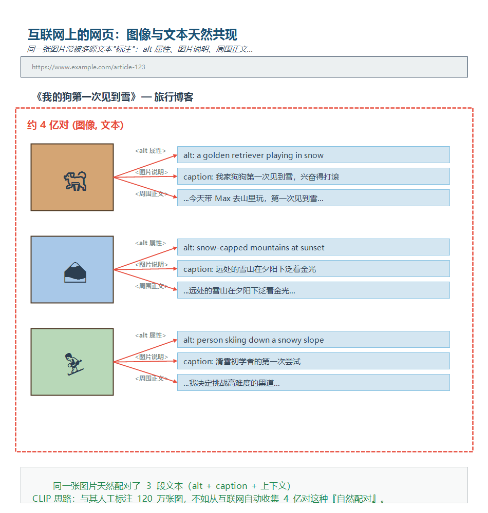
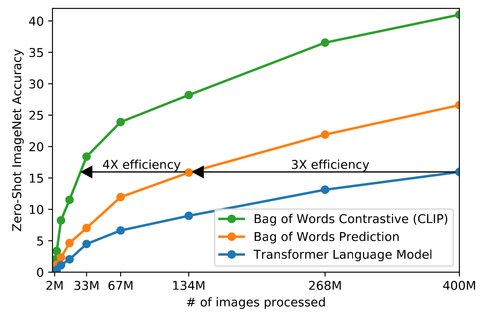
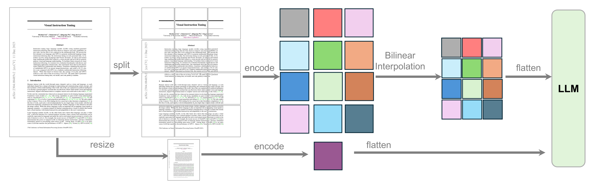
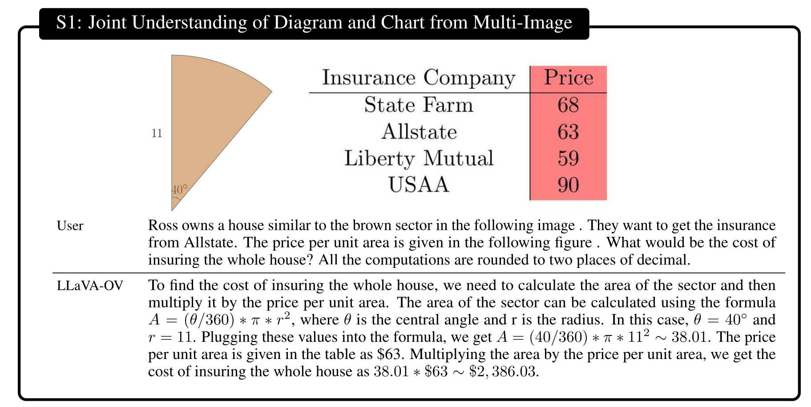
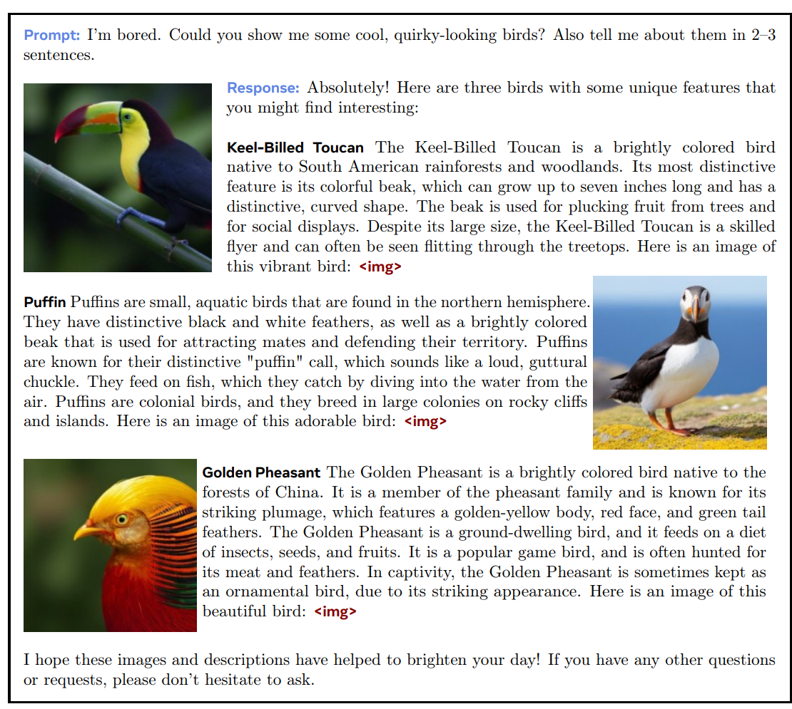

# Chapter 15: Multimodal Models — From CLIP to the Omni Model

## Learning Objectives

&emsp;&emsp;In the previous fourteen chapters, almost everything we covered centered on **text-only language models**. Yet human beings receive information through far more channels than text—vision and hearing are equally important interfaces for an intelligent agent to understand the world. **Multimodal models** are designed to endow models with the ability to "read text, see images, and even hear sounds."

After completing this chapter, you will be able to:

1. **Understand the fundamental motivation for multimodal modeling**: Why do we need to move from pure text to the Omni Model? What are the challenges of multimodal extension given Transformer's dominance?
2. **Master the contrastive learning paradigm of CLIP/SigLIP**: Understand the mathematical principles and engineering implementation of image-text alignment, as well as subsequent improvements.
3. **Understand the working mechanism of the Vision Transformer (ViT)**: Why can ViT replace ResNet as the mainstream visual encoder?
4. **Master the standard VLM paradigm**: The core idea and training process of the three-stage architecture—Vision Encoder + Adapter + LM.
5. **Understand the evolution of representative VLM systems**: Key technical innovations of LLaVA, Qwen-VL, Chameleon, and other models.
6. **Understand the route debate between continuous and discrete representations**: Why did diffusion models ultimately win? Why is discrete tokenization impractical in engineering?

&emsp;&emsp;As the final lecture of the course, this chapter plays a "bridging" role—it extends the language model knowledge learned earlier and provides a panoramic overview of today's mainstream multimodal systems.

---

## 15.1 Introduction: Why Do We Need Multimodality?

&emsp;&emsp;If you have made it this far from Chapter 1, you have already discussed the complete toolchain of language models—from tokenization, architecture, and training to alignment. But stop and think about a question: **Can pure-text LLMs (Large Language Models, 大语言模型) handle the photo you just took with your phone, or the voice message your friend sent you?**

&emsp;&emsp;The answer is no. Models like GLM-5.2 and DeepSeek V4 may be powerful, but they are inherently "unable to hear or see" images and audio—they only understand tokens. This means that if we want an LLM to truly become a universal assistant, we must find a way to **"translate" these non-text signals (images, audio) into a language the LLM can understand**. This is the core challenge of multimodal modeling.

> When using GLM-5.2 or DeepSeek V4 on their official websites, you may notice that you can input images. This is because, although they do not support native multimodality, they leverage external visual models (such as OCR or large vision models) to relay the visual information, converting it into text before passing it to these models for inference. This achieves a similar effect to native multimodality.
### 15.1.1 From Pure Text to the Omni Model

&emsp;&emsp;In the AI industry, there is a "north star" goal, namely the so-called **Omni Model (全能模型)**:

- **Input**: Any combination of modalities—it can be images, video, voice, or a mix of these, plus a textual instruction;
- **Output**: Any combination of modalities—generating not only text answers but also images, audio, or even video.

&emsp;&emsp;Today, whether it is Google's Gemini or OpenAI's GPT series, they are all promoted as "natively multimodal", but the specific implementation details have not been made public. The purpose of this lecture is to dissect the design ideas of those publicly disclosed solutions in the open-source community, so that you can see the inner workings of multimodal models.

<div align="center">
  
  <p>Figure 15.1 A panoramic view of multimodal modeling: from pure text to arbitrary-modality input/output</p>
</div>

### 15.1.2 Two Core Questions

&emsp;&emsp;To achieve the Omni Model, two core questions must be addressed:

**Question 1: How to input non-text data?**

&emsp;&emsp;This is the focus of this lecture. Text naturally has a BPE (Byte Pair Encoding, 字节对编码) tokenizer (see Chapter 2) to split it into tokens, but how do we turn continuous signals like pixels and waveforms into vectors the LLM can "read"? We will see two mainstream approaches:

- **Continuous representation**: Use a Vision Encoder to encode the image directly into continuous vectors, then inject them into the LLM (LLaVA, Qwen-VL);
- **Discrete representation**: First split the image into discrete tokens, then throw the token sequence into the LLM (Chameleon).

**Question 2: How to output non-text data?**

&emsp;&emsp;This is only briefly mentioned in this lecture. The current mainstream solution is the **Diffusion Model**, which starts from pure noise and gradually denoises to eventually generate images, audio, or video. The Transformer here plays the role of "understanding" and "controlling signal generation"—the real "paintbrush" is the diffusion model. This is also why this lecture's title emphasizes "Alignment"—aligning the language model's understanding capability with the diffusion model's generation capability.

### 15.1.3 Extending the Concept of Tokens

&emsp;&emsp;In Chapter 2, we learned that a token is the basic unit of text—a token represents "some semantically meaningful unit of information." A single English letter or a single pixel, by itself, is meaningless; they must be combined to convey information.

&emsp;&emsp;This observation generalizes to all modalities:

| Modality | Smallest unit | Tokenized representation |
|------|------------|---------------|
| Text | Character | Word fragments (BPE) |
| Image | Pixel | Image patches (ViT) / discrete codes (VQ-VAE) |
| Audio | Waveform samples | Short-time spectrum frames, discrete codes |
| Video | Single-frame pixels | Spatiotemporal patches |

&emsp;&emsp;The core philosophy of multimodal modeling is: **"translate" all modalities into tokens, then hand them to the Transformer, the "unified interface", for processing**. This is also why Transformer works across all modalities—it doesn't care where the tokens come from, only about the statistical patterns between them.

---

## 15.2 CLIP: Contrastive Language-Image Pre-training

&emsp;&emsp;In the multimodal field, [CLIP (Contrastive Language-Image Pre-training)](https://arxiv.org/pdf/2103.00020) is a seminal work that cannot be bypassed. It was proposed by OpenAI in 2021 and remains a foundational component of modern VLMs (Vision-Language Models, 视觉语言模型). Understanding CLIP's design philosophy is the first step to understanding the entire multimodal ecosystem.

### 15.2.1 Historical Background: From ImageNet to the Foundation Model Era

&emsp;&emsp;Before CLIP appeared, the mainstream paradigm in computer vision was: researchers manually annotated a large-scale classification dataset (e.g., ImageNet with 1.2 million images and 1,000 categories), then trained a ResNet (Residual Network, 残差网络) to fit those labels. This is a **supervised learning** paradigm, where the labels are manually curated and fixed.

&emsp;&emsp;However, around 2020, a paradigm shift occurred in the language model field: GPT-2 and GPT-3 demonstrated that **by crawling massive amounts of text from the internet and having the model predict the next token on its own**, remarkable language capabilities could be learned. This "Foundation Model" paradigm no longer relies on carefully annotated datasets.

&emsp;&emsp;The question arises: **What is the equivalent of "crawling the internet" for images?**

&emsp;&emsp;OpenAI's researchers gave a clever answer: the internet naturally contains a large number of "image-text pairs." Almost every image on a webpage is accompanied by a caption, an adjacent title, an alt attribute, etc. CLIP leveraged this kind of "natural annotation."

<div align="center">
  
  <p>Figure 15.2 Naturally occurring image-text pairs on the web: every image is "annotated" by multiple text sources (alt attributes, captions, surrounding text)</p>
</div>

> **Key insight**: Crawling 400 million (image, text) pairs and letting the model learn "which text describes which image" is cheaper and more general than manually annotating 1.2 million images.

### 15.2.2 The Objective Function: n-way Classification

&emsp;&emsp;CLIP's training objective is strikingly simple. Given a batch of $n$ (image, text) pairs:

<div align="center">
  
  <p>Figure 15.3 CLIP architecture: image and text are encoded separately and dot-producted in a shared space</p>
</div>

&emsp;&emsp;For each image $I_i$, we want its similarity with its corresponding text $T_i$ to be **far higher** than with the other $n-1$ texts $T_j$; and vice versa for each text. This amounts to:

- An **$n$-way classification problem**: For image $I_i$, select the correct $T_i$ from $n$ candidate texts;
- Another **$n$-way classification problem**: For text $T_i$, select the correct $I_i$ from $n$ candidate images.

&emsp;&emsp;The two losses summed together form CLIP's total loss. In essence, this formulates image-text matching as a **matrix classification** problem.

```python
import torch
import torch.nn.functional as F

def clip_loss(image_embeds, text_embeds, temperature):
    """
    image_embeds: [n, d]  image features (already normalized)
    text_embeds:  [n, d]  text features (already normalized)
    temperature:  scalar   temperature parameter (learnable)
    """
    # Similarity matrix: [n, n]
    logits = image_embeds @ text_embeds.T * temperature.exp()

    # Labels: diagonal entries are positive
    labels = torch.arange(logits.size(0), device=logits.device)

    # Cross-entropy in both directions
    loss_i2t = F.cross_entropy(logits, labels)        # image→text
    loss_t2i = F.cross_entropy(logits.T, labels)      # text→image
    return (loss_i2t + loss_t2i) / 2
```

<div align="center">
  
  <p>Figure 15.4 Core code for CLIP loss computation: similarity matrix + bidirectional cross-entropy</p>
</div>

&emsp;&emsp;Note a key detail: **the temperature parameter $\tau$ is learnable**. It controls the "sharpness" of the similarity distribution. A small temperature makes the distribution sharper, emphasizing the most similar pair; a large temperature smooths the distribution, emphasizing relative differences. CLIP places the temperature inside `exp()` to ensure it stays positive, avoiding manual tuning.

> **Why does the batch size need to be large?**
>
> &emsp;&emsp;CLIP's loss computes softmax across the entire batch. If the batch size is 1, there's only one candidate, and the classification problem degenerates to a trivial case; the larger the batch size, the more "negative samples" there are, and the stronger the contrastive signal. CLIP commonly used a batch size of **32,768** during training, which was an impressive scale back in 2021.

### 15.2.3 Data Scale and Processing

&emsp;&emsp;OpenAI crawled approximately **400 million (image, text) pairs** at the time. Note that this dataset **was never released publicly**, sparking community discussion about "training closed-source models with private data." In response, **OpenCLIP** reproduced and extended CLIP:

- Data source: [LAION-5B](https://arxiv.org/abs/2210.08402) (public 5 billion image-text pairs);
- Training scale: trained on 5B data, covering multiple model sizes;
- Engineering trick: even used CLIP itself to **filter data**. Specifically, a small CLIP scores all data, keeping only the high-confidence subset to train a larger CLIP. This kind of "bootstrapping" can be effective, but it may also amplify the original data's biases.

&emsp;&emsp;**Image preprocessing**:

&emsp;&emsp;Neural networks don't like "dynamic" things, and raw image resolutions vary wildly. CLIP's processing is straightforward:

1. Use bicubic interpolation to scale the short side to 336px;
2. Center-crop to a 336×336 square;
3. Normalize and feed into the visual encoder.

&emsp;&emsp;This pipeline works well for ImageNet-style "centered subject" images, but loses detail for content-rich images like document screenshots or satellite imagery. This issue was addressed in LLaVA OneVision, which we'll cover in Section 15.4.

### 15.2.4 The Visual Encoder: Vision Transformer (ViT)

&emsp;&emsp;CLIP's team experimented with both ResNet and Vision Transformer as the visual backbone network, and the conclusion was that **ViT (Vision Transformer) performed better**. When people say "CLIP" today, they usually mean the ViT version.

<div align="center">
  
  <p>Figure 15.5 Vision Transformer architecture</p>
</div>

&emsp;&emsp;ViT's core idea is "treat the image as a sequence of tokens":

1. Split the image into fixed-size patches (CLIP defaults to 14×14 pixels);
2. Linearly project each patch into a vector—this is a "visual token";
3. Add **1D positional encoding** to all tokens (experiments showed 2D positional encoding offers no significant advantage over 1D for classification);
4. Pass through a standard Transformer encoder;
5. Finally, use an **attention pooling** layer to aggregate all tokens into a single vector.

> **What is Attention Pooling?**
>
> &emsp;&emsp;The simple approach is to average all tokens (mean pooling), but CLIP's team found that using a **learnable query vector** to attend to all tokens worked better. In other words, the model can learn to "focus on which patches." This adds a "soft attention" output layer to the visual encoder.

&emsp;&emsp;**CLIP's best configuration**:

- Visual side: **ViT-L/14@336px** (Large scale, 14×14 patches, 336×336 input);
- Text side: GPT-2-style Transformer (~63 million parameters), input is `[BOS] + text + [EOS]`, taking the last-layer activation at the `[EOS]` position as the entire text's representation.

### 15.2.5 Core Results and Significance

&emsp;&emsp;CLIP's most striking experiment is **zero-shot ImageNet classification**:

&emsp;&emsp;Traditional ImageNet training requires 1.2 million manually annotated images with 1,000 class labels; yet after training on 400 million web image-text pairs, CLIP, **without any downstream fine-tuning**, surpasses dedicated ResNet models on ImageNet (see Figure 15.2(3)).

&emsp;&emsp;The approach constructs 1,000 prompt templates (e.g., "a photo of a {class}"), dot-products the image features with these 1,000 text features, and picks the highest-scoring class. This process is called zero-shot classification.

<div align="center">
  
  <p>Figure 15.6 Contrastive learning vs. direct text generation: computational efficiency comparison</p>
</div>

&emsp;&emsp;Ablation experiments also revealed a counter-intuitive fact: **letting the model directly generate complete caption text from an image performs worse than contrastive learning**. This indicates that for the goal of "obtaining the image's semantic representation," precisely modeling the token sequence is not so important—the contrastive signal is sufficient.

> **CLIP's methodological legacy**:
> 1. Massive weakly supervised data > manually curated labeled data;
> 2. Contrastive learning is an efficient "semantic alignment" tool;
> 3. A simple ViT encoder is sufficient;
> 4. Zero-shot capability is a byproduct of scale.

### 15.2.6 Limitations of CLIP

&emsp;&emsp;Despite CLIP's far-reaching impact, it has several obvious shortcomings:

- **Designed for image classification**, so the learned features lean toward "high-level semantics" and are insensitive to fine-grained information (e.g., OCR, counting, spatial relationships);
- **Relies on very large batch sizes** (32K level); performance drops sharply with small batches;
- **Softmax is computed across the entire batch**, making it impossible to decompose independently on data subsets, and difficult to parallelize;
- **Almost incapable of fine-grained text information** in images (e.g., documents, tables, subtitles).

&emsp;&emsp;These limitations directly inspired SigLIP, which we'll cover in the next section, as well as techniques like AnyRes for handling high-resolution images.

---

## 15.3 SigLIP: A More Efficient Engineering Improvement on CLIP

&emsp;&emsp;[SigLIP (Sigmoid Loss for Language Image Pre-training)](https://arxiv.org/pdf/2303.15343) is an improved version of CLIP proposed by Google in 2023. It matches or exceeds CLIP on many metrics, but is more engineering-friendly. In this section, we focus on the "small changes" that make it so effective.

### 15.3.1 From Softmax to Sigmoid Loss

&emsp;&emsp;CLIP's loss is essentially an $n$-way softmax classification problem. SigLIP replaces it with a **pairwise binary classification problem**:

<div align="center">
  
  <p>Figure 15.7 SigLIP loss: each (image, text) pair is judged independently</p>
</div>

&emsp;&emsp;Specific approach:

- Diagonal elements (positive pairs) → label = +1
- Off-diagonal elements (negative pairs) → label = -1
- Use the **sigmoid function + binary cross-entropy** to compute the loss pair by pair

```python
def siglip_loss(image_embeds, text_embeds, temperature, bias):
    """
    Key difference from CLIP: each pair is judged independently, no in-batch softmax needed
    """
    logits = image_embeds @ text_embeds.T * temperature + bias
    targets = torch.diag(torch.full((logits.size(0),), -1.0))  # off-diagonal
    targets.fill_diagonal_(1.0)  # diagonal is +1
    loss = -F.logsigmoid(targets * logits)  # each element computed independently
    return loss.mean()
```

&emsp;&emsp;The "amount of code" for this change is small, but it brings three profound impacts:

| Dimension | CLIP | SigLIP |
|------|------|--------|
| Loss type | Cross-batch softmax CE (Cross-Entropy) | Per-pair independent sigmoid CE |
| Batch size effect | Strongly coupled (changing batch = changing loss) | Fully decoupled |
| Computational decomposability | Not decomposable | Independent per-pair computation |

### 15.3.2 Decoupling Loss from Batch Size

&emsp;&emsp;CLIP's "must use a large batch" is its biggest engineering pain point. Why? Because CLIP's negative samples come from the same batch—the larger the batch, the more negative samples there are, and the loss function itself keeps changing.

&emsp;&emsp;SigLIP's loss is **insensitive to batch size**. The reason is that each pair's loss is computed independently, and the batch just stacks multiple independent pairs together. Experiments show:

- **Small batches (<16K)**: SigLIP is far superior to CLIP;
- **32K batches**: The two perform comparably;
- **Larger batches**: SigLIP is slightly better, but the improvement slows down.

&emsp;&emsp;This means that for small teams or researchers with limited compute, SigLIP is a "much friendlier" choice.

### 15.3.3 Parallel Strategies and Training Efficiency

&emsp;&emsp;CLIP's loss needs the entire batch's similarity matrix computed before doing softmax, which is a bottleneck in large-scale distributed training because all GPUs need to "see" each other's embeddings.

&emsp;&emsp;SigLIP's natural decomposability makes **a DDP (Distributed Data Parallel)-like parallel strategy** possible:

<div align="center">
  
  <p>Figure 15.8 SigLIP cross-device parallelism: each device computes only its own subset of pairs</p>
</div>

&emsp;&emsp;Specific steps:

1. Each GPU computes embeddings only for its own subset of (image, text) pairs;
2. Through **all-gather** or **shuffle** communication, each GPU obtains all pairs' embeddings;
3. Each GPU independently computes the sigmoid loss for its own subset of pairs.

&emsp;&emsp;**Training efficiency comparison**:

| Model | Hardware | Training Time |
|------|------|----------|
| CLIP | 256 × TPUv3 | 10 days |
| SigLIP | 32 × TPUv4 | **5 days** |

&emsp;&emsp;A single TPUv4 actually has less compute than a TPUv3, but SigLIP's training time is still halved. The reason is that SigLIP can match CLIP's 256-card results with just 32 cards (because it doesn't need such a large batch), which greatly reduces overall communication overhead and energy consumption.

&emsp;&emsp;**Dataset (WebLI)**:

&emsp;&emsp;Google trained SigLIP on the **WebLI (Web Language Image dataset)**:

- Scale: O(billion) (tens of billions) image-text pairs;
- Preprocessing: automatic OCR to extract text from images; use model scoring to keep the top 10% highest-quality data;
- Multilingual: covers **100 languages**, another advantage of SigLIP over CLIP.

> **Why is SigLIP important?**
>
> &emsp;&emsp;It demonstrates that **there is still room to optimize contrastive learning's objective function**. CLIP's softmax is not the "only correct" choice—sigmoid, a simpler loss, is actually more engineering-friendly. This "small change, big payoff" is a worthwhile engineering philosophy.

---

## 15.4 VLM Architecture: Injecting Images into Language Models

&emsp;&emsp;CLIP learned the joint "image-text" space, but its capability is limited to matching and classification. In other words, **it cannot "describe an image in words."**

&emsp;&emsp;The **VLM (Vision-Language Model)** is the standard form of today's multimodal dialogue systems. Its core idea is:

> **Encode the image into vectors, then "squeeze" them into the language model, letting the language model generate natural language answers based on the image content.**

&emsp;&emsp;In this section, we use the LLaVA series to dissect the standard VLM paradigm.

### 15.4.1 The Standard Paradigm: Encoder + Adapter + LM

&emsp;&emsp;Almost all mainstream VLMs follow a three-stage architecture:

```
┌──────────────┐    ┌────────────┐    ┌──────────────────┐
│  Vision      │    │            │    │  Language        │
│  Encoder     │ ─► │  Adapter   │ ─► │  Model (LLM)     │
│  (CLIP/SigLIP)│   │  (W)       │    │  (Vicuna/Qwen)   │
└──────────────┘    └────────────┘    └──────────────────┘
   Image → visual vectors  dim alignment/feature transform  text generation conditioned on vision
```

&emsp;&emsp;Each component's role:

1. **Vision Encoder**: Encodes the image into a sequence of vectors (usually a few hundred patch tokens). Typically uses pre-trained CLIP or SigLIP weights directly, **frozen** during training;
2. **Adapter/Projector**: A small "bridge" module (linear layer, MLP, or cross-attention) that "translates" visual vectors into "pseudo-text tokens" the LLM can understand;
3. **Language Model**: A pre-trained LLM that receives the mixed sequence of "text tokens + visual tokens" and autoregressively generates answers.

&emsp;&emsp;This is essentially a kind of **"mid-training" or "post-training"** approach. Specifically, we don't modify the two large pre-trained modules—we just "wire" them together in the middle, with training cost far lower than training a multimodal model from scratch.

### 15.4.2 LLaVA: The Pioneering Open-Source VLM

&emsp;&emsp;[LLaVA (Large Language and Vision Assistant)](https://arxiv.org/pdf/2304.08485) was released in 2023 by Microsoft and the University of Wisconsin as an open-source VLM. Its performance was not as good as GPT-4V, but it **fully open-sourced both the model weights and the training data**, giving the community its first clear view of a VLM's internal structure.

<div align="center">
  
  <p>Figure 15.9 LLaVA architecture: CLIP + linear projection + Vicuna</p>
</div>

&emsp;&emsp;**LLaVA's three-component choices**:

| Component | Choice | Notes |
|------|------|------|
| Vision Encoder | **CLIP ViT-L/14** | The strongest open-source visual encoder at the time |
| Projector | **Single-layer linear matrix $W$** | The simplest "translator" |
| Language Model | **Vicuna** | LLaMA fine-tuned on ShareGPT conversation data |

&emsp;&emsp;**Training data generation** (key innovation):

&emsp;&emsp;LLaVA's team faced an awkward dilemma: "image-text dialogue" data is very scarce on the internet, because most image-text pairs are "image + single-sentence caption," with no "Q-A" conversations.

&emsp;&emsp;They came up with a clever solution: **use GPT-4 to synthesize dialogue data**.

<div align="center">
  
  <p>Figure 15.10 LLaVA's data generation pipeline: based on COCO annotations + GPT-4 synthesis</p>
</div>

&emsp;&emsp;Specific steps:

1. Use the **MS COCO** dataset as the foundation (which already has high-quality bounding boxes + captions);
2. Package each image's annotations (categories, positions, relationships, captions) into a prompt;
3. Have GPT-4 generate three types of dialogues based on this information:
   - **Conversation**: Daily Q&A based on captions;
   - **Detailed Description**: Descriptions more detailed than captions;
   - **Complex Reasoning**: Questions requiring logical reasoning.

&emsp;&emsp;In the end, they obtained **158K synthesized dialogues** for training LLaVA.

> **On "synthesizing data with GPT-4"**
>
> &emsp;&emsp;This sparked widespread discussion in 2023. LLaVA's team openly admitted "unabashedly distilling GPT-4"—they didn't shy away from using the strongest closed-source model's capabilities to train their open-source model. From an engineering perspective, this is pragmatic; but from a research perspective, **this is also why the capability ceiling of open-source VLMs is still constrained by closed-source models**.

&emsp;&emsp;**Two-stage training**:

| Stage | Training Goal | Frozen Components |
|------|----------|----------|
| Stage 1 (Alignment) | Make image vectors "look like" natural language tokens | Vision Encoder + LM |
| Stage 2 (Instruction fine-tuning) | Fine-tune on multimodal dialogue | Vision Encoder |

&emsp;&emsp;Stage 1 only trains the linear projection $W$, teaching it that "image vectors and text vectors should be aligned in space"; Stage 2 unfreezes the LM, letting it learn "how to answer questions after seeing an image."

<div align="center">
  
  <p>Figure 15.11 LLaVA inference example: identifying "unusual" content</p>
</div>

&emsp;&emsp;LLaVA's paper has a classic example: a user asks "What's unusual about this image?" (a photo of someone ironing clothes on the back of a minivan), and the model answers "a man ironing on the back of a minivan is unusual." The key point is that **the user didn't explicitly ask "what's unusual"**, but the model proactively identified the anomaly. This proactive observation ability was quite impressive at the time.

### 15.4.3 LLaVA OneVision: Multi-Image and Video

&emsp;&emsp;LLaVA 1.5 and LLaVA-Next are incremental improvements. The [LLaVA OneVision](https://arxiv.org/pdf/2408.03326) released in 2024 expanded the goal: handling more complex inputs like multiple images and video.

<div align="center">
  
  <p>Figure 15.12 LLaVA OneVision architecture: SigLIP + 2-layer MLP + Qwen-2</p>
</div>

&emsp;&emsp;**Key upgrades**:

| Component | LLaVA | LLaVA OneVision |
|------|-------|-----------------|
| Vision Encoder | CLIP ViT-L/14 | **SigLIP** |
| Projector | Linear layer | **2-layer MLP** |
| Language Model | Vicuna (13B) | **Qwen-2 72B** |
| Supported inputs | Single image | **Single image / Multi-image / Video** |

&emsp;&emsp;**AnyRes: The Core Innovation in High-Resolution Processing**

&emsp;&emsp;The most noteworthy engineering innovation in LLaVA OneVision is **AnyRes**. The motivation is as follows:

&emsp;&emsp;Recall CLIP—it resizes the image to 336×336 and then crops it to a square. This is fine for "centered subject" ImageNet-style images, but bad for **document screenshots, charts, and long images**, because the text becomes too small to read.

<div align="center">
  
  <p>Figure 15.13 AnyRes principle: global view + multiple 336×336 crops</p>
</div>

&emsp;&emsp;AnyRes's approach:

1. **One stream**: Downsample and encode the entire image (capturing global information);
2. **Multi-stream**: Cut the original image into up to 9 chunks of 336×336, encoding each separately with the vision encoder;
3. **Concatenate**: Stitch the global features + chunk features into a token sequence;
4. **Downsample**: If there are too many tokens, use bilinear interpolation to downsample and control the total length.

&emsp;&emsp;**Resolution strategies for three modalities**:

<div align="center">
  
  <p>Figure 15.14 LLaVA OneVision's differentiated handling for single image / multi-image / video</p>
</div>

&emsp;&emsp;**Terminology note**: The **crop** and **tile** terms mentioned here are similar in meaning—both refer to a fixed-size (usually 336×336) sub-image chunk cut from a high-resolution image. Each crop/tile is fed into the vision encoder separately, producing a set of visual tokens. The difference is just convention: the CLIP era preferred "crop," while LLaVA OneVision's paper prefers "tile."

| Input type | Strategy | Reason |
|----------|------|------|
| Single image | High resolution (full + up to 9 crops) | Single image monopolizes the token budget, can be examined carefully |
| Multiple images | Fewer tiles per image (e.g., 1-4) | Token budget is divided equally; many images must all fit into the context |
| Video | Low resolution/sparse frames (up to 32 frames) | Videos are long; avoid repeated frames dominating training |

&emsp;&emsp;**Data and training**:

&emsp;&emsp;LLaVA OneVision continues to uphold the "quality over quantity" philosophy:

<div align="center">
  
  <p>Figure 15.15 LLaVA OneVision's data composition</p>
</div>

&emsp;&emsp;The training process is divided into three stages:

<div align="center">
  
  <p>Figure 15.16 LLaVA OneVision's three-stage training pipeline</p>
</div>

1. **Stage 1 (Alignment)**: Train only the projector, lock the rest;
2. **Stage 2 (Knowledge Injection)**: High-quality knowledge data, training more parameters;
3. **Stage 3 (Task Fine-tuning)**: Downstream task data, full model training.

### 15.4.4 Cross-Modal Transfer: Emergent Generalization Capability

&emsp;&emsp;The most interesting finding from LLaVA OneVision is **Cross-Modal Transfer**:

<div align="center">
  
  <p>Figure 15.17 Cross-modal transfer example: trained on single images, can perform multi-image tasks at test time</p>
</div>

&emsp;&emsp;Specific examples:

- **Chart + Table joint reasoning**: The training data only contains "single chart" or "single table," but the model can dialogue about "chart + table combinations" at test time;
- **GUI Agent**: The training data only contains "single-image OCR + relational reasoning," but the model can analyze multi-step screenshots and perform interface operations;
- **Video object tracking**: The training data only contains "single-image visual prompting (circling a target)," but the model can do continuous tracking on video.

<div align="center">
  
  <p>Figure 15.18 GUI Agent capability: single-image OCR training → multi-step screenshot analysis</p>
</div>

<div align="center">
  
  <p>Figure 15.19 Video object tracking: single-image visual prompting → video cross-frame tracking</p>
</div>

<div align="center">
  
  <p>Figure 15.20 LLaVA OneVision's capability curves at different training stages</p>
</div>

&emsp;&emsp;This phenomenon is the core characteristic that distinguishes VLMs from traditional supervised learning: **tasks transfer spontaneously to each other**. If a capability has been trained on enough related tasks, it can "extrapolate" to new scenarios. This is the charm of the foundation model paradigm.

---

## 15.5 The Qwen-VL Series: The Evolution of Industrial-Grade VLMs

&emsp;&emsp;If LLaVA is the "open-source demonstration from academia," then the **Qwen-VL series** is the "industrial-grade, continuously refined representative." From 2023 to the present, the Qwen team has released a new version almost every 6-12 months, with each version bringing significant **engineering details** optimization. This section walks through their technical evolution chronologically.

### 15.5.1 Qwen-VL: Cross-Attention Adapter

<div align="center">
  
  <p>Figure 15.21 Overview of Qwen-VL's three-stage training</p>
</div>

&emsp;&emsp;**Architecture**:

| Component | Choice |
|------|------|
| Vision Encoder | OpenCLIP ViT-bigG (14×14 patch) |
| Adapter | Single-layer **cross-attention** + 2D positional encoding → fixed 256 tokens |
| Language Model | Qwen-7B |
| Special tokens | ``, `<box>`, `<ref>` |

&emsp;&emsp;LLaVA's Adapter is a simple linear projection; [Qwen-VL](https://arxiv.org/pdf/2308.12966) uses a **single-layer cross-attention** instead. Specifically, it takes the visual vectors as keys/values and uses a set of learnable queries (fixed at 256) to "query" the visual information. This way, regardless of the input image's size, the result is always compressed to 256 fixed-length tokens, easy to concatenate with text.

&emsp;&emsp;The design of **special tokens** is Qwen-VL's signature:

- ``: Marks image boundaries;
- `<box>`: Embeds detection box coordinates in text (e.g., "Where is `<box>cat</box>` in the image?");
- `<ref>`: Cross-image references (e.g., "What does the object in Figure 1 look like in Figure 2?").

&emsp;&emsp;These special tokens let the model "draw" detection boxes and conduct cross-image dialogues. This kind of fine-grained capability was relatively rare in early VLMs.

&emsp;&emsp;**Three-stage training**:

<div align="center">
  
  <p>Figure 15.22 Qwen-VL Stage 1 details</p>
</div>

<div align="center">
  
  <p>Figure 15.23 Qwen-VL Stage 2 details</p>
</div>

1. **Stage 1**: Large-scale, low-quality data; freeze the LM, train the vision encoder + adapter;
2. **Stage 2**: High-quality task data (VQA, chart QA, etc.); train all parameters;
3. **Stage 3**: Instruction fine-tuning; freeze the vision encoder, train the adapter + LM.

&emsp;&emsp;**Capability showcase**:

<div align="center">
  
  <p>Figure 15.24 Qwen-VL's capabilities: bilingual Chinese/English, code understanding, object detection, OCR</p>
</div>

### 15.5.2 Qwen2-VL: Dynamic Resolution and M-RoPE

&emsp;&emsp;[Qwen2-VL](https://arxiv.org/pdf/2409.12191) (released in 2024) made three key upgrades on top of Qwen-VL.

&emsp;&emsp;**Upgrade 1: Larger Visual Backbone**

&emsp;&emsp;The vision encoder was upgraded from ViT-bigG to a **675M-parameter** ViT, a significant increase in scale.

&emsp;&emsp;**Upgrade 2: Dynamic Resolution**

&emsp;&emsp;Previously, VLMs all resized images to a fixed size (336×336, 448×448, etc.); Qwen2-VL introduced a **dynamic resolution** mechanism:

- Each 224×224 patch is encoded separately with ViT;
- Every 2×2 patches are compressed along the channel dimension → producing 66 tokens per group;
- Different resolution images produce different numbers of visual tokens, but the **downsampling rate is fixed** at 4 patches per group, producing 66 tokens.

<div align="center">
  
  <p>Figure 15.25 Qwen2-VL architecture: dynamic resolution + M-RoPE</p>
</div>

&emsp;&emsp;**Upgrade 3: M-RoPE (Multimodal Rotary Position Embedding, 多模态旋转位置编码)**

&emsp;&emsp;This is Qwen2-VL's most core innovation. In Chapter 4 we learned about **RoPE** (Rotary Position Embedding). Its core property is that the attention inner product depends only on the **relative distance** between tokens. Traditional RoPE is 1D, encoding tokens by their position in the sequence.

&emsp;&emsp;But multimodal input has **2D or even 3D structure**:

- Images have (height, width);
- Videos have (time, height, width).

&emsp;&emsp;**M-RoPE** generalizes RoPE to multiple dimensions: for each patch/token, the position becomes a triple $(t, h, w)$, corresponding to time, height, and width respectively. RoPE is computed separately for each dimension, and the results are concatenated.

<div align="center">
  
  <p>Figure 15.26 M-RoPE principle: 3D positional encoding (time, height, width)</p>
</div>

&emsp;&emsp;Intuitively, M-RoPE lets the model naturally distinguish two patches that are "spatially adjacent but temporally different" (e.g., pixels at the same position in two video frames), which cannot be expressed with traditional 1D positional encoding.

&emsp;&emsp;**Video support**:

&emsp;&emsp;Qwen2-VL supports 2 fps sampling with up to 16,384 video tokens—enough to cover several minutes of video.

<div align="center">
  
  <p>Figure 15.27 Qwen2-VL's capabilities showcase</p>
</div>

### 15.5.3 Qwen3-VL: Interleaved M-RoPE and DeepStack

&emsp;&emsp;[Qwen3-VL](https://arxiv.org/pdf/2511.21631) (released in 2025) focuses not on "sweeping architectural changes," but on a **series of engineering refinements**. Liang particularly emphasized in the original lecture: "These are not big structural changes, but they do affect model quality."

&emsp;&emsp;**Five key improvements**:

<div align="center">
  
  <p>Figure 15.28 Qwen3-VL overview</p>
</div>

**Improvement 1: Stronger LM Backbone**

&emsp;&emsp;The Qwen-3 series (Dense/MoE (Mixture of Experts, 混合专家模型), up to 235B-A22B), supports **256K context**. This is crucial for processing long videos and long documents.

**Improvement 2: SigLIP-2 Visual Encoder**

&emsp;&emsp;The architecture is the same as SigLIP, but with updated data and training recipes. **Key advantage: backward compatible with SigLIP**, can be replaced seamlessly.

**Improvement 3: Interleaved M-RoPE**

&emsp;&emsp;Qwen2-VL's M-RoPE is arranged segmentally, e.g., the RoPE components inside a token are $[t, t, t, t, w, w, w, w, h, h, h, h]$—**the time dimension is all low-frequency, and the spatial dimensions are all high-frequency**.

&emsp;&emsp;Qwen3-VL changes to **interleaved arrangement**: $[t, w, h, t, w, h, t, w, h, t, w, h]$. This way, all dimensions are "exposed" to both low and high frequencies, making the model more sensitive to all positional information.

**Improvement 4: Explicit Video Timestamps**

&emsp;&emsp;Previously, video timestamps were implicit in positional encodings. Qwen3-VL turns "0 seconds" and "2 seconds" into actual referenceable tokens. Users can directly ask "What happened after 2 seconds?"

**Improvement 5: DeepStack Adapter**

&emsp;&emsp;Traditional VLM architecture is "vision encoder → projector → LM," with the vision encoder's information injected into the LM **only once** through the projector. Qwen3-VL introduces **DeepStack**: injecting the vision encoder's **multiple layers'** outputs into the LM's **different layers** respectively.

<div align="center">
  
  <p>Figure 15.29 Qwen3-VL pre-training 4 stages + post-training 3 stages</p>
</div>

&emsp;&emsp;The motivation is that different layers of the vision encoder learn features at different levels of abstraction (shallow = edges/textures, deep = semantics), and different LM layers require different granularities of visual information. DeepStack lets "fine-grained vision" and "coarse-grained semantics" be fused multiple times within the LM, which is more flexible than one-time injection.

**Improvement 6: Square-Root Normalized Per-Token Loss**

&emsp;&emsp;Video samples tend to be very long (thousands of tokens), so if standard cross-entropy is used, one video sample contributes far more to the total loss than a short text sample, which biases the training data distribution heavily toward video.

&emsp;&emsp;Qwen3-VL introduces a $1/\sqrt{\text{length}}$ normalization factor, which down-weights long samples' per-token loss and avoids data imbalance.

&emsp;&emsp;**Training pipeline (7 stages!)**:

&emsp;&emsp;Qwen3-VL's training pipeline is very complex:

- **Pre-training 4 stages**: Train adapter → 8K full parameters → 32K full parameters → 256K full parameters;
- **Post-training 3 stages**: Long CoT (Chain of Thought, 思维链) SFT → knowledge distillation → reinforcement learning.

<div align="center">
  
  <p>Figure 15.30 Qwen3-VL evaluation results</p>
</div>

&emsp;&emsp;Liang remarked in the original lecture: "Pipelines are getting quite complicated now. If you look at the final results, this is indeed a pretty good model. Qwen models are actually quite strong."

&emsp;&emsp;**What this section teaches us**:

&emsp;&emsp;Progress in the VLM field increasingly relies on **systematic engineering optimization**, specifically embodied in fine-grained adjustments across data, training pipeline, and loss design. Simply changing the architecture can hardly bring qualitative changes anymore—**polishing the details** is the key to success.

---

## 15.6 Chameleon: The Exploration of the Discretization Route

&emsp;&emsp;So far, the VLMs we've seen are all **hybrid architectures**—a dedicated Vision Encoder on the visual side, an LLM on the text side, with an Adapter bridging them in the middle.

&emsp;&emsp;[Chameleon (Meta, 2024)](https://arxiv.org/abs/2405.09818) proposes a completely different approach:

> **What if we could treat both images and text as "the same kind of thing"—discrete tokens?**

&emsp;&emsp;If successful, the entire model would be a standard Transformer, from image generation, text generation, to mixed image-text generation, with **unified architecture and unified training** throughout.

### 15.6.1 The Philosophy of Full Tokenization

<div align="center">
  
  <p>Figure 15.31 Chameleon concept: both images and text become discrete tokens</p>
</div>

&emsp;&emsp;Behind this philosophy is the vision of the Omni Model: text, image, audio, and video share the same token space, and the model no longer distinguishes "modality"—it only sees a "token sequence." This kind of unification is indeed appealing from an **aesthetic** standpoint.

<div align="center">
  
  <p>Figure 15.32 Chameleon-generated mixed image-text example</p>
</div>

### 15.6.2 VQ-VAE: The Key Component for Image Discretization

&emsp;&emsp;To convert images into discrete tokens, we need a tool called **VQ-VAE** (Vector Quantized Variational Autoencoder):

<div align="center">
  
  <p>Figure 15.33 VQ-VAE architecture: Encoder + Quantization + Decoder</p>
</div>

&emsp;&emsp;VQ-VAE's workflow:

1. **Encoder**: Image → a set of continuous vectors;
2. **Vector quantization**: Each continuous vector is "rounded" to its nearest codebook entry (codebook size ≈ 8192);
3. **Decoder**: Reconstruct the image from the discrete codes;
4. **Training objective**: Minimize reconstruction error (+ use tricks like the straight-through estimator to handle the non-differentiability of the quantization step).

&emsp;&emsp;**Key parameters**:

- A 512×512 image is split into 1,024 tokens;
- Each token comes from a vocabulary of 8,192 entries;
- The entire training corpus (text + image) requires re-training the BPE tokenizer, because image tokens are entirely new.

&emsp;&emsp;The training process is the same as a standard LM—next-token prediction, with no Adapter and no separate vision encoder. From this perspective, Chameleon is much simpler than LLaVA and Qwen-VL.

### 15.6.3 Training Instability

&emsp;&emsp;However, in actual training, Chameleon encountered **severe instability issues**:

> **"Text and images, despite occupying the same space, just behave very differently. Just calling things discrete tokens isn't hiding the fact that there's an image living there."**

&emsp;&emsp;The root cause is the **entropy difference between the two types of tokens**:

- **Text tokens**: Low entropy—most words are predictable in context, and the model learns them quickly;
- **Image tokens**: High entropy—"I have no idea what exact shade of color this small patch will be," with much higher uncertainty.

&emsp;&emsp;The consequences during training are:

- Parameter norms keep growing;
- Logits exhibit drift;
- Loss oscillates or even diverges.

&emsp;&emsp;**Mitigation measures**: QK Norm (layer normalization on query/key) + Z-loss (an extra regularization term on logits). These tricks allow training to barely converge, but at the cost of elegance.

### 15.6.4 Chameleon's Limitations and the Final Landscape

**Performance layer**: Chameleon's final model performance is **not as good as contemporary hybrid-architecture VLMs**. A key reason is that **discretization inevitably loses information**. VQ-VAE quantizes continuous colors into 8,192 codes, and the reconstructed image itself is lossy; fine-grained tasks like OCR are virtually unusable.

**Paradigm layer**: The VQ-VAE route was once mainstream in the **image generation** field (the latent of early Stable Diffusion was VQ-quantized). But after 2022, **diffusion models** comprehensively surpassed the autoregressive + VQ combination in generation quality:

- Diffusion models denoise directly in continuous latent space;
- No quantization step is needed, so information loss is zero;
- The upper limit of generation quality is higher.

&emsp;&emsp;**The final landscape**:

> **"The current best combination is: continuous encoders + Transformer + diffusion models for generation."**
> —Liang's summary in the original lecture

&emsp;&emsp;This is the common paradigm of almost all frontier multimodal systems today (GPT-4V, Gemini, Qwen-VL, InternVL, etc.):

| Module | Mainstream choice |
|------|----------|
| Visual input | Continuous vector encoders (SigLIP, CLIP) |
| Core architecture | Transformer (autoregressive language model) |
| Visual output | Diffusion models (Stable Diffusion, Imagen, DALL-E 3) |
| Training paradigm | Large-scale multimodal pre-training + instruction fine-tuning + RLHF/RLVR (Reinforcement Learning from Human/Verifiable Rewards) |

&emsp;&emsp;Although Chameleon's "full discrete tokenization" did not become mainstream, its exploration revealed the **difficulty of unifying multimodal architectures**. The reason is that the statistical properties of text and images differ too much; forcing unification actually introduces training difficulties.

---

## 15.7 Summary and Reflections

&emsp;&emsp;This is the final lecture of the CS336 course. We started from the most basic "why do we need multimodality" and made our way to the cutting edge of industrial-grade VLMs. Looking back over the entire chapter, several key insights are worth chewing on:

&emsp;&emsp;**1. The Transformer is the undisputed "unified interface"**

&emsp;&emsp;Whether for text, image, audio, or video, the Transformer is the "optimal solution" at scale. The core challenge of multimodal modeling is not "what architecture to use," but "how to squeeze non-text modalities into the Transformer."

&emsp;&emsp;**2. CLIP's methodological influence is profound**

&emsp;&emsp;The paradigm of contrastive learning + massive weakly supervised data + zero-shot capability, proposed 5 years ago, is still the cornerstone of VLMs. SigLIP's engineering improvements and Qwen-VL's visual encoder choices all follow this line.

&emsp;&emsp;**3. VLM = Encoder + Adapter + LM**

&emsp;&emsp;This three-stage paradigm dominates the current open-source VLM ecosystem. While LLaVA, Qwen-VL, InternVL, and others differ in details, their skeletons are highly similar. The differentiation competition mainly takes place in the "soft" aspects of **data engineering**, **training pipeline**, and **loss design**.

&emsp;&emsp;**4. There is a tension between understanding and generation**

&emsp;&emsp;CLIP/SigLIP only needs "high-level semantics," so 336×336 low resolution is enough; but OCR and document analysis need "fine-grained information," requiring high-resolution solutions like AnyRes. Similarly, the generation side cannot simply use VQ discretization—it must use diffusion models to preserve continuous information. **There is no universal solution** that satisfies all needs.

&emsp;&emsp;**5. The discretization route is elegant but impractical**

&emsp;&emsp;Chameleon's attempt revealed the cost of "full unification." The statistical difference between text and images is too large; forcing discretization introduces training instability and information loss. The combination of **continuous representation + diffusion generation** is the more pragmatic choice today.

&emsp;&emsp;**6. Data is the real moat**

&emsp;&emsp;Whether it's OpenAI's CLIP (400 million unreleased data), LLaVA's 158K synthesized dialogues, or Qwen's multi-stage training data, **data scale and quality** are always the decisive factors in VLM performance. Architectures can be open-sourced, training details can be reproduced, but **high-quality data** is often each company's core secret.

&emsp;&emsp;**7. Cross-modal transfer is an emergent phenomenon**

&emsp;&emsp;LLaVA OneVision demonstrates transfer capabilities like "single-image training → multi-image tasks" and "single-image OCR → GUI Agent"—this is the most fascinating aspect of the foundation model paradigm. **As long as tasks are sufficiently numerous and broad, the model can spontaneously learn general capabilities across tasks.** This stands in stark contrast to the traditional supervised learning paradigm of "one model, one task."

&emsp;&emsp;**8. Industrial-grade VLMs are getting more and more complex**

&emsp;&emsp;Qwen3-VL's 7-stage training, DeepStack cross-layer injection, Interleaved M-RoPE—these engineering details pile up, making a complete VLM training pipeline more complex than early LLMs. **Future breakthroughs in the multimodal field are likely to come from these systematic engineering optimizations**, rather than from single architectural innovations.

---

### Reflection Questions

&emsp;&emsp;After completing this chapter, consider the following questions:

1. **If you were to design a VLM from scratch**, would you choose continuous representation (CLIP route) or discrete representation (Chameleon route)? Why?
2. Which is more efficient, **CLIP's contrastive loss** or **generative caption loss**? Why? (Hint: consider the number of negative samples and computational complexity.)
3. **Why can SigLIP work with small batches?** Explain from the perspective of the loss function.
4. **What are the limitations of AnyRes?** If a super high-resolution image is cut into dozens of patches, will the number of tokens explode?
5. **DeepStack injects visual information into different layers of the LM**. Compared with "one-time injection through the Adapter," what potential problems might this cause?
6. **The root of Chameleon's training instability** is the entropy difference between text and image. If you were to design a loss to alleviate this, how would you do it?

---

## References and Further Reading

- [CLIP (Radford et al., 2021)](https://arxiv.org/abs/2103.00020) — Contrastive Language-Image Pre-training
- [OpenCLIP (Ilharco et al., 2022)](https://arxiv.org/abs/2212.07143) — Open-source reproduction of CLIP
- [SigLIP (Zhai et al., 2023)](https://arxiv.org/abs/2303.15343) — Sigmoid Loss replacing Softmax
- [ViT (Dosovitskiy et al., 2020)](https://arxiv.org/abs/2010.11929) — Vision Transformer
- [LLaVA (Liu et al., 2023)](https://arxiv.org/abs/2304.08485) — The first open-source VLM
- [LLaVA OneVision (Li et al., 2024)](https://arxiv.org/abs/2408.03326) — Multi-image/video VLM
- [Qwen-VL (Bai et al., 2023)](https://arxiv.org/abs/2308.12966)
- [Qwen2-VL (Wang et al., 2024)](https://arxiv.org/abs/2409.12191) — Dynamic Resolution + M-RoPE
- [Qwen3-VL (2025)](https://arxiv.org/abs/2511.21631) — SigLIP-2 + DeepStack + Interleaved M-RoPE
- [Chameleon (Meta, 2024)](https://arxiv.org/abs/2405.09818) — Fully discrete-token multimodal model
- [VQ-VAE (van den Oord et al., 2017)](https://arxiv.org/abs/1711.00937) — Vector Quantized Variational Autoencoder
- [WebLI (Chen et al., 2022)](https://arxiv.org/abs/2209.06794) — Large-scale image-text dataset
- [DeepStack (DeepSeek, 2024)](https://arxiv.org/abs/2406.04334) — Cross-layer vision-language fusion
- [Stanford CS336 (Spring 2026) course website](https://cs336.stanford.edu/)
