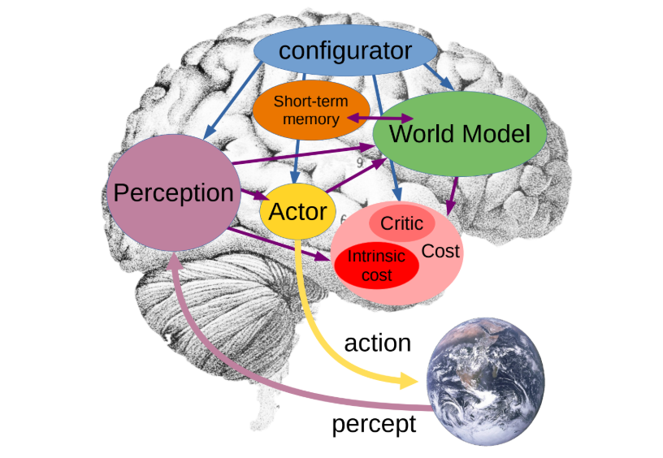
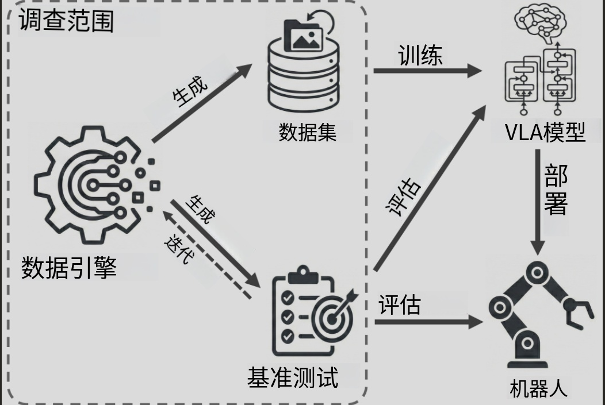
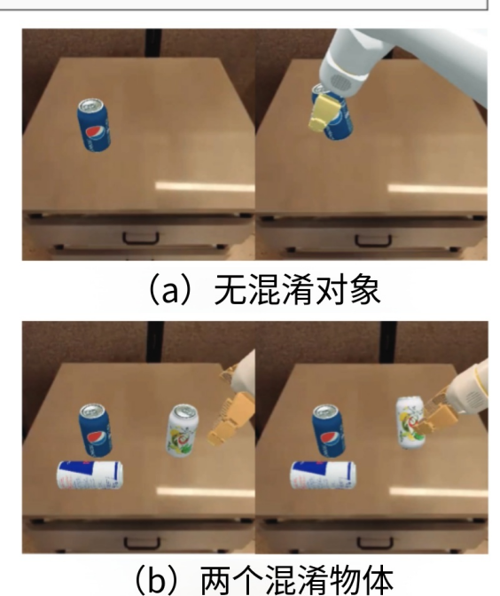
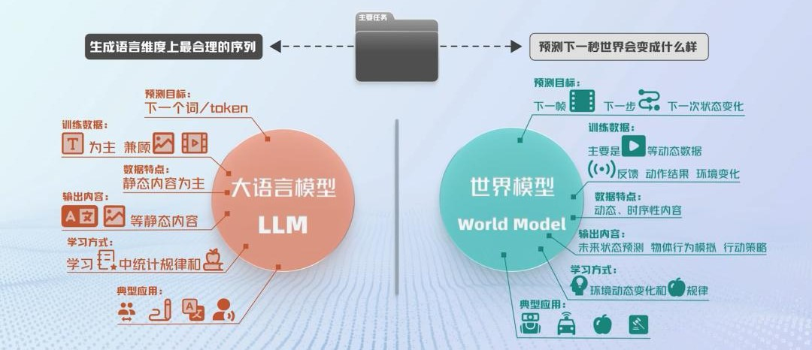
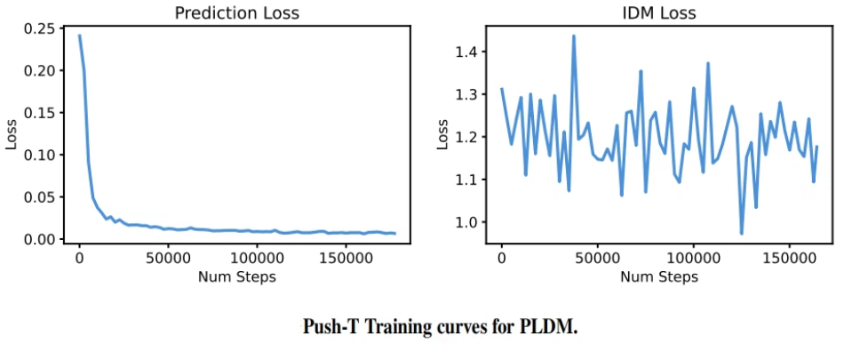
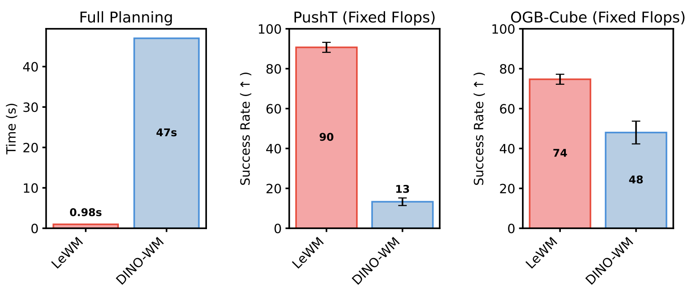
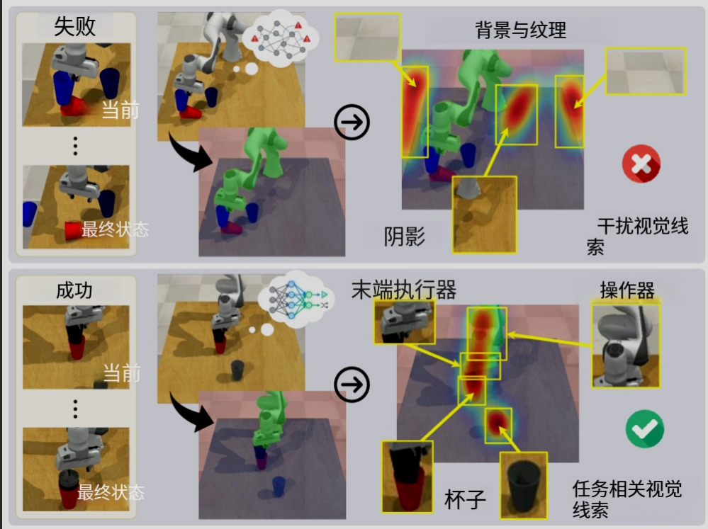
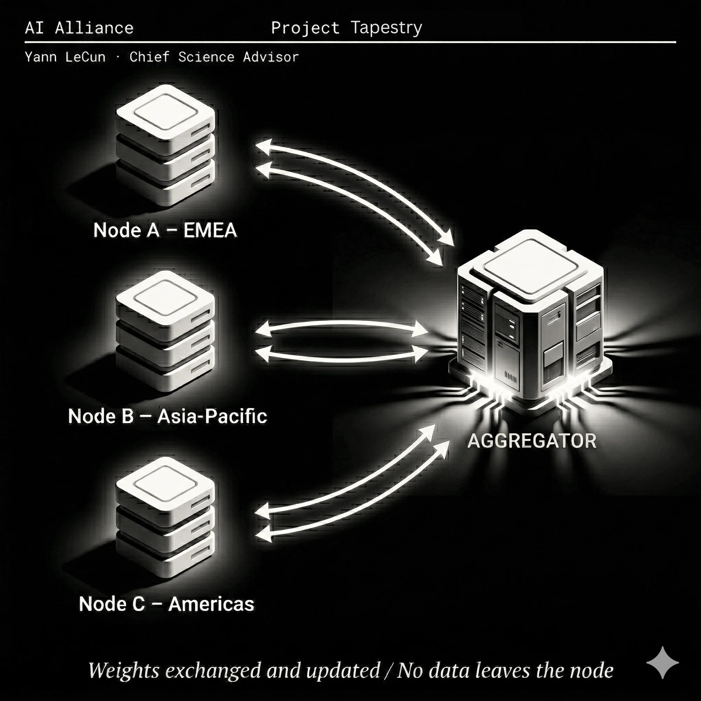
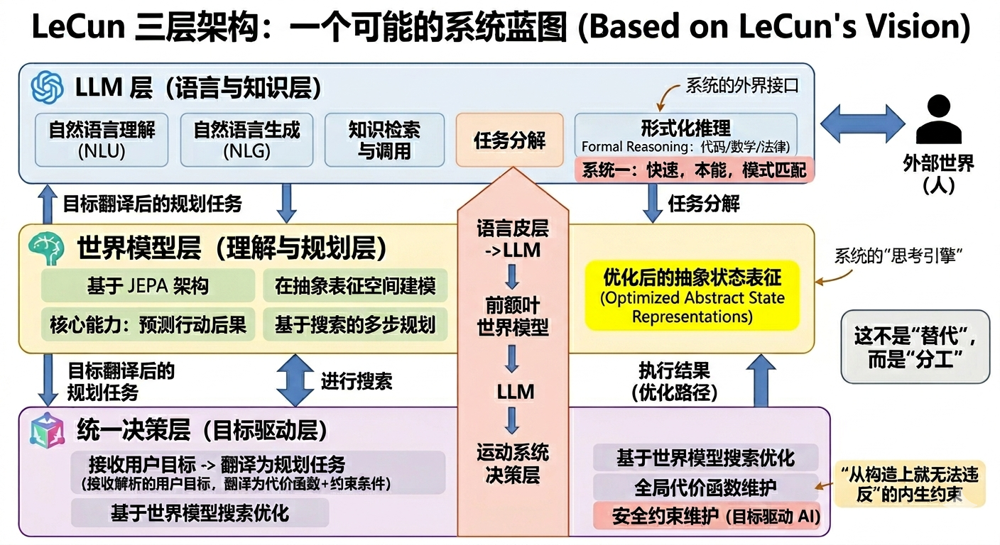

# Where LLMs Are Headed: A Roadmap Based on LeCun's Views

> **Authors**: Xu Hu, Li Shengkang, Jiang Yinhe, Li Youzhen
>
> **Note**: This article takes LeCun's arguments from interviews as its main thread, supplemented by analysis at the engineering and industry levels. It does not represent the only consensus in the industry.

***

## Conclusions First

1. **LLMs are not the endpoint, but they will not disappear.** They will continue to exist as the "language and knowledge interface layer," the "language cortex" of an intelligent system, rather than a complete brain.
2. **"Next-token prediction + scaling" is unlikely to lead to general intelligence.** The two core gaps are: the ability to predict the consequences of actions, and search-based multi-step planning.
3. **VLA has essentially failed in its current paradigm.** LeCun's direct judgment that "VLA pretty much seen as a failure" stems from insufficient reliability, over-reliance on data, and fragile generalization.
4. **The key to a world model is not "drawing the world," but "predicting controllable outcomes in an abstract representation space."** The water-bottle analogy sharply reveals the futility of pixel-level prediction.
5. **The value of JEPA lies in shifting the learning objective from reconstructing details to predicting semantic states; its success or failure hinges on preventing representation collapse.** The most promising current path is the SIGReg direction.
6. **LLMs are fundamentally unsafe, and this problem cannot be fundamentally fixed within the current paradigm.** Objective-Driven AI is the correct architectural direction for safe and controllable agents.
7. **Open-source ecosystems will ultimately win the platform war.** The Tapestry federated training mechanism is LeCun's engineering response to the sovereign AI problem.
8. **The future is more likely a two-system division of labor:** LLMs handle language and knowledge interaction, while world models handle understanding the physical world and planning actions.

***

## 1 Why Are LLMs Not the Endpoint?

LeCun's view is clear from the start: **there is nothing wrong with LLMs themselves.** They have already become the infrastructure for many practical AI products, which we use every day, including LeCun himself. But he believes that **the success of LLMs does not mean they are the correct path to general intelligence (AGI).**

This judgment clearly diverges from many researchers (including some at Google and OpenAI) who believe that continuing to scale up large language models will gradually approach general intelligence.

In LeCun's view, relying solely on next-token prediction and large-scale language modeling is not enough to produce human-level intelligence, *or even the level of intelligence found in many animals—that is, the ability to understand the world, predict the consequences of actions, and engage in long-term planning*. Therefore, **LLMs are an extremely successful and valuable technology, but more like an important component of future intelligent systems, not the final answer.**

Reading this, you may already want to retort: *"LLMs can clearly derive mathematical formulas, explain physical laws, and even assist in research—doesn't that count as 'intelligence'?"*

This rebuttal is very reasonable and is at the heart of the entire debate. LeCun does not deny that LLMs are impressive, but he believes there is a critical "crack" between "performing well" and "being truly intelligent"—and it is this "crack" that determines how far LLMs can go.

**Where exactly is this "crack"? We analyze it in [Section 2](#2-the-two-core-gaps-why-llms-cannot-lead-to-general-intelligence).**

### 1.1 Meaningful but Not the Right Path

Why might the path itself be wrong? Consider a simple everyday scenario: "I need to wash my car, and the car wash is 100 meters from my house. Should I walk there?"

<div align="center">
  
  <p>Figure 1.1 ChatGPT-5.5's response</p>
</div>

GPT-5.5's response (Figure 1) suggests walking, reasoning that 100 meters is close, saving gas and hassle—the entire response sounds well-reasoned, yet it demotes the most basic physical premise that "the car must be driven into the car wash" to a marginal exception. It solves a non-existent problem.

For us, this question barely requires thought: you need to wash the **car**, and the car must be driven to the car wash to be washed, so the answer is to drive.

But many LLMs will seize on the surface clue "100 meters is close" and suggest you "walk"—it is making token-level predictions, not understanding the implicit physical constraint that "washing a car requires bringing the car to the site."

This example, though simple, exposes LLMs' **structural blind spot: they lack the inherent ability to model real-world physical constraints**. But this is not what we usually call "hallucination"; the problem is deeper: the model **lacks an internal representation of how things in the physical world interact with each other**, and can only look for answers in the **statistical patterns of language symbols**.

> Hallucination usually refers to the model fabricating non-existent facts, such as fictional papers, incorrect citations, or fabricated data.

From the perspective of researchers like LeCun, current improvements (such as tool calls, prompt improvements) are essentially still optimizing the model's performance within the existing framework, rather than changing the way the model learns and understands the world. It's like putting better tires and a stronger engine on a car—they do make the LLM run faster, more stable, and further, but the underlying operating principles of the car remain unchanged. Similarly, **these methods can improve the LLM's performance, but cannot solve that deeper problem**.

```text
Some researchers have also noticed this issue and begun to try to break through the limitations of pure text learning through multimodal training. On one hand, the main idea is to have the model learn text, images, video, and even audio simultaneously, hoping it can access more information about the real world from these data, not just human textual descriptions of the world; on the other hand, against the backdrop of high-quality text data gradually becoming a scarce resource, multimodal data is also being seen as a new training source.

However, in the view of researchers like LeCun, the core of the problem is not just whether the data volume is sufficient, but whether the model can learn the structure of the world, causal relationships, and the consequences of actions from these data. Even with more multimodal data, if the training objective is still just predicting the observed data itself, it may not be able to form a true world model.
```

So, why is this considered a problem at the architectural level, not just that the model isn't big enough, the data isn't enough, or the data modalities are limited? To answer this, we need to think about a more fundamental question: Why are LLMs so powerful, and what makes them powerful—is that also what limits them?

***

### 1.2 Why Have LLMs Succeeded?

LeCun believes that the huge success of LLMs in language tasks is **largely because language itself is composed of a finite number of discrete tokens**.

This means that the model's prediction target is very specific: given existing text, predict the probability distribution of the next token from a fixed-sized vocabulary. **This target is computable, and the loss function is well-defined.**

**During training, LLMs learn the statistical relationships and structural patterns between tokens by reading massive amounts of text.** LLMs are very good at solving **domains with clear rules and objective verification**—math answers can be substituted and checked, code can be run directly. This allows the model to obtain clear and accurate feedback signals during training, so it can be corrected and strengthened more effectively. However, excellent performance does not equal true understanding. The model is more likely to have learned a patterned problem-solving ability by repeatedly seeing large numbers of similar patterns, rather than truly understanding mathematical rules or code logic. Like a student who has done 100,000 practice problems and is great at solving them, but if you ask him "why does this method work," he may not be able to explain it clearly. **In one sentence: "knowing how to do it ≠ understanding why."**

**So how do LLMs generalize to solving different types of problems through training?**

**LLMs are essentially giant neural networks.** In the pre-training stage, through repeated forward propagation and backpropagation gradient updates, the statistical patterns in the data are gradually encoded into the weight space. In contrast, the mid-training and post-training stages mainly adjust the model's output distribution on this basis—making it more aligned with human-expected answer styles, value orientations, or specific task requirements.

To put it in an analogy: pre-training is like building a library with massive collections on an empty plot of land; post-training is more like training the librarians, teaching them how to answer readers' questions, what to say and what not to say—**the content of the books remains basically unchanged, only the way of serving changes.**

Some studies have found that LLMs, when generating answers, can also exhibit certain reasoning-path search capabilities through chain-of-thought (CoT) or by combining explicit search mechanisms (such as MCTS). Mentioning search capabilities, although it's easy to associate this with AlphaGo Zero, there is a fundamental limitation worth noting between the two:

```text
Why can't the methods of AlphaGo Zero be directly replicated to LLMs?

The core advantage of AlphaGo Zero is that there are clear and executable Go rules as the environment, and every step can receive real feedback. The final win or loss can clearly verify the quality of decisions, and through self-play, the strategy is continuously optimized. The entire process is completely independent of human Go records.

However, for most real-world tasks faced by LLMs, there are simply no such clear rules, state transitions, and feedback signals. Even if a search mechanism is introduced, it is difficult to stably determine which reasoning path is "correct"—this is the fundamental reason why the two are difficult to directly compare.
```

In summary, the success of LLMs rests on two pillars: large-scale, high-quality human text data, and a training mechanism that continuously optimizes weights through backpropagation—it is during this process that the model learns to leverage statistical patterns to generalize to solutions for various problems.

However, this path to success also buries its own limitations. Since OpenAI proposed the Scaling Law and DeepMind further refined it, a mainstream consensus has formed in the industry: the larger the model scale and the more data, the stronger the capabilities. Since success is highly dependent on data, when the data itself begins to reach its limit, how far can this path go?

***

### 1.3 Scaling May Have Already Hit the Ceiling

Analyzing the development bottleneck of LLMs, LeCun points out that high-quality human text data is gradually approaching its limit. Although the internet continues to produce new content every day, truly high-quality public text suitable for training frontier large language models (LLMs) is not infinite.

<div align="center">
  
  <p>Figure 1.2 Comparing the total amount of public human text data with the growth rate of training data scale for large language models, and predicting the key time point when data will be exhausted</p>
</div>

According to estimates from [Epoch AI](https://epoch.ai/publications/will-we-run-out-of-data-limits-of-llm-scaling-based-on-human-generated-data), the current **large-scale high-quality public human text data available for training** is approximately **300 trillion tokens**, with a 95% confidence interval of approximately **100 trillion to 1000 trillion tokens**. The researchers further point out that if future models continue to adopt an "over-training" strategy, i.e., using more data to improve inference-phase efficiency, then high-quality public text inventory may even be fully utilized earlier.

To intuitively understand this scale, we can recall this scenario—Llama 3-70B was trained on approximately **70 billion tokens (700 Billion)**, and 300 trillion tokens is approximately **429 times** its training data scale. However, in recent years the training data scale has grown extremely fast, so researchers have begun to worry that high-quality human data will gradually become a new scaling bottleneck. For example, their analysis mentioned that under higher over-training multipliers, the data bottleneck may appear between 2025 and 2030.

Therefore, more and more AI companies have begun to explore new data sources, mainly including:

- Acquiring copyright data or private data licensing;
- Using synthetic data to train models, or improving data utilization efficiency;
- Obtaining training signals from other modalities such as code, video, and robotic interaction.

However, "data exhaustion" does not mean AI development stops. Recently, an [OpenAI researcher mentioned in an interview](https://www.youtube.com/watch?v=DhD1zZ8w8Mw) the most-watched data wall issue, and the industry has adopted various methods to overcome it; notably he specifically mentioned synthetic data. Although synthetic data has become an important means to alleviate the data bottleneck and has achieved significant results in mathematics, code, and reasoning tasks, this approach not only has considerable limitations in applicable scenarios, but may also trigger issues such as "model collapse."

> Model collapse refers to the phenomenon that *when AI uses large amounts of synthetic data generated by AI during training, and these data lack strict quality screening*, **biases and errors in the generated data will continuously accumulate over multiple rounds of training, causing the training data to gradually deviate from the real data distribution**. As this deviation continues to expand, the model will gradually lose rare but important information from real data, eventually leading to generated content becoming more and more monotonous, distorted, and reducing generalization ability to real-world data.

**The data bottleneck is only an external constraint**, **LLMs still face more fundamental structural limitations**, which is the issue we will analyze next.

***

## 2 The Two Core Gaps: Why LLMs Cannot Lead to General Intelligence

In fact, LLMs have already demonstrated extremely strong language abilities and knowledge invocation capabilities. But language ability is not equivalent to understanding the world—the success of language is built on the premise of "discrete tokens + computable prediction target," while **the real world is continuous, chaotic, and full of uncertainty**, and cannot be simply cut into a finite number of discrete symbols.

This is precisely the core reason LeCun has been promoting research on **world models** in recent years: he believes that the path to true intelligence does not lie in making large language models bigger and bigger, but in letting models learn, like humans, to maintain an "operating model of the world" internally, able to predict the consequences of actions and understand causal relationships, in order to truly cope with problems in the open world.

***

**A system with general intelligence must not only be able to describe the world, but also understand how the world works, and predict what consequences its own actions will bring.** The reason people can complete complex tasks is not because of language expression ability, but because we can mentally rehearse various possible outcomes before acting, and then decide what to do next.

For example, when crossing the street, the brain automatically simulates:

- If I walk forward now, will there be a car?
- If I wait a few seconds, will it be safer?
- If I take a different road, will it be faster?

Throughout the process, the person does not actually execute these actions, but **builds a simplified world model in their mind, simulates and evaluates the future, and then makes a choice.**

LLMs, however, do not have such an internal simulator. For them, outputting each token is its "action"—it can certainly say "if I do this, what might happen," but this is more like reproducing similar expressions seen in training data, **it uses words to imitate the description of the world, rather than truly simulating the operation of the world internally.**

This leads to the first limitation—**lack of ability to predict the consequences of actions.**

***

**In addition to predicting the future, intelligence also needs to plan the future.** Suppose you want to fly from Chongqing to Paris, you won't randomly try various options, but will simultaneously compare multiple options in your mind:

- Direct flight or transfer, which is cheaper?
- High-speed rail plus plane, is it more convenient?
- How much time and expense do different options require?

This is a typical **search and planning process**: generate multiple candidate options, evaluate the cost and benefit of each, and finally select the optimal solution.

The way LLMs work is completely different. When generating an answer, it outputs token by token sequentially, predicting the next token based on the previous text, and then predicting the next-next token, and so on, until the end. It does not have an internal system to truly "envision multiple futures, evaluate different paths, find the optimal strategy."

```text
At this point, some may wonder: LLMs clearly have CoT multi-path decoding strategies, so how can we say they don't have "multi-path evaluation"?

Here we need to distinguish between two meanings of "multi-path." LLMs' multi-path unfolds in language space—it generates several different reasoning chains, then picks out the most reasonable answer. During this process, the external world does not change at all, only the words change.

Whereas the "multi-path planning" we're talking about here unfolds in physical state space—the agent first simulates in its "mind" "if I go left, what will the world look like; if I go right, what will it look like?", and then compares which path is better. Each path corresponds to a real change in the environment, not just a change in a string of text.

Simply put: LLMs' multi-path is a different way of "saying," world models' multi-path is a different way of "going."
```

In recent years, techniques such as Chain of Thought and Tree of Thoughts have indeed enhanced LLMs' reasoning abilities. But these methods are still essentially searching for more reasonable text in the **token sequence's language space**, rather than deducing future changes in the **real world's state space**—LLMs compare "which paragraph sounds more like a good plan," not "after executing this step, what choices are still available in reality."

This leads to the second limitation—**lack of search-based planning ability.**

***

### 2.1 The Ability to Predict the Consequences of Actions

**Why is predicting the consequences of actions so crucial?**

**Because the essence of intelligence is not reaction, but choice.** A system that cannot predict "what will happen after doing this" can only passively respond to current input, and cannot actively weigh and formulate strategies. Without this ability, so-called "actions" are just mappings between stimulus and response, with no essential difference from a reflex arc.

So how does the intelligent brain actually achieve "predicting the consequences of actions"? A [paper published by neuroscientists in Nature Neuroscience](https://bpb-us-e1.wpmucdn.com/sites.mit.edu/dist/7/1739/files/2026/04/Barrett-and-Miller-NRN-2026.pdf), **gives a counter-intuitive answer: the brain is essentially a prediction machine, not a reaction machine.**

We usually think the brain's workflow is "first sense input, then analyze, and finally output action." But experimental evidence shows that the brain is almost always actively constructing predictions of "if I do this, what will happen next" at all times; the role of perception is not to trigger action, but to correct predictions—when reality does not match predictions, updates are triggered.

The reason is simple: processing sensory signals takes several hundred milliseconds, and the world won't wait. The brain must place bets in advance, with predictions running ahead of reality.

For example, when you walk into a strange street and see a blurry small animal ahead, you don't wait for the brain to "see clearly what it is" before deciding what to do—you have already pre-constructed the prediction of "potentially encountering a threat" and prepared a response plan, and "this is just a small dog" is updated into this prediction framework.

**This is how intelligence truly works: continuously simulate the "action → consequence" cycle internally, use predictions to guide actions, and use perception to correct predictions, iterating constantly.**

However, there is a fundamental gap between LLMs and this. **LLMs do not have such an internal simulator**, and more crucially, they do not need this simulator: regardless of what they output, they do not bear any consequences, and there is **basically no clear feedback loop** between the "impact" caused by the previous word and the prediction of the next word. Their ability to describe the consequences of actions comes from human-written experiences in training data, not from a reality they simulated themselves.

So, how does LeCun plan to solve this problem? His answer is JEPA, an architecture with an internal world model.

<div align="center">
  
  <p>Figure 2.1 The intelligent source architecture proposed by LeCun</p>
</div>

This architecture uses the configurator as the core regulatory hub, coordinating the perception, world model, cost module, short-term memory, and Actor components, achieving a closed-loop decision-making process from environment perception, world state modeling, cost evaluation to action generation.

Among them, **the whole process happens before action, with internal simulation first, rather than blind trial and error.** [The principle of JEPA will be explained in detail in Section 4](#4-world-model-core-concepts-and-jepa-architecture).

***

### 2.2 The Second Gap: Search-Based Multi-Step Planning

Predicting the consequences of actions solves the problem of "knowing what will happen," **but predictive ability alone is not enough; intelligence also needs to search among multiple possible paths and find the optimal one.**

**The relationship between these two capabilities is: search presupposes prediction.** Without a world model telling the system "where this path will lead," search can only be blind trial and error; with predictive ability, search can have direction: advance one step, evaluate the result, adjust the direction, then advance the next step—forming a `"prediction → evaluation → correction"` closed loop, rather than exhaustive enumeration.

**Why does search fail without prediction?**

Take Go as an example: on a 19×19 board, the number of legal positions is approximately $10^{170}$, far exceeding the total number of atoms in the universe. No computer can exhaustively enumerate all possibilities. The reason AlphaGo Zero can defeat top human players is precisely because it **trained a value network** that can directly evaluate "which choices are favorable in the current position"—this is a simplified world model that turns search from aimless exhaustive enumeration into directed pruning. *Without this evaluation ability, search cannot proceed at all.*

LLMs' search ability encounters its fundamental bottleneck here. Even with the introduction of CoT or Tree of Thoughts, its search still occurs in the `language space`, meaning the model is comparing "which reasoning chain reads more reasonably," not "what will the real-world state become after executing this action." There is always an unfilled gap between the search in `language space` and the `real-world state space`.

What the JEPA architecture proposed by LeCun wants to solve is exactly this problem: its search does not occur in language space, but directly in the state space constructed by the world model. The Actor proposes candidate actions, the world model predicts the state after each action, the cost module evaluates how far from the goal, and then adjusts the action plan accordingly. **This process can be rolled for many steps, forming real multi-step planning—not just "generating a piece of reasoning text that sounds reasonable."**

Of course, whether JEPA can truly complete reliable multi-step planning in the open world is still an open research question, because the state space of real-world tasks is far more complex than that of Go, and there are no clear rules and win/loss signals. **But at least at the architectural design level, it points to a path fundamentally different from LLMs.**

***

### 2.3 Why These Two Gaps Cannot Be Fixed by "Patches"

Solutions such as RAG, Tool Use, Tree-of-Thought, and reflection chains essentially stack capabilities outside the LLM, rather than improving its internal reasoning mechanism. They share problems that are difficult to avoid:

**① Planning still occurs in language space, not in action space.**
No matter how long the reasoning chain is or how deep the search tree is, what the model is comparing is always "which text sounds more reasonable," not "which action path is less costly in reality." There is always an unfilled gap between search in language space and the real-world state space.

**② Generalization to the real world is highly dependent on large-scale demonstration data, and learning efficiency is extremely low.**
A 17-year-old can learn to drive independently in about 20 hours; while autonomous driving systems have collected millions of kilometers of real driving data, they still perform unstably in complex scenarios. The reason behind this is: humans have an internal model of the physical world when driving, which allows them to generalize; while data-driven models are essentially memorizing patterns, and when encountering scenarios outside the training distribution, generalization ability will significantly decrease.

**③ Constraints are "stuck on" by post-training, not architecturally endogenous guarantees, and this approach itself has a cost.**
The current mainstream approach is to use post-training methods such as RLHF to teach the model to refuse certain outputs. But this is essentially a secondary correction on top of the pre-trained model: using preference data to adjust the model's output distribution, making it shift in the direction of human expectations.

**The problem is that this alignment process may be lossy. The generalization ability learned by the model from massive data during pre-training may be partially compressed in the "preference shaping" of post-training—the model becomes more obedient, but it may also become more conservative, and is more likely to fail in edge scenarios not covered by preference data. The more fundamental difficulty is: even at this cost, **security boundaries can still be easily bypassed—for example, prompts constructed in classical Chinese or rare languages can easily make the model bypass safety filters, precisely because post-training preference data hardly covers such inputs**. This shows that post-training solves the problem of "making the model output look more compliant," not letting the model truly understand "why a certain action is harmful"—constraints are externally imposed, not "grown" from within the model.

**④ The common sense gap cannot be fundamentally solved by data piling up.**
LLMs' common sense comes from human-written experiences in training data. In scenarios covered by training data, the model performs fairly well; once encountering situation combinations that do not explicitly appear in the data, it is prone to errors. For example, "in winter when the temperature suddenly drops, should the water in outdoor water pipes be drained?" Such everyday judgments that require understanding physical causal relationships are common sense to humans, but a blind spot for LLMs. The root cause is not insufficient data, but the model lacks an internal model that truly understands the physical world; it is only matching language patterns.

***

## 3 VLA: Why This Path Doesn't Work

**The above issues are the inherent and external limitations of LLMs as language models.** But there is another type of problem **often overlooked in discussions: LLMs lack direct interaction with the physical world.** In fact, another popular diagnosis holds that the fundamental reason LLMs cannot move towards AGI is not the prediction paradigm itself, but the lack of "perception-action"—as long as interaction with the physical world is supplemented, the intelligence of language models can "land." Thus, VLA (Vision-Language-Action), as an architecture that extends language model capabilities to physical actions, has become the most anticipated solution.

In 2023, Google DeepMind released RT-2, directly pushing the commercialization expectations of embodied intelligence in the secondary market forward by three years. **However, as technology moves from the laboratory to real scenarios, VLA's limitations have been repeatedly verified in academic research and industrial practice—insufficient reliability, over-reliance on data, and fragile generalization.** A recent survey pointed out that there is a "core bottleneck" in the VLA field that has not been fully examined: the data infrastructure that supports embodied learning itself. And Yann LeCun gave the most direct statement to date in an interview: "VLA is now pretty much seen as a failure." This judgment is not isolated, but is based on a clear understanding of the inherent defects of the VLA architecture. From empirical studies in top conference papers to practical feedback in industrial applications, more and more evidence is corroborating this conclusion.

<div align="center">
  
  <p>Figure 3.1 VLA iteration process</p>
</div>

***

### 3.1 VLA Is Essentially Seen as a Failure

In the interview, LeCun gave a clear negative evaluation of VLA: VLA stands for Vision-Language-Action model—using large language model technology to train a system that takes visual and language input and outputs robot control actions (and possibly language output). This path is now pretty much seen as a failure: not reliable enough, needs too much training data, and so on.

In his view, directly transferring the successful experience of large language models to the field of robot control has encountered fundamental obstacles in practice—forcing the language modeling paradigm onto physical control neither has reliability nor is extremely data-dependent.

***

#### 3.1.1 What is VLA

You can think of a VLA model as a "brain" equipped for robots or autonomous vehicles. It attempts to combine the capabilities of large language models (understanding text) and vision-language models (understanding images) and directly translate them into actions in the physical world.

The logic is very direct: use **vision** to "see" the environment, use **language** to "understand" the task, and then convert the understanding into **actions** to execute. The core idea is to open up the pipeline from perception to decision-making.

A VLA model is like an end-to-end unified system, whose workflow can be understood as `Vision + Language → Action`. Specifically, after the system receives camera images and human instructions (such as "pick up the cup on the table"), it internally goes through several steps:

1. **Environment perception**: The visual encoder in the model analyzes the images to identify objects, positions, and states within them.
2. **Instruction understanding**: The model breaks down the user's natural language instructions to extract key intents.
3. **Joint reasoning**: This is the most critical step; the model will "fuse" visual information and language instructions in a unified semantic space to understand the correlation between instructions and the scene.
4. **Action generation**: Finally, the action decoder generates robot control commands (such as the movement trajectory of the robotic arm) based on the reasoning results to complete the entire task.

VLA's thinking seems reasonable conceptually, mapping robot control to a sequence prediction problem similar to language modeling. However, LeCun believes that [language itself has special properties](#12-why-have-llms-succeeded), which makes autoregressive prediction extremely effective in the language domain. But the real world is basically different from the language world, "training a system to understand the real world is much more difficult." Applying a paradigm suitable for the language domain directly to the action space essentially avoids the core issue of physical world complexity.

**VLA's thinking seems reasonable conceptually: mapping robot control to a sequence prediction problem, borrowing the mature paradigm of language modeling.** However, LeCun points out that the reason autoregressive prediction is so effective in the language domain is precisely because it relies on the structure of language itself, while the physical world does not have these properties. The real world is far more complex than the language world, and the modeling ability required to understand and predict physical processes is fundamentally different from predicting the next word. Therefore, applying the language modeling paradigm directly to the action space is not a method extension, but a paradigm "mismatch."

***

### 3.2 The Four Layers of VLA's Failure

VLA's failure is not due to a single cause, but the result of four interrelated layers working together.

**1. Reliability layer**

VLA's unreliability is not an abstract judgment, but a reality confirmed by large-scale empirical research. A 2025 study published at the top software engineering conference FSE, "VLATest," proposed the first fuzzing testing framework for VLA models, systematically evaluating the performance of seven representative VLA models on robotic manipulation tasks. The study automatically generated diverse manipulation scenarios to examine the performance of VLA models in the face of different camera viewpoints, lighting conditions, object occlusion, and unseen objects. **The conclusion hits the point directly: current VLA models lack the robustness required for actual deployment.** The study further found that the number of confounded objects, lighting conditions, camera pose, and unseen objects can all significantly affect model performance.

<div align="center">
  
  <p>Figure 3.2 Comparison of scenarios with and without confounded objects</p>
</div>

After VLATest, another systematic robustness study, "LIBERO-Plus," was released in 2025, conducting a more comprehensive vulnerability analysis of multiple state-of-the-art VLA models. The researchers introduced controllable perturbations in seven dimensions: object layout, camera viewpoint, robot initial state, language instructions, lighting conditions, background textures, and sensor noise. **The results are alarming: VLA models show extreme sensitivity to perturbations, especially in camera viewpoint and robot initial state aspects; moderate perturbations can cause success rates to plummet from 95% to below 30%.** More notably, the model's response to language changes is extremely weak—**subsequent experiments show that VLA models largely ignore language instructions and rely more on visual cues for decision-making.** *This phenomenon reveals from the side that VLA's generalization ability is essentially stuck at the level of visual pattern matching, rather than truly establishing causal associations between instructions and actions.*

Why does the "ignoring language" phenomenon occur? A reasonable explanation lies in the structural bias of training data: language instructions in demonstration data are often highly tied to specific visual scenes, so the model learns "to act based on the image" rather than understanding the semantic content of the instructions. This also exposes a deeper problem with current VLAs—they are essentially doing "pattern matching" rather than physical world modeling. **They can identify visual scenes within the training distribution and replicate corresponding actions, but once the scene or instructions deviate slightly, it becomes difficult to infer the appropriate behavior.** In the real physical world, **the cost of this fragility is completely different from that of language models: if an LLM's output is wrong, you can retry and correct, and the cost is reversible; if a robot's action is wrong, it directly acts on the physical environment, and errors are often irreversible.**

**The current form of large language models "cannot become reliable because they cannot be prevented from hallucinating."** When this unreliability is grafted onto action output, the problem is magnified dramatically. *A coding agent that makes a mistake might "wipe your hard drive"; a robot that makes a mistake might damage equipment or injure people. VLA inherits all the unreliability of LLMs but bears far more serious consequences.*

**2. Data cost layer**

VLA's data efficiency problem is at the core of LeCun's criticism: they are trained with massive amounts of data... you need a lot of data to train these systems to imitate, which becomes expensive and somewhat fragile—in other words, for every task you want the robot to solve, you need to collect a lot of data.

This forms a stark contrast with LLMs. The pre-training data of LLMs has universal transferability; language abilities learned on internet text can be fine-tuned for countless downstream tasks. **But VLA's imitation learning data does not have this transferability.** Each new task, each new environment, each new operation object often requires re-collecting demonstration data. When scaling to new tasks, costs grow linearly or even super-linearly, not sub-linearly.

**3. Generalization layer**

VLA's generalization bottleneck has been systematically revealed by multiple studies. A 2026 paper published at ICLR, "From Seeing to Doing," points out that **although current VLA models are built on top of general vision-language models, due to the scarcity and heterogeneity of embodied datasets, "they still cannot achieve robust zero-shot performance."** This judgment aligns perfectly with LeCun's skepticism about the generalization ability of imitation learning. Although the FSD method proposes a scheme to improve VLA by generating intermediate representations through spatial relationship reasoning, its best model's zero-shot generalization—a 72% success rate—still has a huge gap from the reliability requirements of industrial deployment.

If "imitation learning + large-scale data" were enough to produce truly generalizable intelligence, then millions of hours of driving data would have long since produced L5-level autonomous driving. The fact is, it hasn't. The problem is not the amount of data; the gap lies in the learning paradigm itself.

What VLA essentially learns is "conditioned reflex" behavior mapping: given the current visual scene and language instructions, output the most probable action sequence. This is not a problem that can be solved by data volume; it is the architectural generalization ceiling.

**4. Planning layer**

VLA follows the core reasoning paradigm of LLMs: autoregressive, token-by-token prediction. In action space, this means the system can only ask "what should the next action be," and cannot ask "what if I do this."

LeCun clearly distinguished these two paradigms in the interview—large language models do not have the ability to predict the consequences of their actions, nor any planning ability, because reasoning is accomplished by predicting the next token, not by searching.

**VLA inherits this defect. It cannot perform explicit multi-step planning, cannot simulate the results of different choices before acting, and cannot perform counterfactual evaluation.** However, these capabilities are precisely what agents need to operate reliably in the real world.

***

**The analysis of the above four layers has also been corroborated in industrial practice.** The head of Li Auto's (理想汽车) base model team pointed out clearly at the 2026 GTC conference that there are three key pain points in current industry VLA solutions:

- Insufficient alignment efficiency between 3D spatial understanding and semantic reasoning;
- Decision latency caused by overly long vision-language-action transmission paths;
- Insufficient coverage of long-tail scenarios, which cannot be broken through by simply expanding real data scale.

Research from Professor Wang Yongtao's team at Peking University further reveals three major defects at the mechanism level: implicit rule learning leads to poor generalization in rare scenarios and low interpretability; fragmented modal reasoning, with VLA models limited to language reasoning, unable to deeply integrate visual perception and language rules; missing value alignment, only optimizing trajectory errors, ignoring human preferences such as traffic regulations and defensive driving.

***

### 3.3 Why Do Many Organizations Still Bet on VLA?

If VLA, as LeCun said, has already revealed fundamental flaws in reliability, generalization, and planning ability, then a natural question is:

**Why do organizations like Google, NVIDIA, Figure, and Physical Intelligence continue to invest in the VLA path?**

In fact, this is precisely one of the most important controversies in the current embodied intelligence field.

It should be pointed out that LeCun's criticism of VLA mainly targets whether "VLA can become the core path to general intelligence (AGI)," while the considerations of the industry when betting on VLA are often more pragmatic: **can it solve problems in real business scenarios within the next three to five years.**

From this perspective, even if VLA's obvious limitations are acknowledged, it still has several practical advantages that world model routes are temporarily difficult to replace.

**First, VLA is currently the most mature engineering solution for embodied intelligence**

World models, JEPA, and Objective-Driven AI are still in relatively early stages.

In contrast, VLA directly inherits the entire technology stack that has been most successful in the large model field in the past few years:

- Transformer architecture
- Large-scale pre-training
- Multimodal alignment
- Instruction fine-tuning
- Powerful foundation vision-language models (VLM)

This means that research teams do not need to wait for new theoretical breakthroughs, but can directly leverage existing foundation models to quickly build robotic systems.

In other words—**world models are more like exploring the next generation of intelligent architectures, while VLA is more like using the most mature current architectures to solve real-world problems.**

For industry, the latter often has higher investment certainty.

**Second, many robotic tasks themselves do not need a "complete world model"**

LeCun's criticism implies a premise: *robots ultimately need human-like long-term planning capabilities.*

But in many business scenarios, this requirement is actually not necessary, for example:

- Warehouse sorting
- Factory assembly
- Restaurant delivery
- Supermarket restocking
- Simple home organization

These tasks often have several characteristics—a relatively fixed environment, clear goals, limited action space, and controllable fault tolerance requirements.

For such tasks, an imitation learning system that can cover over 95% of scenarios may already have commercial value. From a business perspective, robots don't necessarily need to become "general intelligent agents," they just need to be useful enough.

Therefore, even if VLA cannot lead to AGI, it doesn't necessarily prevent it from succeeding in specific domains.

**Third, VLA is continuously absorbing world model ideas**

An easily overlooked fact is that the current VLA is not the same thing as VLA two years ago.

More and more research has begun to try to integrate world model capabilities into the VLA framework, for example:

- Introducing explicit state prediction
- Future trajectory extrapolation
- Introducing hierarchical planning modules
- Introducing video generation or video prediction capabilities
- Introducing reinforcement learning and search mechanisms

The industry has not strictly taken sides with the "VLA camp" or the "world model camp." On the contrary, more and more teams are trying to merge the two paths. From this perspective, the mainstream system in the future may not be one side replacing the other. More likely: VLA handles perception and action expression, while world models handle prediction and planning, and together they constitute a complete intelligent agent architecture.

***

### 3.4 The Applicability Boundaries of VLA

**VLA has structural defects, but this doesn't mean it's worthless in all scenarios.** LeCun's evaluation needs to be understood in the correct context: when he says VLA "doesn't work," he means the path to general machine intelligence doesn't work, not that it's useless in any engineering scenario.

Under controlled conditions, limited task sets, and sufficient demonstration data, VLA can work effectively. Fixed-station sorting and assembly, repetitive operations on specific production lines, laboratory environments with clear constraints—in these scenarios, VLA can be deployed and produce real business value. LeCun himself does not deny this: "If it works, that's fine. Using what they're good at where they're good at is not a problem."

But the "good at" boundaries of VLA are very clear. Its generalization ceiling determines it can only operate stably in in-distribution scenarios; once the task, environment, or instructions deviate slightly, performance drops sharply. This makes it suitable for specific engineering tasks, but it cannot become the foundation for general-purpose robots. What LeCun and his startup AMI (Advanced Machine Intelligence) are pursuing is precisely the latter—a general embodied intelligence that can autonomously reason, plan, and act in the open world.

It is precisely this gap that drives the exploration of new paradigms beyond VLA. The next section will discuss another path proposed by LeCun, and what elements the truly viable embodied intelligence architecture should have.

***

### 3.5 World Model Is Not a New Concept

World models are not new concepts that have only emerged in recent years. From cybernetics to reinforcement learning to cognitive science, researchers have long been exploring how agents can build internal representations of the environment and simulate the future before acting. Some representative work includes:

From theory to practice, the core idea of "world models" has been explored. Starting from the Kalman filter laying the foundation for state estimation theory and the Dyna architecture integrating learning, planning, and reaction, through Ha & Schmidhuber's use of deep neural networks to let agents learn world models and PlaNet learning latent dynamics from pixels, to the Dreamer series learning behaviors through latent imagination and MuZero achieving superhuman levels by learning to plan in unknown environments, then LeCun proposed an autonomous intelligence architecture based on intrinsic motivation and hierarchical joint embedding prediction—and I-JEPA learning semantic representations from images, V-JEPA learning visual representations from videos, and finally LeWorldModel implemented a joint embedding prediction architecture with stable end-to-end training.

The commonality of these works is: let the agent simulate the future internally before acting. In different historical periods, using different technical paths, they have repeatedly verified the same core hypothesis—the key to intelligence is not to react to the outside world immediately, but to have a sufficiently good internal model to predict the consequences of actions.

The JEPA path that LeCun has been promoting in recent years is not "inventing" world models, but trying to answer a more specific question: how to train a scalable world model that predicts directly in the abstract representation space through self-supervised learning? Most of the previous work relied on pixel reconstruction or reward signals as training objectives, while the breakthrough of JEPA is—it tries to completely abandon the reconstruction objective and learn "predictable representations" in latent space, thereby avoiding wasting model capacity on unpredictable surface details. This is exactly the content that will be discussed in depth in Chapter 4.

***

## 4. World Model: Core Concepts and JEPA Architecture

### 4.1 What is a World Model—LeCun's Definition

LeCun gave an extremely concise definition: **In very broad terms, a world model is something that enables an agent system to predict the consequences of its own actions.**

Note that the focus of this definition is not on "generation," but on "predicting consequences." In other words, the existence of a world model serves planning and decision-making, not reconstructing the original observations captured by human retinas or cameras.

<div align="center">
  
  <p>Figure 4.1 LLM vs World Model comparison diagram</p>
</div>

LeCun also talked about his view on agents, that he cannot imagine why you would consider building an active system without the ability to predict the consequences of its own behavior. This means that, in his theoretical framework, a system that cannot predict the consequences of the action sequence it intends to perform cannot yet be considered a true intelligent agent.

### 4.2 Why the Water Bottle Analogy Cannot Use Pixel-Level Prediction

**A very persuasive intuitive example**: Take a water bottle without a cap (filled with water). When you push its bottom, it will slide on the table; when you push near the top, it tends to topple. However, you cannot precisely predict the direction it will fall, and it is even impossible to predict this at the pixel level. This shows that our modeling and prediction of the world happens at the level of abstract representations, not at the level of micro-details.

**There are two layers of deeper logic behind this example:**

**First, irreducible uncertainty.** **The dynamics of the real world are full of chaos and micro-details**, such as the bottle's fall direction depending on the microscopic friction of the table, air disturbances, turbulence in the liquid's sloshing, etc. **These are not "noise," but cognitively incompressible complexity.** Trying to model $P(pixel_{t+1}, action_{t})$ in pixel space is equivalent to requiring the model to master all physical knowledge from molecular dynamics to fluid mechanics.

**Second, the curse of dimensionality.** A 256×256 RGB image has 196,608 dimensions, while a compressed semantic representation may only have a few hundred dimensions (e.g., 192 dimensions in LeWorldModel). Predicting in pixel space, the model will waste computational power on reconstructing textures, lighting, shadows, water surface refraction, and other details that are meaningless for decision-making. A more fundamental problem is that the data distribution in pixel space is extremely sparse and multi-modal, discontinuous—the same semantic state ("the bottle is about to fall") corresponds to a vast number of specific implementations that are completely different at the pixel level, and they are scattered on a very thin manifold in high-dimensional space, making it extremely difficult for the model to learn stable prediction structures from them.

```text
In the language of information theory, the conditional entropy H(pixel|context) in pixel space is extremely high—even with sufficient context, the pixel values remain highly uncertain; while H(state|context) in semantic space is relatively low and structured, providing a stable leverage point for reliable prediction.
```

**Cognitive science also provides evidence: the human mind does not perform "pixel-level mental rendering."** When you imagine pushing a bottle, your intuitive physics works on an abstract, denoised, object-centered representation layer—you know "the bottle will fall," but your brain does not generate the precise RGB values of every reflection point on the bottle's surface. **JEPA's design philosophy is precisely a simulation of this biological intuition: prediction should occur in the semantic representation space, not in the pixel space.**

### 4.3 Generative World Models vs JEPA: A Key Fork

This is the core divergence in current world model research.

Researchers supporting **generative world models** (such as Google's Genie, Sora-like models, Diffusion models, etc.) believe that high-fidelity video prediction may itself be an important pathway to learning world dynamics. Works like Dreamer, Genie, and Sora have also demonstrated the potential of the generative route in environment modeling.

**The generative world model** route: reconstruct or generate observational details, **the training objective contains a large amount of unpredictable noise** (water flow direction, light refraction, etc.).

**The training objective of these models is essentially maximum likelihood reconstruction**: given historical frames or text conditions, model the complete distribution of $P(observation_{t+1}, history)$. They must "draw" every pixel of each frame—including water flow direction, smoke vortex, clothing wrinkles, etc.

LeCun, however, believes the fundamental flaws of this route are:

- **Wasting capacity**: Model parameters are occupied by a large amount of unpredictable, decision-irrelevant noise;
- **Causal confusion**: Generative models learn "what kind of image sequence looks reasonable" (statistical correlation), rather than "how the world causally operates" (physical mechanism);
- **Planning inability**: Even if beautiful future videos can be generated, optimization and search of action sequences cannot be performed in the latent space.

He specifically mentioned MAE as a failure case: take an image, corrupt it in some way, then train a large neural network to restore the original image, the original one. There was a large project about this at Facebook AI Research (FAIR), called Masked Autoencoders (MAE), but the results were very disappointing. There was a lot of competition, but no truly satisfactory results were obtained.

***

**For the issues mentioned, what is LeCun's solution?**

The core training principle of JEPA: there is one encoder for one kind of observation, and another encoder for a different observation, then try to use a predictor to predict the representation of the first encoder based on the representation of the second encoder.

This process occurs in the semantic representation space, and its training objective is **predictability at the semantic layer**, rather than the pixel reconstruction error. This allows the model to learn representations that are "planable," not just "recognizable."

Specifically, the core components of this process are:

- **Joint encoder**: Map the inputs $x$ and $y$ (two different views of a data sample, usually the first few frames and the last few frames of a video, or the visible patches and masked patches of an image) using the same encoder, respectively mapping to $s_x$ and $s_y$ in the same latent space;
- **Predictor**: In the latent space, based on the encoding result $s_x$ and optional action conditions, predict $\widehat{s}_y$;
- **Training objective**: $\| \widehat{s}_{y} - \text{sg}(s_{y}) \|^2$, **i.e., the error between the predicted representation and the target representation, rather than the pixel reconstruction error.** Where $sg( \cdot )$ denotes stop-gradient, preventing gradients from flowing back through $s_y$, this is a key trick—it forces the predictor not to "cheat" by relying on decoding shortcuts, but to truly learn to infer $s_y$ from $s_x$. **Please note that JEPA has multiple objective functions; what is shown here is only the most basic one.**

This allows the model to learn representations that are "planable," meaning the predictor extrapolates the consequences of actions in the latent space, and the controller can directly perform trajectory optimization in this low-dimensional, structured, denoised space; *in contrast, the latent space of generative models is usually disconnected from downstream decision-making.*

**Comparison of the two routes**

| Dimension | **Generative route (Sora/Genie/MAE)** | **JEPA route (V-JEPA/LeWorldModel)** |
| :----------- | :------------------------ | :------------------------------- |
| **Prediction space** | Pixel / Token space (high-dimensional, high-entropy) | Semantic latent space (low-dimensional, structured) |
| **Core capability** | Render realistic future observations | Extrapolate action consequences, support planning |
| **Handling uncertainty** | Try to model all details (including irreducible noise) | Actively discard unpredictable surface details |
| **Relationship with decision-making** | Weak coupling (need to additionally extract decision features) | Strong coupling (representation directly supports action evaluation) |

LeCun's view is very clear:

- The success of current LLMs (predicting the next token) and diffusion models (predicting pixel distributions) is a "perceptual-level statistical miracle," but they lack true causal reasoning and planning abilities;
- The JEPA route is not about "generating" the future, but about "understanding" the future in the abstract latent space, mastering the dynamics of the world's operation.

This determines whether it can move from "visual pre-training" to "end-to-end autonomous intelligent agents."

***

### 4.4 From JEPA to World Model: Making Prediction Serve Planning

The mathematical framework of JEPA is very simple: consider two different views of a data sample, usually the first few frames and the last few frames of a video, or the visible patches and masked patches of an image. For ease of understanding below, we consider the current frame and the next frame of the video, denoted as $O_t$ and $O_{t+1}$, then:

$$Z_t=Enc( O_t ), Z_{t+1}=Enc(O_{t+1})$$

Here $Enc(\cdot)$ is the encoder, usually a ViT or Transformer, mapping the original input to a latent vector. Note that $O_t$ and $O_{t+1}$ share the same encoder, hence called joint embedding.

Next, the predictor $Pred(\cdot)$ receives $O_t$ and additional action condition information $a_t$ (such as action commands, spatial positions, mask tokens), and tries to predict the representation of $O_{t+1}$:

$$\widehat{Z}_{t+1} = Pred( Z_t, a_t )$$

<div align="center">
  
  <p>Figure 4.2 Flow diagram of the first stable JEPA—LeWorldModel</p>
</div>

LeWorldModel was published in March 2026, and is the only specific world model paper recommended by LeCun at the end of the interview, which shows the weight of this paper. In LeWorldModel, the encoder and predictor adopt the following structure:

**LeWorldModel encoder**

The encoder uses a Vision Transformer (ViT) architecture, specifically configured as ViT-Tiny (approximately 5 million parameters):

- Patch size: 14×14
- 12-layer Transformer
- 3 attention heads
- Hidden layer dimension: 192

The input is an RGB image, and the output is a low-dimensional latent representation vector. Specific process:

1. The image is split into 14×14 patches
2. Each patch is converted into a token through linear projection
3. The Transformer processes all tokens
4. The \[CLS] token of the last layer is extracted as the global representation
5. The final latent representation is obtained through a 1-layer MLP + Batch Normalization projection head

> Note: The projection step uses Batch Normalization instead of Layer Normalization, because LayerNorm would limit the variance of the representation distribution, making it difficult to optimize SIGReg regularization effectively.

**LeWorldModel predictor**

The predictor is a Transformer (approximately 10 million parameters):

- 6-layer Transformer
- 16 attention heads
- 10% dropout

Action conditions are injected into each layer of the predictor through Adaptive Layer Normalization (AdaLN). AdaLN's parameters are initialized to zero, ensuring that the influence of action conditions in the early stages of training is progressive, rather than drastically changing the predictor's behavior.

The predictor receives the latent representations of the past N frames and autoregressively predicts the representation of the next frame through temporal causal masking.

**LeWorldModel dual-loss training: prediction loss + SIGReg**

The training objective of WorldModel is to make the predicted representation close to the true representation, learning the causal structure on shallow features, rather than making predictions at the pixel level (like the Diffusion Model) or the token level (like the LLM of the scene). The training objectives of LeWorldModel and WorldModel are basically consistent.

$$
\begin{aligned}
L&=  \underbrace{\parallel Pred(Enc(O_{t}), a_{t} )-Enc(y) \parallel^{2}}_{\text{prediction loss}}+ \underbrace{ \lambda·SIGReg(Z)}_{\text{anti-collapse regularization}}\
\\
&=  \underbrace{\parallel \widehat{Z}_{t+1}-Z_{t+1} \parallel^{2}}_{\text{prediction loss}}+ \underbrace{ \lambda·SIGReg(Z)}_{\text{anti-collapse regularization}}\
\end{aligned}
$$

In addition to the prediction loss used to backpropagate and optimize the encoder and predictor, the above objective function also uses SIGReg (Sketch Isotropic Gaussian Regularization) to prevent representation collapse.

[Representation collapse will be introduced in Section 5](#51-what-is-representation-collapse). In short, representation collapse means that the encoder maps different inputs to highly similar, low-diversity representations, which gather in a narrow, low-dimensional region of the feature space. **The effective dimension of the representation (verifiable by PCA) is far lower than its nominal dimension (vector dimension), losing the amount of information needed to distinguish different inputs.**

When JEPA extends to action conditions $a_t$, it transforms from a representation learning tool into a world model:

```text
Given the current state representation + candidate action → predict the future state representation
```

With this, the agent can plan through search: iterating in the imagined action space to find the action sequence that can bring the system to the target state. This is exactly the "objective-driven AI" architecture emphasized by LeCun.

**LeWorldModel performance analysis**

In LeWorldModel's experiments, four tasks were selected for verification, covering diverse scenarios from simple to complex, 2D to 3D, and from navigation to operation, used to verify the generalization and planning capabilities of world models in different environments.

| Task | Type / Domain | Core Objective | Action Space | Data Scale | Data Collection Method |
| :----------- | :------- | :----------------------------------- | :------------ | :------------------ | :--------------------------- |
| Push-T | 2D Manipulation | Control agent to push T-shaped block to target pose (position + orientation) | Continuous, push only (cannot grab) | 20,000 trajectories, average 196 steps | Expert trajectories (using DINO-WM dataset) |
| Reacher | Continuous Control | Control a two-joint robotic arm to reach a target position, requiring joint angles to perfectly align with target configuration | Continuous | 10,000 trajectories, 200 steps each | Soft Actor-Critic (SAC) policy collection |
| TwoRoom | 2D Navigation | Control agent (red dot) from starting room through a single door passage to a random target position in another room | Continuous | 10,000 trajectories, average 92 steps | Simple noise heuristic policy (first toward door, then toward target) |
| OGBench-Cube | 3D Robot Manipulation | Control robotic arm end-effector to grab a cube and place it at a target position | Continuous | 10,000 trajectories, 200 steps each | OGBench |

The following describes the results achieved by LeWorldModel and its shortcomings:

**1. Training stability**

By compressing the loss function from PLDM's 7 terms and 6 tunable hyperparameters to only 2 loss terms and 1 effective hyperparameter $λ$, the LeWorldModel training curve converges monotonically, no longer struggling with the various loss terms as PLDM did, as shown in the figure below.

<div align="center">
  
  
  <p>Figure 4.3 Comparison of loss curves of LeWM and PLDM on the Push-T task</p>
</div>

**2. Control performance**

LeWorldModel's Push-T success rate is 96%, an 18% improvement over PLDM; on tasks like Reacher and TwoRoom, it is on par with or better than SOTA. But on OGBench-Cube, it is slightly inferior to SOTA models, because OGBench-Cube is a more visually rich 3D environment, which makes training the encoder end-to-end more challenging than 2D tasks; DINO-WM benefits from DINOv2's large-scale pre-training knowledge (trained on approximately 124 million images) and has obvious advantages for physical quantities such as dynamic attributes and rotation; while LeWorldModel is a 15M parameter small model trained completely from raw pixels, lacking this prior.

<div align="center">
  
  <p>Figure 4.4 Performance comparison of LeWM with various models</p>
</div>

**3. Planning speed**

Under the same computational power conditions, compared to DINO-WM, LeWorldModel reduces the number of tokens used to encode observation information by approximately 200 times, so the planning speed is comparable to PLDM, while compared to DINO-WM, it can be up to nearly 50 times faster.

<div align="center">
  
  <p>Figure 4.5 Comparison of planning speed between Le-WorldModel and various models under the same computational power</p>
</div>

**4. Short-horizon planning limitations**

The current planning capability of latent world models is still limited to short horizons. **Autoregressive stepwise extrapolation errors will accumulate as the planning length increases, making it difficult to support long-range reasoning.** Hierarchical world models are seen as a promising direction to solve the long-horizon planning problem.

**5. Dependence on offline datasets and limitations of SIGReg**

The method still relies on offline datasets with sufficient interaction coverage, and the collection of such data is costly and difficult. More specifically: in simple scenarios with limited data diversity and intrinsically low dimensions (such as TwoRoom), **SIGReg's mandatory requirement that the latent space match a high-dimensional isotropic Gaussian prior will cause representation learning difficulties and effectiveness degradation.**

Solution: pre-training on large-scale, diverse natural video datasets to provide stronger representation priors, thereby reducing dependence on domain-specific data.

**6. Dependence on action labels**

Current end-to-end implicit world models require explicit action labels to predict future states, and the acquisition of action annotations is also costly.

Solution: learning future action representations through inverse dynamics modeling is expected to reduce dependence on explicit action annotations.

It should be pointed out that the significance of LeWorldModel is more in verifying the engineering feasibility of the JEPA world model route, rather than having already achieved a general-purpose world model. The experiments in the paper mainly focus on low-dimensional, controlled, short-time-horizon tasks such as Push-T, Reacher, TwoRoom, and OGBench-Cube. These results show that JEPA can stably learn environment dynamics and support planning, but they have not yet proven that it possesses long-term reasoning, complex causal modeling, and cross-scene generalization capabilities in the open world. Therefore, a more reasonable positioning is: LeWorldModel is an important milestone on the JEPA route, not the final answer to the world model problem.

> LeCun's plan for the next 12 to 18 months is: to conduct demonstrations, showing that we can train world models, perhaps action-conditioned world models, which will allow us to plan for many different use cases. Some of these use cases will involve robotics, and others will involve various industrial process control.

***

### 4.5 Industrial Application: The Near-Term Value of World Models

LeCun particularly emphasized the short-term value of world models in the industrial field, which is often overlooked in discussions: in the industrial field there are a large number of application scenarios where you need a system with predictive capability, that is, what happens when I change a control variable in this complex system—this complex system can be a jet engine, a chemical plant, a power plant, a production line, a patient, or a human cell.

These systems are too complex to model with equations, but you can train a neural network to learn their dynamics from data. This is a more near-term, more practical landing scenario than robots, and is also one of AMI Labs' short-term priority directions.

***

## 5 Representation Collapse: The Hardest Technical Problem for JEPA

**Neural networks have a natural "lazy" tendency during training**: some tasks have similar inputs outputting similar results, so why not just have all inputs output the same result? Networks do indeed do this, which is representation collapse. It is one of the most thorny problems in self-supervised learning, and also a core challenge that the JEPA architecture must squarely face.

***

### 5.1 What is Representation Collapse

LeCun gave a specific example in the interview to illustrate this problem: suppose you input the opening segment of a video and the subsequent segment into the same encoder separately, and then train a predictor to let it predict the representation of the subsequent segment based on the representation of the opening.

**Sounds reasonable, but the system will find a "shortcut"**: simply map all inputs to the same vector. In this way, no matter what the input is, the predictor will always "guess correctly," the loss function will keep decreasing, and the training will look very successful.

**This is the essence of representation collapse: the model has found a "cheating solution."** It has not truly learned to understand the relationship between video content, but has muddled through by "all answers are the same." **On the surface, the prediction is very accurate, but in fact, no effective information has been learned.**

***

### 5.2 Three Solution Routes: Maturity and Limitations

Regarding how to solve the representation collapse problem, LeCun mentioned three solution routes: contrastive learning, distillation methods, and explicit regularization routes.

#### 5.2.1 Contrastive Learning

The idea of contrastive learning is intuitive: instead of telling the model "don't collapse," it directly creates "repulsive forces" in the representation space—

- Positive sample pairs (different augmented versions of the same image): pulled closer in the representation space;
- Negative sample pairs (different images): forcibly pushed apart.

It's equivalent to delineating a "territory" for each sample, preventing representations from stacking together through mutual repulsion. The logic is intuitive, and it is indeed effective.

**But LeCun points out that contrastive learning has obvious scaling bottlenecks in high-dimensional large-scale scenarios.**

In high-dimensional latent spaces (such as 768 dimensions, 1024 dimensions), the space itself is extremely sparse. Most randomly sampled negative samples are naturally far enough apart—they have already been "pushed apart," and contribute almost nothing to training. **What is really valuable is those difficult negative samples that are close to positive samples in the representation space and are easily confused by the model, but such samples are extremely scarce and almost impossible to encounter through random sampling.**

This leads to a dilemma:

- Undersampling: A large number of negative samples are "easy negatives," providing no effective gradient, positive and negative representations cannot be pushed apart, and collapse is still likely;
- Oversampling: In order to find difficult negative samples, a large number of samples are taken, which may violently push apart samples that are originally semantically close, thereby destroying the representation structure.

**In other words, the "repulsive force" becomes thin and inaccurate in high-dimensional spaces**—it's not that you can't sample, but most of what you sample is invalid targets, and the real ones can't be found.

This is the fundamental reason why LeCun believes that contrastive learning is difficult to support large-scale world models.

***

#### 5.2.2 Distillation Methods

The core idea of **distillation methods** is: instead of using negative samples, use **two encoders cooperating with each other**—one plays the student, the other plays the teacher.

Representative methods are BYOL and DINO, whose structure is:

- **Online network**: Plays the student, does normal backpropagation, with an additional predictor;
- **Target network**: Plays the teacher, **does not participate in gradient backpropagation**, its weights are not updated through the loss function, but slowly follow the changes of the online network through EMA (exponential moving average):

$$\theta_{target}^{t+1} = \lambda\theta_{target}^{t}+(1-\lambda)\theta_{online}^{t}$$

The loss function during training is to make the output of the online network close to the output of the target network, doing MSE or cross-entropy.

**Why does LeCun say that in this distillation method there is a phenomenon of "you think the cost function you are minimizing is actually not"?**

**The premise of standard optimization theory is**: there is a **fixed objective function** $L(\theta)$, *gradient descent makes it stably smaller and smaller, and the loss curve is a monitoring table for training health*.

But this premise doesn't hold in BYOL:

1. **The target is moving**: Every time the online network updates one step, the target network moves slightly through EMA. The target being chased is not a fixed target, but a **target that has been slowly walking**. *In other words, the standard for judging whether the online network (target network) is good or not has been changing*;
2. **The loss function is not equal to the true optimization objective**: The monitored loss $L = ||\text{Pred}(s\_\text{online}) - s\_\text{target}||^2$ only reflects "whether the current step is chasing accurately," but where the system as a whole is converging to, what it converges to, the loss curve **cannot be seen at all**;
3. **Lack of reliable monitoring signals**: A decreasing loss curve does not mean that representation quality is improving; a fluctuating loss curve does not mean that training is about to collapse. You cannot judge whether the training state is healthy from the loss value.

So LeCun's evaluation is very straightforward: **"We don't like this method, but it works."** It can be made to work in engineering, but the training process is like a black box—what it is doing, why it doesn't collapse, there is no complete theoretical explanation to this day.

***

#### 5.2.3 Explicit Regularization Route

The explicit regularization route is the direction LeCun currently favors most, **the core idea is no longer relying on indirect mechanisms to prevent collapse, but directly mathematically stipulating that "the representation must carry information."**

**VICReg** is the anti-collapse scheme adopted by end-to-end JEPA models such as PLDM. It does not rely on negative samples, but directly imposes constraints on the statistical properties of the representation. The loss function consists of three terms:

$$L\_{VICReg}= \underbrace{\lambda L_{inv}}_{\text{invariance}}+ \underbrace{\mu L_{var}}_{\text{variance}}+ \underbrace{vL_{cov}}_{\text{covariance}}$$

1. **Invariance**: Similar inputs should have similar standards. For the same sample, two different augmentations are made (such as different crops of the image, different frame samples of the video), and the encoder output should be similar:

$$L\_{inv}= \frac 1 { n } \sum _ { i = 1 } ^ { n } {\parallel s_i -s^{'} _i \parallel^{2}}$$

This ensures that the representation is robust to irrelevant transformations (lighting, cropping, viewpoint, etc.), **extracting the core semantics**.

2. **Variance**: Force each dimension of the representation vector to disperse

For all sample representations in a batch, compute the variance (the original paper's naming is a legacy issue, the actual is standard deviation) dimension by dimension, forcing it to be greater than a threshold $γ$:

$$L_{var}= \frac 1 { d } \sum _ { j = 1 } ^ { d } max(0, γ - \sqrt{Var(s_j)+ \epsilon} )$$

If a certain dimension outputs 0.5 for all samples, the variance of that dimension is 0, and the loss will punish it. **It forces the encoder to use every dimension of the representation vector to carry information**, so that not all samples are crowded at the same value, which ultimately constrains that the standard deviation $\sqrt{Var(s\_j)+ \epsilon}$ must be $\geq γ$. VICReg uses it to measure "whether this dimension is sufficiently spread within the batch"—if it is too flat (standard deviation $< γ$), a penalty is imposed.

3. **Covariance**: Dimensions cannot "collude"

Compute the covariance matrix $C(s)$ of the batch representation, the sum of squares of all off-diagonal elements:

$$L_{cov}= \sum _ { j \neq k  } C(S)^2_{jk}$$

This can prevent dimensional collapse: even if the vector as a whole changes, all information may be compressed into only 2-3 dimensions, and other dimensions are redundant. At the same time, **the covariance penalty forces each dimension to be as "uncorrelated" as possible (covariance is 0), with each dimension independently carrying different information, improving effective capacity.** Ideally, after optimization, the covariance matrix is close to a diagonal matrix: each dimension independently carries information, without redundancy.

VICReg has achieved good results in combating representation collapse. Although VICReg only needs a few hyperparameters, when extended to world model scenarios (such as PLDM), it requires combining multiple loss terms, resulting in an increase in the number of hyperparameters.

***

**The idea of SIGReg** is to force the variable distribution output by the encoder to become a joint Gaussian distribution, thereby directly constraining the lower bound of the information content. Its predecessor VICReg has mature work, but it has multiple hyperparameters, and SIGReg is a further refinement on its basis.

LeWorldModel uses SIGReg to prevent representation collapse. SIGReg was first published in November 2025 in the paper "LeJEPA: Provable and Scalable Self-Supervised Learning Without the Heuristics," and LeWorldModel published in March 2026 successfully applied it to the training of end-to-end world models. **The core idea is very simple: force the distribution of latent embeddings to match an isotropic Gaussian distribution** $N(0,I)$.

**Why choose Gaussian distribution here?**

A theoretical work published in May 2026 by David Klindt, Yann LeCun et al., "When Does LeJEPA Learn a World Model?" proves: in a class of worlds where the latent variables obey stationary, additive noise transitions, **LeJEPA** (alignment + isotropic Gaussian regularization) can, and only when the latent distribution is Gaussian, linearly recover (up to rotation) the true latent variables of the world from nonlinear observations—this property is called linear identifiability. The conclusion has the strictness of 'if and only if': **the forward pass strictly penalizes nonlinear components through spectral decomposition, and the reverse pass excludes all non-Gaussian distributions. It is precisely this linear identifiability that ensures the optimal equivalence of planning in latent space and planning in real space.**

**The specific implementation of SIGReg utilizes the Cramér-Wold theorem: a multivariate distribution is a Gaussian distribution if and only if it is a Gaussian distribution under all one-dimensional random projections.** In other words: if you have an $M$-dimensional distribution and you project it in all possible directions, if each projection is a one-dimensional Gaussian, then this $M$-dimensional distribution itself is a multivariate Gaussian. The specific implementation is divided into three steps:

1. Random projection: Project the representation vector $Z\in R^{N \times B \times d}$ of a batch in a random direction $u^m$ to obtain a one-dimensional projection $h^m=Z \cdot u^m$; you can think of $Z\in R^{N \times B \times d}$ as "all latent vectors pulled from the current training batch, where $N$ represents the history length, $B$ represents the batch size, and $d$ represents the dimension of each representation vector. Projecting the high-dimensional representation $Z\in R^{N \times B \times d}$ onto the direction $u^m$ gives a one-dimensional sequence $h^m$. Now the problem is back in the comfort zone of classical statistics: testing whether this one-dimensional sequence of numbers obeys a Gaussian distribution."

2. Normality test: For each projection $h^m$, compute the Epps-Pulley statistic—a measure of the degree to which the one-dimensional distribution deviates from a Gaussian distribution; the Epps-Pulley test is a normality test based on characteristic functions, which is sensitive to deviations from normality (especially heavy tails, multi-modality). SIGReg uses it as a loss function: if the projected distribution is not like a Gaussian, a penalty is generated.

3. Aggregate penalty: Take the average of the test statistics for all projections as the regularization loss to add to the total objective.

$$L\_{total}=  \underbrace{\parallel \widehat{Z}_{t+1}-Z_{t+1} \parallel^{2}}_{\text{prediction loss}}+ \underbrace{ \lambda·SIGReg(Z)}_{\text{anti-collapse regularization}}$$

Before LeWorldModel, end-to-end JEPA world models (such as PLDM) required a combination of six tunable loss hyperparameters (multiple VICReg regularizations + EMA + various tricks). LeWorldModel compresses all this into two loss terms and one hyperparameter $λ$, and can stably train from raw pixels on a single GPU in a few hours.

**In one sentence**: LeWorldModel uses SIGReg to transform "preventing collapse" from engineering heuristics (EMA, stop-gradient, multi-loss tuning) into a mathematically cleaner distribution matching problem.

***

### 5.3 The Broader Significance of Representation Collapse

Representation collapse is not just a technical detail; it reveals **a deep dilemma in self-supervised learning**: when the supervision signal is only endogenous to the data itself, **the model naturally tends to choose the most effortless path—compressing all inputs into uninformative constants or near-similar distributions**, because this is often the optimal solution at the local loss level.

Contrastive learning, distillation methods, and explicit regularization, **are essentially three constraint paradigms that prevent representations from losing discriminability (representation information content approaching zero)**: they respectively rely on repulsive forces between samples, implicit dynamics of asymmetric architectures, and hard constraints directly on distribution geometry to **force the representation space to maintain rich geometric structure**.

All three lead to the same goal, sharing the same meta-question behind them: how to make neural networks learn latent states that are information-rich, geometrically distinct, and support causal reasoning, rather than degrading into representations without discriminability?

The quality of the answer to this question will directly determine whether the JEPA route can stably scale from visual pre-training to the construction of end-to-end world models, and possess true engineering scalability and theoretical stability.

***

## 6 The Insecurity of LLMs and the Way Out for Objective-Driven AI

The analysis of the first five sections basically answers one question: why LLMs cannot lead to general intelligence. From the limitations of next-token prediction, to the failure of VLA in the physical world, to JEPA's attempt to reconstruct world models in the abstract representation space—the end of this thread of clues leads to a more fundamental inquiry: **Even if we create an intelligent agent that can truly understand the world, can we ensure that it does the right thing?**

This is exactly where LeCun repeatedly emphasizes safety issues in the interview. His assertion is not an isolated personal judgment—in recent years, from ICLR, ICML to NeurIPS, a large number of top-conference studies have corroborated the same conclusion from different angles: **The insecurity of LLMs is not an engineering detail flaw, but an inevitable result of the lack of hard constraints at the architectural level, which cannot be fundamentally fixed within the current paradigm.** And the **Objective-Driven AI paradigm** he proposed is precisely an attempt to provide an answer at the architectural level—*transform safety constraints from post-hoc alignment to the system's endogenous goal*.

The Objective-Driven AI paradigm has an inherent connection with the JEPA discussed earlier: the cost function of JEPA (*functionally equivalent to the loss function*) already embodies the embryonic form of goal-driven—taking the expected representation state rather than pixel reconstruction as the learning objective, embedding "goals" **into** the representation learning itself; but this is only goal-driven at the representation level; the full meaning of the Objective-Driven AI paradigm is to extend this constraint to the action planning layer—the system not only needs to predict the world, but also needs to choose actions under clear goals and safety constraints. **The common point of the two is: both drive system behavior by minimizing well-defined objective functions, rather than relying on post-hoc correction of external supervision signals.**

***

### 6.1 LLMs Are Fundamentally Insecure

Yann LeCun made an extremely clear judgment on the security of large language models—"I'm going to say something that may be controversial again. But I think large language models are fundamentally unsafe. I think they cannot become reliable and safe."

This assertion is based on two interrelated reasons: **unreliability** and **unpredictability**.

**First, hallucinations cannot be prevented.**

LLMs "cannot become reliable because you cannot prevent them from hallucinating."

This is not an accidental engineering defect, but an inherent property of the autoregressive generation architecture: at each moment, the model is only predicting "the possible next token," and there is no built-in verification mechanism to check whether the generated content is consistent with facts. Beijing General Artificial Intelligence Research Institute, when analyzing the current pain points of VLA models, clearly pointed out that VLA "models lack common sense of the real physical world, and generation and decision-making do not conform to physical laws," which is exactly the inevitable cost of the LLM architecture reducing the continuous high-dimensional problems of the physical world to discrete symbol prediction problems.

**Second, when the agent acts, it cannot predict the consequences.** If LLMs are endowed with agent capabilities (i.e., being able to call tools, execute code, control physical devices), then: "You cannot guarantee that they will not take an action whose consequences they have not predicted." This risk cannot be eliminated at the LLM's architectural level, because LLMs themselves do not have a mechanism to simulate and evaluate the consequences of actions; they only predict the next token, not the causal chain in the physical world.

And there is a gap between training error and test error, there will always be some prompt that makes the system do something very outrageous. In other words, no matter how much alignment or filtering you do on the training data, there will always be out-of-distribution prompts (Prompts) that can trigger the system's dangerous behavior. This is not something that "one more training" can solve; this is the mathematical limit of out-of-distribution generalization ability.

LeCun gave a specific and alarming example, occurring in the field where LLMs are relatively most reliable, such as code: code is something where you can actually verify whether the generated code meets the specification. But not everything is code, and there are examples of code agents wiping your hard drive, right? Or doing weird things, making you lose a lot of data and so on.

The reason why LLMs in the coding field are relatively reliable is that there are external verification mechanisms; we can run code, check output, perform unit tests. But this verification is external and post-hoc, not an endogenous part of the model. Once the model is given the authority to automatically execute code, there is no one in the middle to check. *The example of wiping a hard drive is not a theoretical deduction, but a real case that has already happened.*

The insecurity of LLMs is already difficult to cure in the language domain, and when it is transferred to embodied architectures like VLA, the problem is further intensified. **VLA inherits all the defects of LLMs but has to bear the consequences in the physical world**—if a language model outputs an error, the user can retry; if a robot outputs an erroneous action, the cost may be irreversible.

<div align="center">
  
  <p>Figure 6.1 Effect of perturbation conditions on VLA model performance</p>
</div>

The model naturally leans towards "[shortcut learning](#32-the-four-layers-of-vlas-failure)"—relying on visual patterns within the training distribution to make decisions, rather than truly understanding the semantics of instructions and the causality of actions. This means that there are structural loopholes in alignment and safety constraints at the physical execution level: the constraints are imposed in language space, but the failures occur in physical space.

**Why can't RLHF and safety fine-tuning solve this problem?**

LeCun said it very clearly: there is a gap between training error and test error. There will always be some prompt that makes the system do something very stupid.

In other words, all RLHF, Constitutional AI, red team testing are essentially lowering the probability of dangerous outputs on the training data. They are **probabilistic safety measures**, not **deterministic safety guarantees**. Because LLMs have no architecturally guaranteed safety mechanism at inference time, in the face of out-of-distribution inputs, the trained probability distribution cannot cover all possible scenarios, and the system will always find a way to "escape."

**Existing risk cases: limitations from coding agents to ethical alignment**

**In fact, the case of coding agents wiping hard drives is not an isolated one.** In the embodied intelligence field, the ethical alignment challenges faced by VLA models are even more thorny. Research from teams such as the University of Science and Technology of China found that when there is "irrelevant contextual information" in instructions (such as "bring me the red coffee cup on the table, although today is Wednesday and the weather is nice"), VLA models will be disturbed by both the main instruction and the irrelevant information, exposing serious flaws in security and efficiency.

<div align="center">
  
  <p>Figure 6.2 Irrelevant information will affect the model</p>
</div>

Research on causal understanding further reveals the root of the problem: the attention mechanism of VLA models often over-activates in **task-irrelevant regions** (such as the background), rather than the objects and interaction regions that actually affect decision-making; what's more, even if the visual input is completely occluded, the model's output behavior still follows a similar trend. This shows that VLA models "may rely on memorizing the statistical mapping between tasks and actions, rather than learning the underlying causal mechanism," it doesn't know what it's doing, it just mechanically replicates the association patterns in the training data.

LeCun summarized it in one sentence—the current form of large language models is fundamentally unsafe, because they cannot predict the consequences of their actions, and the way they complete tasks depends on their training. You give them a prompt, and they complete a task corresponding to that prompt, but only within the limits allowed by their training. But no hard-wired constraint forces them to complete this task, and then predict that the task will be completed correctly.

This sentence points to the core of the LLM safety dilemma: **there are no hard constraints.** All alignment means (RLHF, Constitutional AI, red team testing) are soft constraints imposed after the fact, which can be covered in training and "jailbroken" in inference. **True safety requires a hard constraint that cannot be violated from the architectural level.**

### 6.2 Objective-Driven AI: From Endogenous Safety to Controllable Agents

In response to the insecurity of LLMs, LeCun proposed an alternative architecture, which he called **Objective-Driven AI**. The core idea of this architecture is: the system's behavior is not driven by "predicting the next token," but by "finding a sequence of actions that can satisfy the goal."

LeCun's view is, basically you give the AI system a goal: complete this task. How does the system know it will complete this task? **There is a world model, which predicts the outcomes of a series of actions it imagines taking.** If this outcome satisfies a cost function—this function describes how well the task is completed or not—then if the system works by optimization, finding a series of actions that complete the task and minimize the cost according to its model, then it can only do these, no choice.

**"No choice" means behavioral constraints at the architectural level, not post-hoc filtering or alignment.** The system's output is not a "possibly reasonable next token" sampled from a probability distribution, but an "action sequence that can minimize the cost function" found through an optimization process. If the optimization is exact, then the system's behavior is hard-locked to the trajectory that satisfies the goal.

More importantly, safety constraints can be embedded as part of the objective function, alongside the task goal. LeCun pointed out—now you can add to the system, not just the cost function that ensures the task is completed, you can also add a bunch of other objective functions, other cost functions, and even safety constraints—such as 'don't hurt anyone.' You can't specify this at the abstract level, but you can have some low-level objective functions that, combined, can ensure that the system will not be dangerous. And the system cannot violate these things by construction. It must satisfy those conditions.

The essence of this design lies in **"cannot be violated by construction."** Security is not achieved by "praying it doesn't do bad things after training," but by "the planning process has already excluded all actions that violate safety constraints before any action is generated." Before the system generates any output, it has already used the world model to simulate the consequences of each possible action sequence, and discarded the options that would violate safety constraints.

**The essential difference from existing alignment schemes: pre-planning vs. post-hoc constraints**

Existing alignment schemes such as RLHF and Constitutional AI belong to "post-hoc constraints":

1. In the training phase, the probability distribution of behavior has been adjusted, the probability of dangerous outputs is reduced, but never zeroed out
2. In the inference phase, it can be exploited by red team attacks, unknown prompts trigger dangerous patterns in the "training-testing" gap
3. There is no endogenous verification, the model cannot ask itself before acting "would I violate the safety constraint if I do this?"

Objective-Driven AI is "pre-planning":

1. Simulate the results of all possible action sequences with the world model before acting
2. The optimization process directly filters out actions that violate safety constraints
3. If no action exists that satisfies the goal and constraints, the system does not act or requests human intervention

The CVPR 2026 best paper nominee "See, Plan, Rewind" happens to demonstrate this concept: **the researchers decomposed the task into fine-grained spatial subtask planning, continuously monitoring progress during execution, and automatically backtracking once a deviation from expectations is detected**—"progress-driven anomaly detection and backtracking" is essentially the engineering implementation of "using the world model to predict consequences" that LeCun talked about: the system no longer blindly predicts the next action, but continuously asks "how far am I from the goal? If I continue to do this, will there be a problem?".

**Failure modes of Objective-Driven AI**

Of course, LeCun also frankly admits that this architecture is not foolproof. Failure modes still exist. In particular, the cost function may not be accurate. You think the cost function is measuring how well the task is completed, but maybe it's not. The world model may not be accurate. So the predictions the system makes are actually not correct.

If the cost function is designed incorrectly, the system will "efficiently" complete the wrong goal; if the world model is inaccurate, the system's prediction of the consequences of actions will be wrong, which may still cause harm.

But the key is that these failure modes are **debuggable and verifiable**—you can check whether the cost function is accurate, you can test the prediction error of the world model. In contrast, **the hallucinations and unpredictability of LLMs are a "black box," you cannot locate the source of the error, nor can you guarantee that after fixing it, new problems will not appear elsewhere**.

**The fundamental difference between the two paradigms**

LeCun finally made a comparison between LLMs and Objective-Driven AI:

> "Large language models are not like that. Large language models can always escape. There is a gap between training error and test error. There will always be some prompt that makes the system do something very stupid."

This contrast points to the fundamental divergence of the two technical paths:

| Dimension | LLM/RLHF paradigm | Objective-Driven AI paradigm |
| ------ | ---------------- | --------------- |
| Action generation method | Autoregressive prediction of "the most likely next token" | Optimization search for "action sequence that satisfies the goal" |
| Safety constraint method | Post-hoc adjustment of probability distribution (soft constraint) | Hard filtering in pre-planning (hard constraint) |
| Failure mode | Black box hallucination, unable to locate the source of the error | Cost function or world model inaccurate, debuggable |
| Safety guarantee | Training-testing gap always exists and cannot be eliminated | If the world model is exact, the constraint cannot be violated |
| Source of reliability | Statistical probability (jailbreak always exists) | Optimization guarantee (no solution then no action) |

The road to Objective-Driven AI is still long; we need to solve the accuracy of the world model, the design of the cost function, the efficiency of optimization, and other issues, but it provides something that LLMs completely lack: **a verifiable safety framework.** The core promise of this framework is: if the world model is accurate enough and the cost function is designed correctly, then the system cannot make behaviors that violate constraints. This is not a probabilistic "unlikely," but an architectural "impossible."

***

## 7 Tapestry and Sovereign AI: The Counterattack of the Open-Source Ecosystem

**Earlier we discussed the safety hazards brought about by the architecture of LLMs themselves, but there is another type of risk that is easier to overlook—it does not come from the technology itself, but from who controls this technology.** This is precisely the "sovereign AI" issue that has been gaining attention in recent discussions. When LeCun compares open-source and closed-source models, he pushes this issue to a specific entry point: when global users' information acquisition is filtered by a few AI systems, the values and positions behind the information are no longer neutral. Next, we will start from here to see where the problem of "sovereign AI" is rooted.

***

### 7.1 The Political Issue of Information Intake

LeCun raised a rarely-discussed concern: in the future, people will increasingly rely on AI assistants to obtain information, and these assistants are almost all born in the US or China—for users elsewhere, this means that their "window" for seeing the world is, from the very beginning, cut out according to someone else's perspective.

This judgment is based on an obvious trend: AI assistants are replacing traditional search engines and becoming the main entry point for people to obtain information. LeCun further described this prospect—if devices like smart glasses promoted by companies like Meta become popular, "basically you will use voice to talk to your AI assistant through smart glasses or some smart device. **So all your information intake will be indirectly processed by the AI assistant, and this data will become an 'information diet.'**"

The term "information diet" here is worth noting. It implies a problem more fundamental than "search bias": **it is not that the AI assistant occasionally pushes you biased content, but that all the information you access to the world is filtered by it first.** If this filter is trained in Silicon Valley or China, then the cognitive background of global users will quietly be tinged with the trainer's values. LeCun listed three specific levels of mismatch:

- **Language level**: Low-resource languages are naturally insufficient in public internet training data, and the model's ability to handle these languages is far weaker than English and Chinese.
- **Cultural level**: There may be a culture that is not understood by people in Silicon Valley or China, and is not well represented in the publicly available internet training data.
- **Value and political level**: You will almost certainly have political views that are not represented by the few AI assistants you can get from West Coast US tech companies or Chinese companies.

This is essentially a **cognitive sovereignty** issue. LeCun used a very straightforward expression: there are many countries in the world that desire a certain degree of sovereignty in the field of artificial intelligence. This is not only related to their industrial development, but also to their own citizens. They do not want their citizens to be "brainwashed" by models developed in China or the US.

The word "brainwash" is heavy, but LeCun uses it to describe a structural information asymmetry: **when all information is filtered through the same AI assistant, the training data and value orientation of this assistant essentially shape the worldview of its users.**

It is worth mentioning that this topic was not first raised by LeCun. India, France, South Korea, Japan and many other countries are already promoting the "**Sovereign AI**" agenda, with governments or local institutions investing in building their own foundation models to ensure that key infrastructure is not controlled externally. But what is unique about LeCun is that he gives a specific engineering solution to respond to this political demand.

***

### 7.2 Tapestry's Technical Solution: Federated Global Training

LeCun believes that **Tapestry** may provide a solution that balances data sovereignty with global collaborative training. It is a **federated learning architecture**, but more sophisticated than traditional federated learning: you will have contributors from all over the world participating in training a global model, which will essentially become a treasure trove of all the world's knowledge and cultures. These contributors will provide data and computing resources, but will retain control over their data, without sharing raw data with other contributors.

<div align="center">
  
  <p>Figure 7.1 Federated learning data center diagram</p>
</div>

The key point is that **contributors share parameter vectors, not the data itself.**

The specific mechanism is that each participating data center obtains the current parameter vector from the "global consensus model," trains on local data and then updates parameters, and then exchanges parameter vectors with other contributors through a central server (or peer-to-peer protocol). **On each update, the local model both fits the local data and maintains proximity to the global consensus vector, so that all parameter vectors converge to a "consensus model trained as if on all the world's data" during the training process.**

You can think of it as the average of all contributors' parameter vectors. Each party regularly notifies each other through a central server: "Here is my parameter vector, what's yours?"

However, the scheme is still in the proof-of-concept stage, and its communication efficiency, incentive mechanism, and cross-institutional collaboration cost remain to be verified.

> **Background supplement**: Traditional Federated Learning was proposed by Google in 2016, mainly used to train models on edge devices such as mobile phones without uploading user data. Tapestry elevates this idea to the national/institutional level—not to protect individual privacy, but to protect **data sovereignty**. The breakthrough of this idea is: it transforms "not sharing data" from a compromise ("my data is not given to you") into an advantage ("our respective private-domain data, combined, can train a model stronger than any single party").

<div align="center">
  
  <p>Figure 7.2 The original federated learning proposed by Google in 2016</p>
</div>

***

### 7.3 The Historical Pattern of Platform Open-Source

LeCun used the analogy of Sun Microsystems to argue why this would happen. Think about who were the big players in Internet infrastructure in 1996. Sun Microsystems, HP, Dell. All of this was completely replaced by Linux. The entire Internet runs on Linux. Even Azure runs Linux. So today's OpenAI, Anthropic, etc. are yesterday's Sun Microsystems and HP-UX.

The logic chain of this analogy is this:

- In the mid-to-late 1990s, Sun Microsystems relied on Solaris + proprietary hardware to sell servers, HP relied on HP-UX, and Dell relied on Windows NT. They all claimed that their closed-source Unix was more reliable and more suitable for Web servers than Windows.
- But Linux, with its open-source, free, and freely customizable advantages, gradually penetrated from edge scenarios, and eventually ate up the entire Internet infrastructure layer. Today, even Microsoft's Azure runs mostly Linux underneath.

LeCun's inference is: when AI (especially the foundation model layer) moves toward infrastructure, **the same pattern will repeat itself.** The moat of closed-source models (first-mover advantage, data scale, engineering accumulation) may not be as solid as it seems in platform-level competition.

This judgment has several implicit premises: first, **the foundation model itself is becoming the basic infrastructure layer similar to operating systems; not everyone trains their own, but everyone needs to use it**; second, **the infrastructure layer naturally needs customizability, auditability, and low-cost diffusion capabilities, and the open-source ecosystem has structural advantages in these three points**; third, **the scaling benefits of closed-source models are not infinite.** LeCun clearly pointed out that when closed-source parties have to rely on synthetic data or copyright data to continue advancing, open-source parties only need to solve the **data access mechanism problem** (which is exactly what Tapestry does), and can achieve a reversal in data scale and quality.

***

### 7.4 The Structural Advantages of Open Source

There is another judgment that is easy to overlook, directly related to whether the open-source ecosystem can overtake later comers. As mentioned earlier, public text data is nearly exhausted, and closed-source companies' response is to turn to copyright licensing and synthetic data—but these two paths are not equitable to the open-source ecosystem:

- Copyright data requires high licensing fees, which are difficult for small and medium-sized open-source projects to afford;
- [Synthetic data has hidden dangers](#13-scaling-may-have-already-hit-the-ceiling); training on model-generated content repeatedly can cause the output quality to decay generation by generation.

**This means that the data bottleneck does not impact closed-source and open-source equally; it may instead further widen the gap between the two.**

In contrast, the advantage of Tapestry's design is: it incorporates a large amount of private-domain data currently not included in any model (Indian local language texts, Japanese academic literature, European government documents, Southeast Asian cultural content) **into model training through a federated mechanism that does not share raw data**. These data are completely unavailable under the current centralized training paradigm (because the data holders are unwilling to give them up), but under the Tapestry architecture, they can participate in training without leaving the local site.

This is a subtle but important engineering judgment: **if the open-source community innovates in the data access mechanism, it may have a larger data mining space than closed-source parties**, because the data pool that the open-source community can access is the part that closed-source parties cannot buy with money.

***

## 8 A Multi-Layer Division-of-Labor System: The More Likely Future System Picture

**Up to this point, all the previous analyses are actually converging to the same conclusion: LLMs will not disappear, but they are destined not to be the endpoint.** The real question has never been "is the LLM strong enough," but it has been placed in a wrong position—people are trying to use a language predictor to take on all the work of perception, planning, and decision-making. LeCun's answer is division of labor: let LLMs do what they are really good at, and hand over the tasks of understanding the physical world and planning actions to the world model. This is not a denial of LLMs, but a "demotion" and "liberation."

***

### 8.1 LLMs Will Not Disappear, but Will Retreat to Their Natural Position

LeCun's positioning of LLMs is neither "terminator" nor "transitional product"—large language models will still have a place, basically as a "language interface."

This statement is easy to misunderstand. It does not mean LLMs are unimportant (the value of "language interface" is not small), but that the scope of LLMs' functions in the overall architecture of intelligent systems has boundaries. LeCun's complete judgment can be understood as: LLMs will continue to exist as the "language cortex" for a long time, responsible for input and output, knowledge retrieval, and language operations, but will no longer take on core decision-making tasks.

**So where is the boundary of what LLMs are really good at?**

LeCun gave a precise definition: large language models perform particularly well in fields where language itself is the [reasoning substrate](#12-why-have-llms-succeeded)—in addition to mathematics and code, there are also writing, translation, etc. In other words, as long as the task can be completely described and solved in language space, LLMs are powerful tools.

But this is also where the boundary lies. LeCun used a direct analogy: large language models are good programmers, but not software architects; they are problem solvers, not designers. This distinction is not just a matter of precision, but a matter of capability type—**software architecture requires understanding the constraints, trade-offs, and evolution paths of the system in reality, which are not covered by language pattern matching.**

### 8.2 Why Will LLMs Be "Demoted"?

Another core judgment of LeCun is: the core of intelligent systems is "thinking" ability (prediction, planning, reasoning), and "speaking" (language interaction) is secondary. The basis for this judgment has been analyzed in detail in [Section 2](#2-the-two-core-gaps-why-llms-cannot-lead-to-general-intelligence), which will not be repeated here; we only focus on its most direct corollary: why LLMs cannot undertake planning tasks.

**Why can't planning be done in the token space?**

LeCun gave a clear explanation in the interview—"What I'm talking about in JEPA is that you are not doing this in the token space, but in the abstract thinking space."

The "planning" that current LLMs exhibit in mathematics and code—using search, verification, and backtracking to find the correct token sequence—is indeed effective. But LeCun points out that this is not an efficient planning method, and it only holds in fields where search can be performed in `token space`.

Once you enter the physical world, the problem changes: **the action space is continuous, high-dimensional, and non-enumerable, and token search completely fails.** This is like using a dictionary to look up a sound that has never been recorded—the structure of the tool itself determines that it cannot cover here. Search in abstract representation space does not depend on the enumerability of discrete symbols; this is the essential difference between the two planning methods.

***

### 8.3 Three-Layer Architecture: A Possible System Blueprint

Since LLMs have their boundaries and world models are not yet mature, a realistic question emerges: can the two collaborate rather than replace each other? Synthesizing LeCun's arguments in the interview, the most likely form of future AI systems is not a binary choice between "LLM or world model," but a three-layer division-of-labor architecture:

<div align="center">
  
  <p>Figure 8.1 Three-layer system architecture based on LeCun's perspective</p>
</div>

**First layer: LLM layer (language and knowledge layer)**

This is the interface between the system and the outside world. Responsible for **natural language understanding and generation, knowledge retrieval and invocation, task decomposition and instruction parsing, and direct formal reasoning in specific fields where "language is the reasoning substrate" (code, mathematics, legal documents)**. This layer does not do planning, but it is the interaction interface with the lowest friction between humans and the system.

**Second layer: world model layer (understanding and planning layer)**

This is the "thinking engine" of the system. Based on the JEPA architecture, **model the physical world in the abstract representation space (rather than pixel space or token space)**. Its core capabilities are the two "missing capabilities of LLMs" defined by LeCun: **predicting the consequences of actions**, and **search-based multi-step planning**.

**Third layer: unified decision layer (goal-driven layer)**

Receive the user goals parsed by the LLM layer, translate them into planning tasks executable by the world model layer (cost functions + constraints), complete search optimization in the world model layer, and then return the execution results to the LLM layer for natural language communication. At the same time, **maintain global cost functions and safety constraints**, which is what LeCun calls "Objective-Driven AI". **Security is not relying on external constraint filtering, but "endogenous constraints that cannot be violated by construction."**

The relationship between these three layers is similar to: **language cortex → prefrontal lobe → motor system**. The LLM is responsible for "understanding" and "speaking clearly," the world model is responsible for "thinking clearly" and "predicting consequences," and the decision layer is responsible for "ensuring no boundary crossing."

***

### 8.4 How Do the Two Divide Labor?

The three-layer architecture clarifies "who does what," but there is a deeper question: why are LLMs and world models naturally suited to different tasks? There is a correspondence in cognitive science behind this.

The division of labor between the two types of systems can be mapped to two different intelligence modes:

- **System 1** (fast, instinctive, pattern matching) → LLM's area of advantage: given context, quickly output the most reasonable response, without involving action consequence prediction, pure pattern completion.
- **System 2** (slow, deliberate, consequence simulation) → world model's area of advantage: simulate multiple possible consequences before acting, find the optimal path through search and optimization.

<div align="center">
  
  <p>Figure 8.2 System 1 vs System 2</p>
</div>

In LeCun's framework, both modes have their place: **System 1 is responsible for efficiency**, most daily language interactions do not require deep planning; **System 2 is responsible for reliability and generalization**, when the system needs to make stable decisions in never-before-seen scenarios, it must take this path.

At this point, we have walked from the three-layer architecture division of labor back to the [original question](#11-meaningful-but-not-the-right-path): what exactly are LLMs? They are not the endpoint, nor are they transitional products, but an indispensable component in the right place. LeCun's entire argument **is actually repositioning LLMs, not kicking them out**—this distinction is the "key" to understanding all his views. And **one of the key characteristics of human intelligence is also the ability to switch between the two modes on demand, while current LLMs only have System 1, not System 2.**

***

### 8.5 When Will the Paradigm Shift Occur?

The direction of the ideal architecture may be clear, but there is a more realistic question: when will all this actually happen? LeCun gave a rare specific judgment in the interview—the recognition of the "need for paradigm shift" is quietly forming now, and by early 2027, this will become self-evident to everyone.

But he also added a key qualification: "This does not mean that by then we will have a solution." The transformation of cognition and the maturity of technical solutions are two different things. The former may be completed around 2027; the latter will take longer.

There are two observable signal indicators here: **First, whether the scaling attempts of LLMs in non-language domains (robots, industrial control, medical dynamics) continue to encounter generalization bottlenecks.** If the VLA route really does not work as LeCun judges, this will be the biggest driving force for promoting the paradigm shift cognition. **Second, whether the planning demonstrations of JEPA/world models in small-scale but complex scenarios can be replicated and scaled.** LeCun revealed in the interview that the timeline is "within one year to a year and a half" for initial industrial scenario demonstrations.

It is worth noting that this dual-system picture does not mean that a "perfect general-purpose world model" will appear at that time. The more likely path is: first train domain-internal world models in restricted domains (such as specific industrial process control, specific medical scenarios, specific robotic operations) and verify the reliability of planning, and then gradually expand the coverage of the domain. **This is a gradual technological evolution, not a one-time "GPT moment."**

***

## Conclusion

If we summarize LeCun's core argument in one sentence: **Intelligence is not about predicting the next token, but about predicting the consequences of actions.**

LLMs are powerful because the language medium happens to make "next-token prediction" a shortcut to knowledge and reasoning. But the real world beyond language—robots, industrial systems, medical dynamics—is continuous, high-dimensional, and uncertain, where this shortcut no longer works.

We are more inclined to believe that the future will not be "LLMs replace world models" or "world models replace LLMs," but language models are responsible for knowledge expression and interaction, world models for prediction and planning, and reinforcement learning and search for decision optimization. True intelligent systems may come from the fusion of these technical paths, rather than the individual victory of any single path.

The recognition of paradigm shift is already on its way.

***

## References

- <https://x.com/jacobeffron/status/2055279354821607551>
- [LeWorldModel Paper](https://arxiv.org/abs/2603.19312)
- [OpenAI's Yann Dubois: Why AI Progress Suddenly Feels Real](https://www.youtube.com/watch?v=DhD1zZ8w8Mw)
- [When Does LeJEPA Learn a World Model?](https://arxiv.org/abs/2605.26379)
- [Why is it difficult for LLMs to directly replicate AlphaGo's tree search miracle?](https://mp.weixin.qq.com/s/fMFCSe4yLr4e7529gxTIDQ)
- [Chapter 1: Combating Entropy Increase—Reasoning as a Survival Strategy](https://datawhalechina.github.io/reasoning-kingdom/volume1/chapter1/)
- [What is Intelligence?](https://bpb-us-e1.wpmucdn.com/sites.mit.edu/dist/7/1739/files/2026/04/Barrett-and-Miller-NRN-2026.pdf)
- [DOTS: Learning to Reason Dynamically in LLMs via Optimal Reasoning Trajectories Search](https://arxiv.org/abs/2410.03864)
- [LLM Reasoning as Trajectories: Step-Specific Representation Geometry and Correctness Signals](https://arxiv.org/abs/2604.05655)
- [Will We Run Out of Data Limits of LLM Scaling Based on Human-Generated Data?](https://epoch.ai/publications/will-we-run-out-of-data-limits-of-llm-scaling-based-on-human-generated-data)
- [Elon Musk analyzes the human data problem in AI training](https://www.theguardian.com/technology/2025/jan/09/elon-musk-data-ai-training-artificial-intelligence)
- [Reasoning emerges from constrained inference manifolds in large language models](https://arxiv.org/pdf/2605.08142)
- [JEPA Deep Dive](https://rohitbandaru.github.io/blog/JEPA-Deep-Dive/)
- [LeJEPA: Provable and Scalable Self-Supervised Learning Without the Heuristics](https://arxiv.org/pdf/2511.08544.pdf)
- [Project Tapestry](https://thealliance.ai/projects/tapestry)
- [NVIDIA CEO: Every Country Needs Sovereign AI](https://blogs.nvidia.com/blog/world-governments-summit/)
- [Psychology of Actions: The System 1 and System 2 Thinking](https://identitydrivenwork.substack.com/p/the-system-1-and-system-2-thinking)
- [Vision-Language-Action in Robotics: A Survey of Datasets, Benchmarks, and Data Engines](https://arxiv.org/html/2604.23001v1)
- [LIBERO-Plus: In-depth Robustness Analysis of Vision-Language-Action Models](https://arxiv.org/html/2510.13626v3)
- [VLATest: Testing and Evaluating Vision-Language-Action Models for Robotic Manipulation](https://dl.acm.org/doi/10.1145/3729343)
- [VLA is not dead, waiting to be reborn: World models are key, the data factory war determines the future of embodied intelligence](https://m.finance.itbear.com.cn/html/2026-06/408223.html)
- [FATE-VLA: Failure-Aware Test Generation for Vision-Language-Action Model](https://arxiv.org/html/2606.02307v1)
- [Embodied Interpretability: Linking Causal Understanding to Generalization in Vision-Language-Action Models](https://arxiv.org/html/2605.00321v1)
- [Where is the next step for VLA](https://gitcode.csdn.net/69c27cbc0a2f6a37c59a012c.html)
- [LIBERO-Plus: In-depth Robustness Analysis of Vision-Language-Action Models](https://browse-export.arxiv.org/abs/2510.13626?context=cs.CL)
- [Kalman, R. E. (1960). A New Approach to Linear Filtering and Prediction Problems](https://www.unitedthc.com/DSP/Kalman1960.pdf)
- [Sutton, R. S. (1990). Integrated Architectures for Learning, Planning, and Reacting Based on Approximating Dynamic Programming](https://doi.org/10.1145/122344.122377)
- [Ha & Schmidhuber (2018). World Models](https://arxiv.org/abs/1803.10122)
- [Hafner et al. (2019). Learning Latent Dynamics for Planning from Pixels](https://arxiv.org/abs/1811.04551)
- [Schrittwieser et al. (2020). Mastering Atari, Go, Chess and Shogi by Planning with a Learned Model](https://arxiv.org/abs/1911.08265)
- [Dreamer (2019)](https://arxiv.org/abs/1912.01603), [DreamerV2 (2021)](https://arxiv.org/abs/2010.02193), [DreamerV3 (2023)](https://arxiv.org/abs/2301.04104)
- [LeCun et al. A Path Towards Autonomous Machine Intelligence](https://openreview.net/pdf?id=BZ5a1r-kVsf)
- [I-JEPA (2023)](https://arxiv.org/abs/2301.08243)
- [V-JEPA (2024)](https://arxiv.org/abs/2404.08471)
- [LeWorldModel (2026)](https://arxiv.org/abs/2603.19312)

