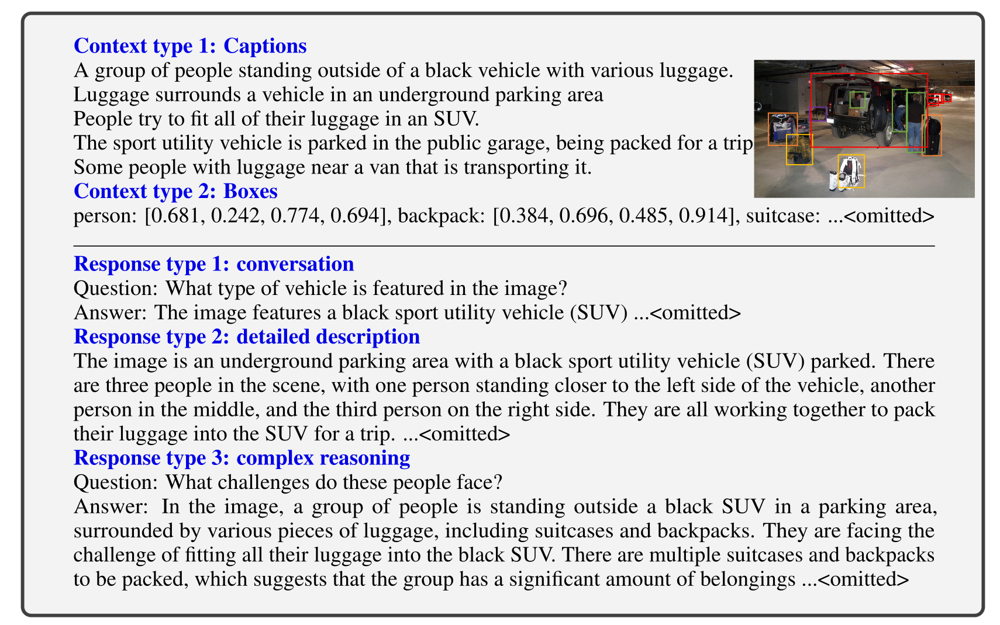
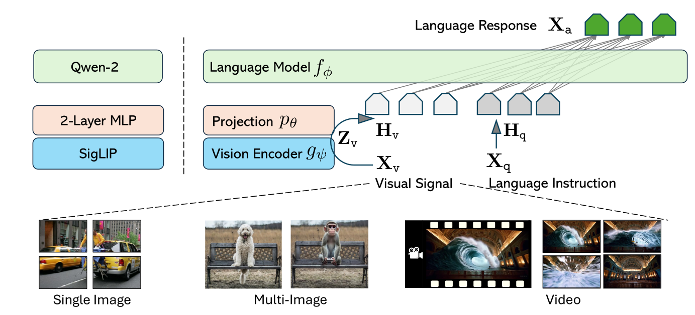
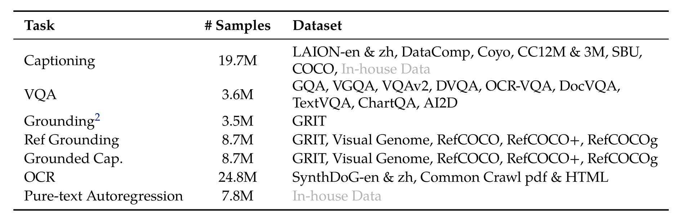
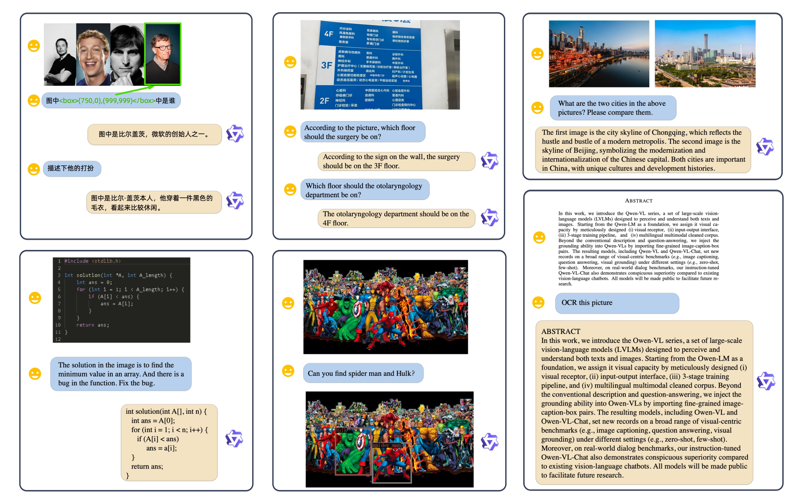
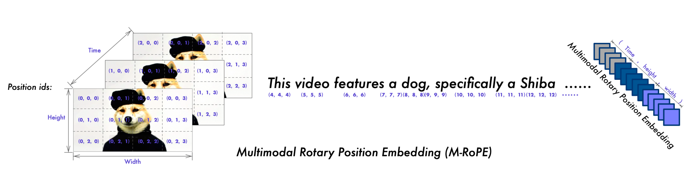
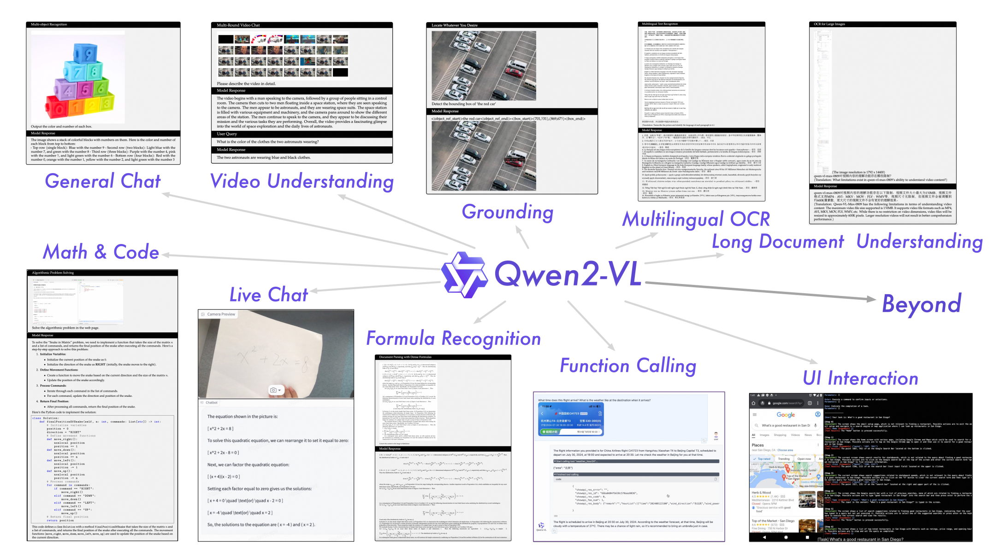
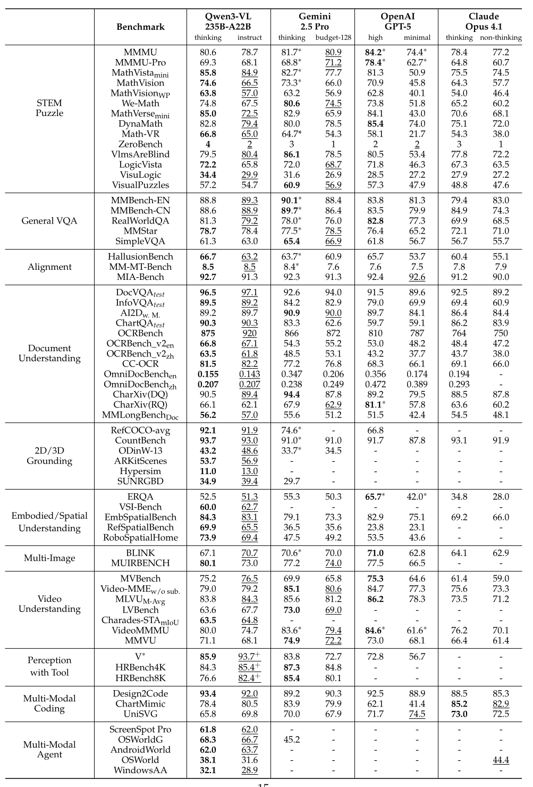

# 第十五章：多模态模型 — 从 CLIP 到 Omni Model

## 本章学习目标

&emsp;&emsp;在之前的十四章里，我们几乎所有内容都围绕**纯文本的语言模型**展开。然而人类接收信息的渠道远不止文字，视觉、听觉同样是智能体理解世界的重要接口。**多模态模型（Multimodal Model）** 正是要让模型具备"既会读文字，也会看图像，甚至能听声音"的能力。

完成本章学习后，你将能够：

1. **理解多模态建模的根本动机**：为什么需要从纯文本走向 Omni Model？Transformer 的统治地位与多模态扩展的挑战是什么？
2. **掌握 CLIP/SigLIP 的对比学习范式**：理解图像-文本对齐的数学原理、工程实现，以及后续的改进方向。
3. **了解 Vision Transformer 的工作机制**：为什么 ViT 能替代 ResNet 成为主流视觉编码器？
4. **掌握 VLM 的标准范式**：Vision Encoder + Adapter + LM 三段式架构的核心思想与训练流程。
5. **了解代表性 VLM 系统的演进**：LLaVA、Qwen-VL、Chameleon 等模型的关键技术创新。
6. **理解连续表示与离散表示的路线之争**：为什么扩散模型最终胜出？离散 token 化为什么在工程上不实用？

&emsp;&emsp;本章作为课程最后一讲，承担着"承上启下"的角色，既是对前面所学语言模型知识的延伸，也是对当下主流多模态系统的全景式概览。

---

## 15.1 引言：为什么需要多模态

&emsp;&emsp;如果你从第一章一路学到这里，我们已经完整地讨论了语言模型从分词、架构、训练到对齐的全套工具链。但请停下来想一个问题：**你用手机拍的一张照片，你身边朋友发的一段语音，这些信息能用纯文本 LLM（Large Language Model，大语言模型）处理吗？**

&emsp;&emsp;答案是不能。GLM-5.2 和 DeepSeek V4 这些模型虽然强大，但它们天生"听不懂、看不懂"图像和音频，它们只认识 token。这意味着如果想让 LLM 真正成为通用助手，就必须想办法**把图像、音频这些非文本信号也"翻译"成 LLM 能理解的语言**。这正是多模态建模的核心挑战。

> 在 GLM-5.2 和 DeepSeek V4 官网使用这些模型时，你可能发现能够输入图像，那是因为它们虽然不支持原生多模态，但是借助外部视觉模型（如 OCR 或视觉大模型）进行中转，将视觉信息转化为文本后再交由这些模型进行推理，同样实现了类似于原生多模态的效果
### 15.1.1 从纯文本到 Omni Model

&emsp;&emsp;在 AI 业界，大家有一个"北极星"目标，即所谓的 **Omni Model（全能模型）**：

- **输入**：任意模态的组合，可以是图、可以是视频、可以是语音，也可以是它们的混合，再加上一段文本指令；
- **输出**：任意模态的组合，既能生成文字回答，也能生成图像、音频甚至视频。

&emsp;&emsp;当下无论是 Google 的 Gemini 还是 OpenAI 的 GPT 系列，都被宣传为"原生多模态"（natively multimodal），但具体实现细节并未公开。我们这一讲的目的，是拆解开源社区中那些已公开方案的设计思路，让你能看清多模态模型的内部构造。

<div align="center">
  
  <p>图 15.1 多模态建模的全景：从纯文本到任意模态输入输出</p>
</div>

### 15.1.2 两个核心问题

&emsp;&emsp;要实现 Omni Model，面临两个核心问题：

**问题一：如何输入非文本数据？**

&emsp;&emsp;这是本讲的重点。文本天然有 BPE（Byte Pair Encoding，字节对编码）tokenizer（见第 2 章）把它切成 token，但像素、波形这些连续信号怎么变成 LLM 能"读"的向量？我们将看到两种主流路径：
- **连续表示**：用 Vision Encoder 把图像直接编码成连续向量，再注入 LLM（LLaVA、Qwen-VL）；
- **离散表示**：先把图像切成离散 token，再把 token 序列丢给 LLM（Chameleon）。

**问题二：如何输出非文本数据？**

&emsp;&emsp;本讲只做简要提及。当前主流方案是**扩散模型**（Diffusion Model），它能从纯噪声出发逐步去噪，最终生成图像、音频或视频。Transformer 在这里扮演"理解"和"控制信号生成"的角色，真正的"画笔"是扩散模型。这也是为什么本讲题目里强调 "Alignment"（对齐），即把语言模型的理解能力与扩散模型的生成能力对齐起来。

### 15.1.3 Token 概念的扩展

&emsp;&emsp;在第 2 章中我们学到，token 是文本的基本单位，一个 token 代表"某个有语义的信息单元"。一个单独的英文字母、一个单独的像素，本身都没有意义，必须组合起来才有信息。

&emsp;&emsp;这个观察可以推广到所有模态：

| 模态 | 最小单位 | token 化表示 |
|------|------------|---------------|
| 文本 | 字符 | 词片段（BPE） |
| 图像 | 像素 | 图像 patch（ViT）/ 离散 code（VQ-VAE） |
| 音频 | 波形采样点 | 短时频谱帧、离散 code |
| 视频 | 单帧像素 | 时空 patch |

&emsp;&emsp;多模态建模的核心哲学就是：**把一切模态都"翻译"成 token，然后交给 Transformer 这个"统一接口"进行处理**。这也是为什么 Transformer 在所有模态上都能 work，它不关心 token 来自哪里，只关心 token 之间的统计模式。

---

## 15.2 CLIP：对比语言-图像预训练

&emsp;&emsp;在多模态领域，[CLIP（Contrastive Language-Image Pre-training）](https://arxiv.org/pdf/2103.00020) 是绕不开的开山之作。它由 OpenAI 在 2021 年提出，至今仍是现代 VLM（Vision-Language Model，视觉语言模型）的基础组件。理解 CLIP 的设计思想，是理解整个多模态生态的第一步。

### 15.2.1 历史背景：从 ImageNet 到基础模型时代

&emsp;&emsp;在 CLIP 出现之前，视觉领域的主流范式是这样的：研究人员人工标注一个超大规模分类数据集（如 ImageNet 有 120 万张图、1000 个类别），然后训练一个 ResNet（Residual Network，残差网络）去拟合这些标签。这是一个**监督学习**范式，标签是人工精心标注的、固定的。

&emsp;&emsp;然而 2020 年前后，语言模型领域发生了范式转变：GPT-2、GPT-3 证明了只要**从互联网上爬取海量文本，让模型自己预测下一个 token**，就能学到惊人的语言能力。这种"基础模型"（Foundation Model）范式不再依赖精心标注的数据集。

&emsp;&emsp;问题来了：**对图像来说，"爬取互联网"的对应物是什么？**

&emsp;&emsp;OpenAI 的研究者们给出了一个巧妙的答案：互联网上天然存在大量"图像-文本配对"（image-text pairs）。网页上每张图几乎都配有一段说明文字、相邻的标题、alt 属性等。CLIP 正是利用了这种"自然标注"。

<div align="center">
  
  <p>图 15.2 互联网上的图像-文本天然配对：每张图都被 alt 属性、caption、周围正文等多源文本"标注"</p>
</div>

> **关键洞察**：爬取 4 亿对 (图像, 文本)，让模型学习"哪段文字描述了哪张图"，比人工标注 120 万张图更便宜、更通用。

### 15.2.2 目标函数：n 路分类

&emsp;&emsp;CLIP 的训练目标出奇地简洁。给定一批 $n$ 对 (image, text) 配对数据：

<div align="center">
  
  <p>图 15.2 CLIP 架构：图像和文本分别编码后在共享空间做点积</p>
</div>

&emsp;&emsp;对每张图像 $I_i$，希望它与自己对应文本 $T_i$ 的相似度**远高于**与其他 $n-1$ 个文本 $T_j$ 的相似度；反过来对每个文本也类似。这相当于：

- 一个 **$n$ 路分类问题**：对图像 $I_i$，从 $n$ 个候选文本中选出正确的 $T_i$；
- 另一个 **$n$ 路分类问题**：对文本 $T_i$，从 $n$ 个候选图像中选出正确的 $I_i$。

&emsp;&emsp;两路损失加起来就是 CLIP 的总损失。本质上这就是把图文匹配**建模为矩阵分类**问题。

```python
import torch
import torch.nn.functional as F

def clip_loss(image_embeds, text_embeds, temperature):
    """
    image_embeds: [n, d]  图像特征（已归一化）
    text_embeds:  [n, d]  文本特征（已归一化）
    temperature:  标量    温度参数（可学习）
    """
    # 相似度矩阵：[n, n]
    logits = image_embeds @ text_embeds.T * temperature.exp()

    # 标签：对角线为正例
    labels = torch.arange(logits.size(0), device=logits.device)

    # 两个方向的交叉熵
    loss_i2t = F.cross_entropy(logits, labels)        # 图像→文本
    loss_t2i = F.cross_entropy(logits.T, labels)      # 文本→图像
    return (loss_i2t + loss_t2i) / 2
```

<div align="center">
  
  <p>图 15.3 CLIP 损失计算的核心代码：相似度矩阵 + 双向交叉熵</p>
</div>

&emsp;&emsp;注意一个关键细节：**温度参数 $\tau$（temperature）是可学习的**。它控制了相似度分布的"尖锐程度"。小温度让分布更尖锐、强调最相似的对；大温度让分布更平滑、强调相对差异。CLIP 把温度放到 `exp()` 里，使其恒为正，避免手工调参。

> **为什么 batch size 必须大？**
>
> &emsp;&emsp;CLIP 的损失是在整个 batch 内做 softmax。如果 batch size 是 1，那就只有一个候选，分类问题退化为平凡情况；batch size 越大，"负样本"越多，模型学到的对比信号就越强。CLIP 训练时常用的 batch size 是 **32,768**。这个数字在 2021 年是相当惊人的规模。

### 15.2.3 数据规模与处理

&emsp;&emsp;OpenAI 当时爬取了约 **4 亿对 (图像, 文本)** 数据。注意，这个数据集**从未公开**，引发了社区对"用私有数据训练闭源模型"的广泛讨论。作为回应，**OpenCLIP** 复现并扩展了 CLIP：

- 数据源：[LAION-5B](https://arxiv.org/abs/2210.08402)（公开的 50 亿图文对）；
- 训练规模：在 5B 数据上训练，模型规模覆盖多个量级；
- 工程上甚至用 CLIP 自己来**过滤数据**。具体来说，先用一个小 CLIP 给所有数据打分，只保留置信度高的部分训练大 CLIP。这种"自举"（bootstrapping）虽然有效，但也可能放大原始数据的偏差。

&emsp;&emsp;**图像预处理**：

&emsp;&emsp;神经网络不喜欢"动态"的东西，而图像的原始分辨率五花八门。CLIP 的处理方式很直接：

1. 双三次插值（Bicubic）把短边缩放到 336px；
2. 中心裁剪成 336×336 的正方形；
3. 归一化后送入视觉编码器。

&emsp;&emsp;这个流程对 ImageNet 风格的"主体居中"图像很有效，但对文档截图、卫星图等多内容图像会丢失细节。这一问题在 15.4 节的 LLaVA OneVision 中得到了解决。

### 15.2.4 视觉编码器：Vision Transformer（ViT）

&emsp;&emsp;CLIP 团队实验了 ResNet 和 Vision Transformer 两种视觉骨干网络，结论是 **ViT（Vision Transformer）效果更好**。如今大家说 "CLIP" 默认指的就是 ViT 版本。

<div align="center">
  
  <p>图 15.4 Vision Transformer 架构</p>
</div>

&emsp;&emsp;ViT 的核心思想是"把图像当成一串 token"：

1. 把图像切成固定大小的 patch（CLIP 默认是 14×14 像素）；
2. 每个 patch 线性投影成一个向量，这就是一个"视觉 token"；
3. 给所有 token 加上 **1D 位置编码**（实验证明 2D 位置编码相对 1D 并没有显著优势）；
4. 送入标准 Transformer encoder；
5. 最后用一个 **attention pooling** 层把所有 token 聚合成一个向量。

> **什么是 Attention Pooling？**
>
> &emsp;&emsp;简单的做法是对所有 token 取平均（mean pooling），但 CLIP 团队发现用一个**可学习的 query 向量**对所有 token 做 attention 效果更好。换句话说，模型可以学会"重点关注哪些 patch"。这相当于给视觉编码器加了一个"软注意力"的输出层。

&emsp;&emsp;**CLIP 的最佳配置**：

- 视觉端：**ViT-L/14@336px**（Large 规模、14×14 patch、336×336 输入）；
- 文本端：GPT-2 风格的 Transformer（约 6300 万参数），输入是 `[BOS] + 文本 + [EOS]`，取 `[EOS]` 位置的最后一层激活作为整个文本的表示。

### 15.2.5 核心结果与意义

&emsp;&emsp;CLIP 最令人震撼的实验是 **zero-shot ImageNet 分类**：

&emsp;&emsp;传统 ImageNet 训练需要 120 万张人工标注的图像和 1000 个类别标签；而 CLIP 用 4 亿对网络图文训练后，**不做任何下游微调**就能在 ImageNet 上超过专门训练的 ResNet，见图 15.2的(3).

&emsp;&emsp;做法是构造 1000 个 prompt 模板（如 "a photo of a {class}"），把图像特征和这 1000 个文本特征做点积，选分数最高的类别。这一过程就是 zero-shot 分类。

<div align="center">
  
  <p>图 15.5 对比学习 vs 直接生成文本：计算效率对比</p>
</div>

&emsp;&emsp;消融实验还揭示了一个反直觉的事实：**让模型直接从图像生成完整 caption 文本，效果反而不如对比学习**。这说明对于"获取图像的语义表示"这个目标，精确建模 token 序列并不重要，对比信号已经足够。

> **CLIP 的方法论遗产**：
> 1. 海量弱监督数据 > 人工精标数据；
> 2. 对比学习是高效的"语义对齐"工具；
> 3. 简单的 ViT 编码器足以胜任；
> 4. 零样本能力是规模化的副产品。

### 15.2.6 CLIP 的局限

&emsp;&emsp;尽管 CLIP 影响深远，但它有几个明显短板：

- **设计目标是图像分类**，所以学到的特征偏"高层语义"，对细粒度信息（如 OCR、计数、空间关系）不敏感；
- **依赖超大 batch size**（32K 级别），小 batch 下性能急剧下降；
- **softmax 跨整个 batch 计算**，无法在数据子集上独立分解，并行化困难；
- 对图像中的**细粒度文本信息**（如文档、表格、字幕）几乎无能为力。

&emsp;&emsp;这些局限直接催生了下一节要介绍的 SigLIP，以及后续处理高分辨率的 AnyRes 等技术。

---

## 15.3 SigLIP：让 CLIP 更高效的工程改进

&emsp;&emsp;[SigLIP（Sigmoid Loss for Language Image Pre-training）](https://arxiv.org/pdf/2303.15343)是 Google 在 2023 年提出的 CLIP 改进版。它在很多指标上和 CLIP 持平甚至更好，但工程上更友好。本节我们重点分析它做了哪些"小改动"，为什么这些改动如此有效。

### 15.3.1 从 Softmax 到 Sigmoid Loss

&emsp;&emsp;CLIP 的损失本质是一个 $n$ 路 softmax 分类问题。SigLIP 把它换成了**逐对的二分类问题**：

<div align="center">
  
  <p>图 15.6 SigLIP 损失：每对 (图像, 文本) 独立判定</p>
</div>

&emsp;&emsp;具体做法：

- 对角线元素（正样本对）→ 标签 = +1
- 非对角线元素（负样本对）→ 标签 = -1
- 用 **sigmoid 函数 + 二分类交叉熵**逐对计算损失

```python
def siglip_loss(image_embeds, text_embeds, temperature, bias):
    """
    与 CLIP 的关键区别：每对独立判定，无需 batch 内 softmax
    """
    logits = image_embeds @ text_embeds.T * temperature + bias
    targets = torch.diag(torch.full((logits.size(0),), -1.0))  # 反对角线
    targets.fill_diagonal_(1.0)  # 对角线为 +1
    loss = -F.logsigmoid(targets * logits)  # 每个元素独立算
    return loss.mean()
```

&emsp;&emsp;这个改动的"代码量"很小，但带来三个深远影响：

| 维度 | CLIP | SigLIP |
|------|------|--------|
| 损失类型 | 跨 batch 的 softmax CE（Cross-Entropy） | 每对独立的 sigmoid CE |
| batch size 影响 | 强耦合（改 batch = 改损失） | 完全解耦 |
| 计算分解性 | 不可分解 | 可按 pair 独立计算 |

### 15.3.2 Loss 与 batch size 解耦

&emsp;&emsp;CLIP 的"必须用大 batch"是它工程上的最大痛点。为什么会这样？因为 CLIP 的负样本来自同一个 batch，batch 越大负样本越多，损失函数本身就在变。

&emsp;&emsp;SigLIP 的损失**对 batch size 不敏感**。原因是每对的损失是独立计算的，batch 只是把多个独立的 pair 堆在一起。实验发现：

- **小 batch（<16K）**：SigLIP 远优于 CLIP；
- **32K batch**：两者性能相当；
- **更大 batch**：SigLIP 略优但提升放缓。

&emsp;&emsp;这意味着对小团队、有限算力的研究者来说，SigLIP 是个"友好得多"的选择。

### 15.3.3 并行策略与训练效率

&emsp;&emsp;CLIP 的损失需要把整个 batch 的相似度矩阵算出来才能做 softmax，这在大规模分布式训练中是个瓶颈，因为所有 GPU 之间的 embedding 都要互相"看到"。

&emsp;&emsp;SigLIP 的天然分解性让**类似 DDP（Distributed Data Parallel）的并行策略**成为可能：

<div align="center">
  
  <p>图 15.7 SigLIP 跨设备并行：每个设备只算自己那部分 pair</p>
</div>

&emsp;&emsp;具体做法：

1. 每个 GPU 只算自己那部分 (image, text) pair 的 embedding；
2. 通过 **all-gather** 或 **轮转（shuffle）** 通信，让每个 GPU 拿到所有 pair 的 embedding；
3. 每个 GPU 独立计算自己那部分 pair 的 sigmoid 损失。

&emsp;&emsp;**训练效率的对比**：

| 模型 | 硬件 | 训练时间 |
|------|------|----------|
| CLIP | 256 × TPUv3 | 10 天 |
| SigLIP | 32 × TPUv4 | **5 天** |

&emsp;&emsp;TPUv4 单卡算力其实不如 TPUv3，但 SigLIP 训练时间反而减半。原因是 SigLIP 用 32 卡就能跑出 CLIP 256 卡的效果（因为不需要那么大的 batch），整体通信开销和能耗都大幅下降。

&emsp;&emsp;**数据集（WebLI）**：

&emsp;&emsp;Google 训练 SigLIP 用的是 **WebLI（Web Language Image dataset）** 数据集：

- 规模：O(billion)（数十亿）对图文；
- 预处理：自动 OCR 提取图像中的文字；用模型打分保留 top 10% 高质量数据；
- 多语言：覆盖 **100 种语言**，这是 SigLIP 相对 CLIP 的另一个优势。

> **为什么 SigLIP 重要？**
>
> &emsp;&emsp;它证明了**对比学习的目标函数还有优化空间**。CLIP 的 softmax 不是"唯一正确"的选择，sigmoid 这种更简单的损失在工程上反而更友好。这种"小改动带来大收益"是值得借鉴的工程哲学。

---

## 15.4 VLM 架构：将图像注入语言模型

&emsp;&emsp;CLIP 学到了"图像-文本"的联合空间，但它的能力仅限于匹配和分类。换句话说，**它不会"读图说话"**。

&emsp;&emsp;**VLM（Vision-Language Model）** 才是当下多模态对话系统的标准形态。它的核心思想是：

> **把图像编码成向量，然后"塞进"语言模型，让语言模型基于图像内容生成自然语言回答。**

&emsp;&emsp;这一节我们以 LLaVA 系列为例，拆解 VLM 的标准范式。

### 15.4.1 标准范式：Encoder + Adapter + LM

&emsp;&emsp;几乎所有主流 VLM 都遵循一个三段式架构：

```
┌──────────────┐    ┌────────────┐    ┌──────────────────┐
│  Vision      │    │            │    │  Language        │
│  Encoder     │ ─► │  Adapter   │ ─► │  Model (LLM)     │
│  (CLIP/SigLIP)│   │  (W)       │    │  (Vicuna/Qwen)   │
└──────────────┘    └────────────┘    └──────────────────┘
   图像 → 视觉向量   维度对齐/特征转换   基于视觉条件生成文本
```

&emsp;&emsp;每个组件的角色：

1. **Vision Encoder**：把图像编码成一系列向量（通常是几百个 patch token）。一般直接用现成的 CLIP 或 SigLIP 权重，**冻结**不训练；
2. **Adapter/Projector**：一个小型的"桥梁"模块（线性层、MLP 或 cross-attention），把视觉向量"翻译"成 LLM 能理解的"伪文本 token"；
3. **Language Model**：预训练好的 LLM，接收"文本 token + 视觉 token"的混合序列，自回归生成回答。

&emsp;&emsp;这其实是一种**"mid-training"或"post-training"**。具体做法是：我们不动两个已经预训练好的大模块，只在中间"接一根线"，训练成本远低于从零训练一个多模态模型。

### 15.4.2 LLaVA：奠基性开源 VLM

&emsp;&emsp;[LLaVA（Large Language and Vision Assistant）](https://arxiv.org/pdf/2304.08485) 是 2023 年由微软和威斯康星大学联合发布的开源 VLM。它本身性能不如 GPT-4V，但**完整开源了模型权重和训练数据**，让社区第一次看清了 VLM 的内部结构。

<div align="center">
  
  <p>图 15.8 LLaVA 架构：CLIP + 线性投影 + Vicuna</p>
</div>

&emsp;&emsp;**LLaVA 的三组件选择**：

| 组件 | 选择 | 说明 |
|------|------|------|
| Vision Encoder | **CLIP ViT-L/14** | 当时最强开源视觉编码器 |
| Projector | **单层线性矩阵 $W$** | 最简单的"翻译器" |
| Language Model | **Vicuna** | LLaMA 在 ShareGPT 对话数据上的微调版 |

&emsp;&emsp;**训练数据生成**（关键创新）：

&emsp;&emsp;LLaVA 团队面临一个尴尬的难题：互联网上"图文对话"数据非常稀缺，因为大部分图文配对都是"图片 + 单句 caption"，没有"问-答"对话。

&emsp;&emsp;他们用了一个巧妙的方案：**用 GPT-4 合成对话数据**。

<div align="center">
  
  <p>图 15.9 LLaVA 的数据生成流程：基于 COCO 标注 + GPT-4 合成</p>
</div>

&emsp;&emsp;具体步骤：

1. 以 **MS COCO** 数据集为基础（已有高质量的物体框 + caption）；
2. 把每个图像的标注（类别、位置、关系、caption）打包成 prompt；
3. 让 GPT-4 基于这些信息生成三类对话：
   - **Conversation**：基于 caption 的日常问答；
   - **Detailed Description**：比 caption 更详细的描述；
   - **Complex Reasoning**：需要逻辑推理的问题。

&emsp;&emsp;最终得到 **158K 条合成对话**，用于训练 LLaVA。

> **关于"用 GPT-4 合成数据"**
>
> &emsp;&emsp;这在 2023 年引发了广泛讨论。LLaVA 团队坦承"unabashedly distilling GPT-4"，并不避讳用最强闭源模型的能力来训练开源模型。从工程角度看这是务实的；但从研究角度看，**这也是为什么开源 VLM 的能力上限至今仍受制于闭源模型**。

&emsp;&emsp;**两阶段训练**：

| 阶段 | 训练目标 | 冻结部分 |
|------|----------|----------|
| Stage 1（对齐） | 让图像向量"看起来像"自然语言 token | Vision Encoder + LM |
| Stage 2（指令微调） | 在多模态对话上微调 | Vision Encoder |

&emsp;&emsp;Stage 1 只训练线性投影 $W$，相当于教它"图像向量和文本向量在空间上要对齐"；Stage 2 解冻 LM，让它学会"看到图像后怎么回答问题"。

<div align="center">
  
  <p>图 15.10 LLaVA 推理示例：识别"不寻常"的内容</p>
</div>

&emsp;&emsp;LLaVA 论文里有一个经典示例：用户问 "What's unusual about this image?"（一张在小货车后面熨衣服的照片），模型回答 "a man ironing on the back of a minivan is unusual"。重点是**用户并没有明确问"哪里不寻常"**，但模型主动识别了反常点。这种主动观察能力在当时相当惊艳。

### 15.4.3 LLaVA OneVision：多图与视频

&emsp;&emsp;LLaVA 1.5 和 LLaVA-Next 是渐进式改进。2024 年发布的 [LLaVA OneVision](https://arxiv.org/pdf/2408.03326) 则把目标扩大：处理多张图像、视频等更复杂的输入。

<div align="center">
  
  <p>图 15.11 LLaVA OneVision 架构：SigLIP + 2层MLP + Qwen-2</p>
</div>

&emsp;&emsp;**关键升级**：

| 组件 | LLaVA | LLaVA OneVision |
|------|-------|-----------------|
| Vision Encoder | CLIP ViT-L/14 | **SigLIP** |
| Projector | 线性层 | **2 层 MLP** |
| Language Model | Vicuna (13B) | **Qwen-2 72B** |
| 支持输入 | 单图 | **单图 / 多图 / 视频** |

&emsp;&emsp;**AnyRes：高分辨率处理的核心创新**

&emsp;&emsp;LLaVA OneVision 最值得关注的工程创新是 **AnyRes**。动机如下：

&emsp;&emsp;回想 CLIP，它把图像缩放到 336×336 再裁成正方形。这对"主体居中"的 ImageNet 风格图像没问题，但对**文档截图、图表、长图**来说就糟糕了，因为文字会小到无法辨认。

<div align="center">
  
  <p>图 15.12 AnyRes 原理：全局 + 多个 336×336 切片</p>
</div>

&emsp;&emsp;AnyRes 的做法：

1. **一路**：把整张图像 downsampled 编码（捕获全局信息）；
2. **多路**：把原图切成最多 9 个 336×336 的 chunk，分别用 vision encoder 编码；
3. **拼接**：把全局特征 + 切片特征拼成 token 序列；
4. **降采样**：如果 token 太多，用 bilinear interpolation 降采样，控制总长度。

&emsp;&emsp;**三种模态的分辨率策略**：

<div align="center">
  
  <p>图 15.13 LLaVA OneVision 对单图 / 多图 / 视频的差异化处理</p>
</div>

&emsp;&emsp;**术语说明**：这里提到的 **crop** 和 **tile** 含义相近——都是指把高分辨率图切成的一个固定大小（通常 336×336）的子图块。每个 crop / tile 单独送进 vision encoder 编码，得到一组视觉 token。区别只是叫法习惯：CLIP 时代多用 "crop"，LLaVA OneVision 论文里偏好 "tile"。

| 输入类型 | 策略 | 原因 |
|----------|------|------|
| 单张图像 | 高分辨率（full + 最多 9 个 crop） | 单图独享 token 预算，可以"看仔细" |
| 多张图像 | 每张较少 tile（如 1-4 个） | token 预算被均分，要让多张图都进入上下文 |
| 视频     | 低分辨率/稀疏帧（最多 32 帧） | 视频很长，避免重复帧主导训练 |

&emsp;&emsp;**数据与训练**：

&emsp;&emsp;LLaVA OneVision 仍然坚持"质量 > 数量"的哲学：

<div align="center">
  
  <p>图 15.14 LLaVA OneVision 的数据构成</p>
</div>

&emsp;&emsp;训练流程分三阶段：

<div align="center">
  
  <p>图 15.15 LLaVA OneVision 的三阶段训练流程</p>
</div>

1. **Stage 1（对齐）**：仅训练 projector，锁住其他；
2. **Stage 2（知识注入）**：高质量知识数据，训练更多参数；
3. **Stage 3（任务微调）**：下游任务数据，全模型训练。

### 15.4.4 跨模态迁移：涌现的泛化能力

&emsp;&emsp;LLaVA OneVision 最有趣的发现是**跨模态迁移**（Cross-Modal Transfer）：

<div align="center">
  
  <p>图 15.16 跨模态迁移示例：训练用单图，测试时能做多图任务</p>
</div>

&emsp;&emsp;具体例子：

- **图表+表格联合推理**：训练数据里只有"单张图表"或"单张表格"，但模型在测试时能对"图表 + 表格组合"做对话；
- **GUI Agent**：训练数据里只有"单图 OCR + 关系推理"，但模型能分析多步骤的截屏、做界面操作；
- **视频物体追踪**：训练数据里只有"单图 visual prompting（圈出目标）"，但模型能对视频做持续追踪。

<div align="center">
  
  <p>图 15.17 GUI Agent 能力：单图 OCR 训练 → 多步截屏分析</p>
</div>

<div align="center">
  
  <p>图 15.18 视频物体追踪：单图 visual prompting → 视频跨帧跟踪</p>
</div>

<div align="center">
  
  <p>图 15.19 LLaVA OneVision 在不同训练阶段的能力曲线</p>
</div>

&emsp;&emsp;这种现象是 VLM 区别于传统监督学习的核心特征：**任务之间会自发迁移**。如果某个能力在足够多相关任务上被训练过，它就能"外推"到新场景。这正是基础模型范式的魅力所在。

---

## 15.5 Qwen-VL 系列：工业级 VLM 的演进

&emsp;&emsp;如果说 LLaVA 是"学术界的开源示范"，那么 **Qwen-VL 系列** 就是"工业界持续打磨的代表"。从 2023 年至今，Qwen 团队几乎每 6-12 个月发布一个新版本，每个版本都带来**工程细节**上的显著优化。本节按时间顺序梳理其技术演进。

### 15.5.1 Qwen-VL：跨注意力适配器

<div align="center">
  
  <p>图 15.20 Qwen-VL 的三阶段训练总览</p>
</div>

&emsp;&emsp;**架构**：

| 组件 | 选择 |
|------|------|
| Vision Encoder | OpenCLIP ViT-bigG（14×14 patch） |
| Adapter | 单层 **cross-attention** + 2D 位置编码 → 固定 256 tokens |
| Language Model | Qwen-7B |
| 特殊 token | ``、`<box>`、`<ref>` |

&emsp;&emsp;LLaVA 的 Adapter 是简单线性投影，[Qwen-VL](https://arxiv.org/pdf/2308.12966) 改成了**单层 cross-attention**。具体而言，把视觉向量作为 key/value，用一组可学习 query（数量固定为 256）去"查询"视觉信息。这样无论输入图像多大，最后都压缩成 256 个固定长度的 token，方便和文本拼接。

&emsp;&emsp;**特殊 token** 的设计是 Qwen-VL 的特色：

- ``：标记图像边界；
- `<box>`：在文本中嵌入检测框坐标（"图中的 `<box>cat</box>` 在哪里"）；
- `<ref>`：跨图引用（"图1中的物体，在图2中变成什么样了？"）。

&emsp;&emsp;这些特殊 token 让模型能"画"检测框、做跨图对话。这类细粒度能力在早期 VLM 中比较少见。

&emsp;&emsp;**三阶段训练**：

<div align="center">
  
  <p>图 15.21 Qwen-VL 阶段 1 细节</p>
</div>

<div align="center">
  
  <p>图 15.22 Qwen-VL 阶段 2 细节</p>
</div>

1. **Stage 1**：大规模低质量数据；冻结 LM，训练 vision encoder + adapter；
2. **Stage 2**：高质量任务数据（VQA、chart QA 等）；全参数训练；
3. **Stage 3**：指令微调；冻结 vision encoder，训练 adapter + LM。

&emsp;&emsp;**能力展示**：

<div align="center">
  
  <p>图 15.23 Qwen-VL 的能力展示：中英双语、代码理解、目标检测、OCR</p>
</div>

### 15.5.2 Qwen2-VL：动态分辨率与 M-RoPE

&emsp;&emsp;[Qwen2-VL](https://arxiv.org/pdf/2409.12191)（2024 年）在 Qwen-VL 基础上做了三项关键升级。

&emsp;&emsp;**升级 1：更大的视觉骨干**

&emsp;&emsp;视觉编码器从 ViT-bigG 升级到 **675M 参数**的 ViT，规模显著增大。

&emsp;&emsp;**升级 2：动态分辨率**

&emsp;&emsp;之前 VLM 都把图像缩放到固定大小（336×336、448×448 等），Qwen2-VL 引入了**动态分辨率**机制：

- 每个 224×224 patch 单独用 ViT 编码；
- 每 2×2 个 patch 在通道维度压缩 → 每组产生 66 个 token；
- 不同分辨率的图像产生不同数量的视觉 token，但**下采样率固定**为每组 4 个 patch 对应 66 token。

<div align="center">
  
  <p>图 15.24 Qwen2-VL 架构：动态分辨率 + M-RoPE</p>
</div>

&emsp;&emsp;**升级 3：M-RoPE（Multimodal Rotary Position Embedding，多模态旋转位置编码）**

&emsp;&emsp;这是 Qwen2-VL 最核心的创新。在第 4 章我们学过 **RoPE**（Rotary Position Embedding）。它的核心性质是让 attention 内积只取决于 token 之间的**相对距离**。传统 RoPE 是 1D 的，按 token 在序列中的位置编码。

&emsp;&emsp;但多模态输入有**二维甚至三维结构**：
- 图像有 (高, 宽)；
- 视频有 (时间, 高, 宽)。

&emsp;&emsp;**M-RoPE** 把 RoPE 推广到多维：对每个 patch/token，位置变成三元组 $(t, h, w)$，分别对应时间、高、宽。在每个维度上分别计算 RoPE，然后拼接。

<div align="center">
  
  <p>图 15.25 M-RoPE 原理：3D 位置编码 (时间, 高, 宽)</p>
</div>

&emsp;&emsp;直觉上，M-RoPE 让模型能自然地区分"空间上相邻但时间上不同"的两个 patch（比如视频中两帧相同位置的像素），这在传统 1D 位置编码下是无法表达的。

&emsp;&emsp;**视频支持**：

&emsp;&emsp;Qwen2-VL 支持 2 fps 采样、最多 16,384 个视频 token，足以覆盖几分钟的视频。

<div align="center">
  
  <p>图 15.26 Qwen2-VL 的能力展示</p>
</div>

### 15.5.3 Qwen3-VL：交错 M-RoPE 与 DeepStack

&emsp;&emsp;[Qwen3-VL](https://arxiv.org/pdf/2511.21631)（2025 年）的改进重点不是"大刀阔斧的架构变化"，而是**一系列工程精修**。Liang 在原讲中特别强调："这些不是结构上的大变化，但确实影响模型质量。"

&emsp;&emsp;**五项关键改进**：

<div align="center">
  
  <p>图 15.27 Qwen3-VL 概览</p>
</div>

**改进 1：更强的 LM 基座**

&emsp;&emsp;Qwen-3 系列（Dense/MoE（Mixture of Experts，混合专家模型），最高 235B-A22B），支持 **256K 上下文**。这一点对于长视频、长文档的处理至关重要。

**改进 2：SigLIP-2 视觉编码器**

&emsp;&emsp;架构与 SigLIP 相同，但用了更新版本的数据与训练配方。**关键优势：向后兼容 SigLIP**，可以无缝替换。

**改进 3：Interleaved M-RoPE**

&emsp;&emsp;Qwen2-VL 的 M-RoPE 是分段排列的，比如某个 token 内部的 RoPE 分量是 $[t, t, t, t, w, w, w, w, h, h, h, h]$——**时间维度全在低频、空间维度全在高频**。

&emsp;&emsp;Qwen3-VL 改为**交错排列**：$[t, w, h, t, w, h, t, w, h, t, w, h]$。这样所有维度都"暴露"在低频和高频下，模型对所有位置信息都更敏感。

**改进 4：显式视频时间戳**

&emsp;&emsp;之前视频时间戳是隐含在位置编码里的。Qwen3-VL 把"0 秒"、"2 秒"做成实际可引用的 token。用户可以直接问"2 秒后发生了什么？"。

**改进 5：DeepStack Adapter**

&emsp;&emsp;传统 VLM 架构是"vision encoder → projector → LM"，vision encoder 的信息**只通过 projector 一次性**注入 LM。Qwen3-VL 引入 **DeepStack**：把 vision encoder 的**多层**输出分别注入 LM 的**不同层**。

<div align="center">
  
  <p>图 15.28 Qwen3-VL 预训练 4 阶段 + 后训练 3 阶段</p>
</div>

&emsp;&emsp;动机是：vision encoder 不同层学到不同抽象程度的特征（浅层=边缘/纹理，深层=语义），不同 LM 层需要的视觉信息粒度也不同。DeepStack 让"细粒度视觉"和"粗粒度语义"在 LM 内部多次融合，比一次性注入更灵活。

**改进 6：平方根归一化的 per-token loss**

&emsp;&emsp;视频样本往往非常长（数千 token），如果用标准 cross-entropy，一个视频样本对总损失的贡献远超一个短文本样本，会让训练数据分布严重偏向视频。

&emsp;&emsp;Qwen3-VL 引入 $1/\sqrt{\text{length}}$ 的归一化因子，让长样本的 per-token 损失被降权，避免数据不平衡。

&emsp;&emsp;**训练流程（7 阶段！）**：

&emsp;&emsp;Qwen3-VL 的训练流程非常复杂：

- **预训练 4 阶段**：训练 adapter → 8K 全参数 → 32K 全参数 → 256K 全参数；
- **后训练 3 阶段**：长 CoT（Chain of Thought，思维链）SFT → 知识蒸馏 → 强化学习。

<div align="center">
  
  <p>图 15.29 Qwen3-VL 评测结果</p>
</div>

&emsp;&emsp;Liang 在原讲中感慨："Pipeline 现在变得相当复杂了。如果你看最终结果，这确实是一个相当好的模型。Qwen 模型实际上非常强。"

&emsp;&emsp;**这一节给我们的启示**：

&emsp;&emsp;VLM 领域的进步越来越依赖**系统性的工程优化**，具体体现在从数据、训练流程到 loss 设计的每一步精细调整上。单纯改变架构已很难带来质变，**打磨细节**才是制胜关键。

---

## 15.6 Chameleon：离散化路线的探索

&emsp;&emsp;到目前为止我们看到的 VLM 都是**混合架构**。视觉端用专门的 Vision Encoder，文本端用 LLM，中间用一个 Adapter 桥接。

&emsp;&emsp;[Chameleon（Meta，2024）](https://arxiv.org/abs/2405.09818)提出了一个截然不同的思路：

> **能不能把图像和文本都当成"同一种东西"——离散 token？**

&emsp;&emsp;如果成功，整个模型就是一个标准的 Transformer，从图像生成、文本生成到图文混合生成，全程**统一架构，统一训练**。

### 15.6.1 全 Token 化的哲学

<div align="center">
  
  <p>图 15.30 Chameleon 概念图：图像和文本都变成离散 token</p>
</div>

&emsp;&emsp;这种哲学的背后是 Omni Model 的愿景：文本、图像、音频、视频共享同一个 token 空间，模型不再区分"模态"，只看到"token 序列"。这种统一在**美感**上确实让人向往。

<div align="center">
  
  <p>图 15.31 Chameleon 生成的图文混合示例</p>
</div>

### 15.6.2 VQ-VAE：图像离散化的关键组件

&emsp;&emsp;要把图像变成离散 token，需要 **VQ-VAE**（Vector Quantized Variational Autoencoder）这种工具：

<div align="center">
  
  <p>图 15.32 VQ-VAE 架构：Encoder + 量化 + Decoder</p>
</div>

&emsp;&emsp;VQ-VAE 的工作流程：

1. **Encoder**：图像 → 一组连续向量；
2. **向量量化**：每个连续向量被"四舍五入"到最近的 codebook entry（codebook 大小约 8192）；
3. **Decoder**：从离散 code 重建图像；
4. **训练目标**：最小化重建误差（+ 用 straight-through estimator 等技巧处理量化步骤的不可导性）。

&emsp;&emsp;**关键参数**：

- 一张 512×512 的图像被切分成 1024 个 token；
- 每个 token 来自 8192 大小的词表；
- 整个训练语料（文本 + 图像）需要重新训练 BPE tokenizer，因为图像 token 完全是新东西。

&emsp;&emsp;训练流程和标准 LM 一样，也是 next-token prediction，没有 Adapter，没有单独的 vision encoder。从这个角度看，Chameleon 比 LLaVA、Qwen-VL 简单得多。

### 15.6.3 训练不稳定性

&emsp;&emsp;然而实际训练中，Chameleon 遇到了**严重的不稳定问题**：

> **"Text and images, despite occupying the same space, just behave very differently. Just calling things discrete tokens isn't hiding the fact that there's an image living there."**

&emsp;&emsp;造成问题的根本原因是**两类 token 的熵差异**：

- **文本 token**：低熵——大多数词在上下文中是可预测的，模型很快就能学到；
- **图像 token**：高熵——"我完全不知道这一小块 patch 的具体颜色"，不确定性大得多。

&emsp;&emsp;后果是训练过程中：

- 参数范数（norm）不断膨胀；
- logits 出现 drift（漂移）；
- loss 震荡甚至发散。

&emsp;&emsp;**缓解措施**：QK Norm（query/key 上的层归一化）+ Z-loss（logits 的额外正则项）。这些技巧能让训练勉强收敛，但代价是不优雅。

### 15.6.4 Chameleon 的局限与最终格局

**性能层面**：Chameleon 最终的模型性能**不如同时期的混合架构 VLM**。一个关键原因是**离散化必然丢失信息**。VQ-VAE 把连续色彩量化到 8192 个 code，重建的图像本身就有损；OCR 这种细粒度任务更是几乎不可用。

**范式层面**：VQ-VAE 路线在**图像生成**领域曾经很主流（早期 Stable Diffusion 的 latent 就是 VQ 化的）。但 2022 年后，**扩散模型** 在生成质量上全面超越自回归 + VQ 的组合：

- 扩散模型直接在连续 latent 空间去噪；
- 不需要量化步骤，信息损失为零；
- 生成质量上限更高。

&emsp;&emsp;**最终格局**：

> **"The current best combination is: continuous encoders + Transformer + diffusion models for generation."**
> ——Liang 在原讲中的总结

&emsp;&emsp;这就是当下几乎所有前沿多模态系统（GPT-4V、Gemini、Qwen-VL、InternVL 等）的共同范式：

| 模块 | 主流选择 |
|------|----------|
| 视觉输入 | 连续向量编码器（SigLIP、CLIP） |
| 核心架构 | Transformer（自回归语言模型） |
| 视觉输出 | 扩散模型（Stable Diffusion、Imagen、DALL-E 3） |
| 训练范式 | 大规模多模态预训练 + 指令微调 + RLHF/RLVR（Reinforcement Learning from Human/Verifiable Rewards） |

&emsp;&emsp;Chameleon 的"全离散 token 化"虽然没能成为主流，但它的探索揭示了**统一多模态架构的难度**。原因是文本和图像的统计性质差异太大，强行统一反而引入训练难题。

---

## 15.7 总结与思考

&emsp;&emsp;本讲是 CS336 课程的最后一节，我们从最基础的"为什么需要多模态"出发，一路走到了工业级 VLM 的最前沿。回顾整章内容，几个关键洞察值得反复咀嚼：

&emsp;&emsp;**1. Transformer 是当之无愧的"统一接口"**

&emsp;&emsp;无论文本、图像、音频还是视频，Transformer 都是大规模下的"最优解"。多模态建模的核心挑战不是"用什么架构"，而是"如何把非文本模态塞进 Transformer"。

&emsp;&emsp;**2. CLIP 的方法论影响深远**

&emsp;&emsp;5 年前提出的对比学习 + 海量弱监督数据 + 零样本能力这套范式，至今仍是 VLM 的基石。SigLIP 的工程改进、Qwen-VL 的视觉编码器选择，都延续了这条路线。

&emsp;&emsp;**3. VLM = Encoder + Adapter + LM**

&emsp;&emsp;这个三段式范式统治了当前的开源 VLM 生态。LLaVA、Qwen-VL、InternVL 等模型虽然具体细节不同，但骨架高度相似。差异化竞争主要在**数据工程**、**训练流程**、**loss 设计**这些"软"层面。

&emsp;&emsp;**4. 理解与生成存在张力**

&emsp;&emsp;CLIP/SigLIP 只需要"高层语义"，所以 336×336 的低分辨率就够；但 OCR、文档分析需要"细粒度信息"，必须用 AnyRes 这样的高分辨率方案。同样，生成端不能简单用 VQ 离散化，必须用扩散模型保持连续信息。**没有一种万能方案**能同时满足所有需求。

&emsp;&emsp;**5. 离散化路线虽优雅但不实用**

&emsp;&emsp;Chameleon 的尝试让我们看清"全统一"的代价。文本和图像的统计差异太大，强行离散化会引入训练不稳定和信息损失。**连续表示 + 扩散生成**的组合在当下是更务实的选择。

&emsp;&emsp;**6. 数据是真正的护城河**

&emsp;&emsp;无论是 OpenAI 的 CLIP（4 亿未公开数据）、LLaVA 的 158K 合成对话、还是 Qwen 的多阶段训练数据，**数据规模和数据质量**始终是 VLM 性能的决定性因素。架构可以开源，训练细节可以复现，但**高质量数据**往往是各家的核心机密。

&emsp;&emsp;**7. 跨模态迁移是涌现现象**

&emsp;&emsp;LLaVA OneVision 展示的"单图训练 → 多图任务"、"单图 OCR → GUI Agent"等迁移能力，是基础模型范式最迷人的地方。**只要任务足够多、足够广，模型能自发学到跨任务的通用能力**。这与传统监督学习"一个模型一个任务"的范式形成鲜明对比。

&emsp;&emsp;**8. 工业级 VLM 越来越复杂**

&emsp;&emsp;Qwen3-VL 的 7 阶段训练、DeepStack 跨层注入、Interleaved M-RoPE……这些工程细节堆叠起来，已经让一个完整 VLM 的训练 pipeline 比早期 LLM 还要复杂。**未来多模态领域的突破，很可能来自这些系统性的工程优化**，而非单一架构创新。

---

### 思考题

&emsp;&emsp;在学完本章后，不妨思考以下问题：

1. **如果让你从零设计一个 VLM**，你会选择连续表示（CLIP 路线）还是离散表示（Chameleon 路线）？为什么？
2. **CLIP 的对比损失**和**生成式 caption 损失**哪个更高效？为什么？（提示：考虑负样本数量与计算复杂度）
3. **SigLIP 为什么能在小 batch 下 work？** 从损失函数的角度解释。
4. **AnyRes 的局限是什么？** 如果一张超高分辨率的图像被切成了几十个 patch，token 数量会不会爆炸？
5. **DeepStack 把视觉信息注入 LM 的不同层**。这和"通过 Adapter 一次性注入"相比，有什么潜在问题？
6. **Chameleon 训练不稳定**的根源是文本和图像的熵差异。如果让你设计一个 loss 来缓解，你会怎么做？

---

## 参考文献与延伸阅读

- [CLIP (Radford et al., 2021)](https://arxiv.org/abs/2103.00020) — 对比语言-图像预训练
- [OpenCLIP (Ilharco et al., 2022)](https://arxiv.org/abs/2212.07143) — CLIP 的开源复现
- [SigLIP (Zhai et al., 2023)](https://arxiv.org/abs/2303.15343) — Sigmoid Loss 替代 Softmax
- [ViT (Dosovitskiy et al., 2020)](https://arxiv.org/abs/2010.11929) — Vision Transformer
- [LLaVA (Liu et al., 2023)](https://arxiv.org/abs/2304.08485) — 第一个开源 VLM
- [LLaVA OneVision (Li et al., 2024)](https://arxiv.org/abs/2408.03326) — 多图/视频 VLM
- [Qwen-VL (Bai et al., 2023)](https://arxiv.org/abs/2308.12966)
- [Qwen2-VL (Wang et al., 2024)](https://arxiv.org/abs/2409.12191) — Dynamic Resolution + M-RoPE
- [Qwen3-VL (2025)](https://arxiv.org/abs/2511.21631) — SigLIP-2 + DeepStack + Interleaved M-RoPE
- [Chameleon (Meta, 2024)](https://arxiv.org/abs/2405.09818) — 全离散 token 的多模态模型
- [VQ-VAE (van den Oord et al., 2017)](https://arxiv.org/abs/1711.00937) — 向量量化变分自编码器
- [WebLI (Chen et al., 2022)](https://arxiv.org/abs/2209.06794) — 大规模图文数据集
- [DeepStack (DeepSeek, 2024)](https://arxiv.org/abs/2406.04334) — 跨层视觉-语言融合
- [Stanford CS336 (Spring 2026) 课程主页](https://cs336.stanford.edu/)
